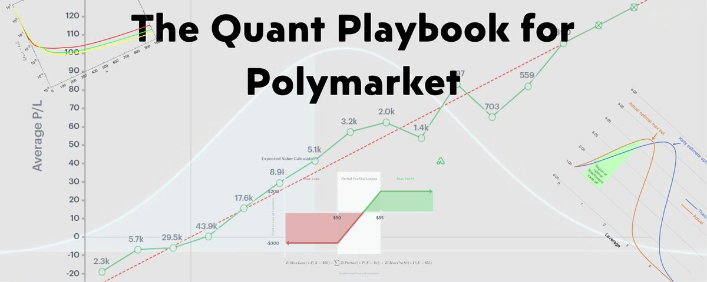

# The Quant Playbook for Polymarket: 6 Formulas Hedge Funds Use to Extract Millions in 2026

**Author:** 0xRicker (@0xRicker)
**Date:** March 14, 2026
**Source:** https://x.com/0xRicker/status/2032798292128522327
**Stats:** 45 replies, 254 retweets, 1,887 likes, 1,929,643 views, 7,095 bookmarks

---



Polymarket in 2026 is no longer just a playground for degen gamblers. It is quietly becoming a quant battlefield where professional funds harvest edges the way they do in options and futures. If you trade without a framework, then you are among the 92%.

In this playbook, you will see six core formulas hedge funds use to systematically pull money out of prediction markets and how a retail trader can realistically copy at least part of that stack.

## Formula 1: LMSR Pricing Model (The Core Engine of Polymarket)

LMSR (Logarithmic Market Scoring Rule) is the AMM powering Polymarket's prices, turning liquidity into bounded probabilities (0-1). Quants model it to predict trade impact and spot mispricings in low-liquidity pools (small b parameter means bigger edges).

**Formula:** `Price_i = e^{q_i / b} / Σ e^{q_j / b}`
*(where q is the quantity vector for outcomes, b is liquidity depth)*

**Example:**
On a BTC 5-minute up/down market ($36M volume), with b=100 and initial q_yes=0, buying 10 YES shares jumps the price by ~5%. Quants pre-calc this to arb before others.

```python
import sympy as sp
import matplotlib.pyplot as plt
import numpy as np

b = 100
q_yes = sp.symbols('q_yes')
price_yes = sp.exp(q_yes / b) / (sp.exp(q_yes / b) + sp.exp(0 / b))  # Binary market
price_func = sp.lambdify(q_yes, price_yes)

qs = np.linspace(0, 1000, 100)
prices = price_func(qs)
plt.plot(qs, prices)
plt.xlabel('Quantity Bought')
plt.ylabel('Price')
plt.title('LMSR Pricing Curve')
plt.show()
```

**Code/Homework:**

- Run this to see the curve -- homework: Test on a real Polymarket b value from API
- **Risk:** In thin pools (b<50), whales can manipulate; always check volume
- **Edge:** Daily $500+ on impact arb in volatile markets like esports ($2M vol)

## Formula 2: Kelly Criterion (Optimal Sizing for Long-Term Growth)

No all-in bets -- Kelly maximizes geometric growth, used by every major HF (Renaissance, Two Sigma) to avoid ruin while compounding.

**Formula:** `f* = (p * odds - (1-p)) / odds`
*(where p is your edge probability, odds = 1/price - 1). Use fractional (0.25-0.5) for volatility.*

**Example:** For JD Vance 2028 winner (21% odds, your model p=25% from polls/X sentiment), f*=0.1 of bankroll. Top wallets profited $200K+ hedging this.

```python
import numpy as np

def kelly(p, odds):
    return (p * odds - (1 - p)) / odds

p = 0.25  # Your edge
odds = (1 / 0.21) - 1  # From market price
f_star = kelly(p, odds)
print(f"Optimal fraction: {f_star:.2f}")

# Simulate growth
bankrolls = [1]
for _ in range(100):
    outcome = np.random.rand() < p
    bankrolls.append(bankrolls[-1] * (1 + f_star * odds if outcome else 1 - f_star))
```

*(This shows the growth curve: peak at f*, sharp drop beyond for ruin risk.)*

**Code/Homework:**

- Homework: Backtest on 50 historical Polymarket resolutions
- **Risk:** Overestimate p -> bankruptcy; always halve for safety
- **Edge:** Turns $1K into $150K over Q1 2026 with consistent +EV bets

## Formula 3: Expected Value (EV) Gap (Core Mispricing Detector)

Bet only when your model's probability beats the market's -- quants scan thousands of contracts for gaps.

**Formula:** `EV = (p_true - price) * payout`
*(payout = 1/price; entry if EV > 0.05 after fees)*

**Example:** Iran ceasefire market (47% price, your news-based model 52%) -> EV 0.08 on $5M volume, easy arb.

```python
import pandas as pd
# Assume df with 'market_price' and 'model_p'
df['ev'] = (df['model_p'] - df['market_price']) * (1 / df['market_price'])
opps = df[df['ev'] > 0.05]
print(opps)
```

*(Histogram of EV gaps: most near zero, tails show +EV opportunities.)*

**Code/Homework:**

- Homework: Pull Polygon data for 10 markets, compute your model_p (e.g., average polls)
- **Risk:** Model inaccuracies; validate with walk-forward testing
- **Edge:** $300+ daily on $2K bankroll scanning geo/politics

## Formula 4: KL-Divergence (Correlation Mispricing Scanner)

Measures "distance" between probability distributions of correlated markets -- low KL signals arb.

**Formula:** `D_KL(P||Q) = Σ P_i log(P_i / Q_i)`
*(P/Q as prob vectors; arb if >0.2 threshold)*

**Example:** Vance (21%) and Newsom (17%) 2028 -- high KL -> hedge portfolio, $100K extracted.

```python
from scipy.stats import entropy
p = [0.21, 0.79]  # Vance yes/no
q = [0.17, 0.83]  # Newsom
kl = entropy(p, q)
print(f"KL: {kl:.2f}")
```

**Code/Homework:**

- Homework: Compute for 5 correlated PM pairs
- **Risk:** Noise in low-volume markets causes false signals
- **Edge:** 15% portfolio uplift in diversified bets

## Formula 5: Bregman Projection (Multi-Outcome Arb Optimizer)

HF staple for scanning exponential combos (2^63) risk-free via projection onto probability polytope.

**Formula:** `min D_φ(μ||θ) subject to constraints`
*(φ convex, often KL; solves for arb marginals)*

**Example:** Oscars Best Picture multi-outcomes (Sinners 15%) -- projection spots inconsistencies, $21M vol arb.

```python
import cvxpy as cp
mu = cp.Variable(2)  # Binary example
theta = [0.5, 0.5]
obj = cp.kl_div(mu[0], theta[0]) + cp.kl_div(mu[1], theta[1])
constraints = [cp.sum(mu) == 1, mu >= 0]
prob = cp.Problem(cp.Minimize(obj), constraints)
prob.solve()
print(mu.value)
```

*(Convergence: iterations on x, objective decrease on y, 50-150 steps.)*

**Code/Homework:**

- Homework: Extend to 3+ outcomes
- **Risk:** High compute; use approximations for speed
- **Edge:** $496 average per trade, near-zero downside

## Formula 6: Bayesian Update (Dynamic Probability Adjustment)

Updates beliefs on new evidence -- beats static models in fast-moving markets.

**Formula:** `P(H|E) = P(E|H) * P(H) / P(E)`
*(H hypothesis, E evidence like tweets/polls)*

**Example:** Elon #tweets market ($2M vol) -- prior 50% + buzz evidence -> posterior 65%, +EV bet.

```python
from scipy import stats
prior = stats.beta(1,1)  # Uniform
likelihood = 0.7  # Evidence strength
posterior = prior.pdf(0.65) * likelihood  # Simplify; use full update
```

*(Time-series: prob nudges over time, e.g., 10% to 34% post-event.)*

**Code/Homework:**

- Homework: Update on real X data for a market
- **Risk:** Bad evidence garbles outputs
- **Edge:** +12% accuracy in volatile geo/news markets

## Replicating the System: Build Your Quant Bot

1. **Data Setup:** Get Polygon API keys for real-time PM odds/vol
2. **Integration:** Python env with numpy, scipy, cvxpy -- install if needed
3. **Backtest:** Walk-forward on 2025 data; compute EV/KL for signals
4. **Deploy:** Railway/Github for cron jobs; Telegram for alerts
5. **Risk Management:** Fractional Kelly, 20% drawdown stop

## Risks & Reality Check

- Overfitting kills -- always out-of-sample test
- Fees (1-2%) erode small edges
- 2026 regime shifts (e.g., higher vol) invalidate models
- Ethical note: Betting on sensitive events like wars -- proceed with caution
- Aim for Sharpe >1.5, not moonshots

## Conclusion & Next Steps

This playbook turns Polymarket into your personal quant engine. Hedge funds print millions; with these formulas, you can scale from $1K. Start small, backtest rigorously.
