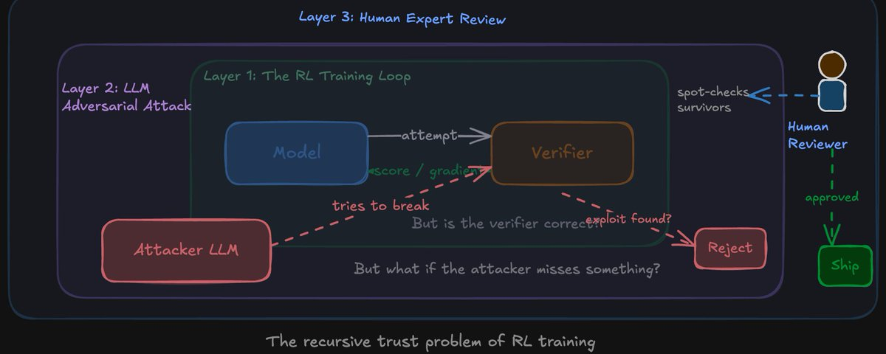
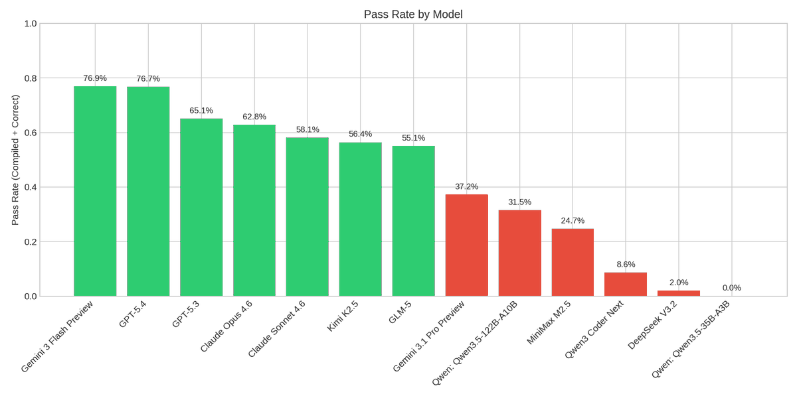
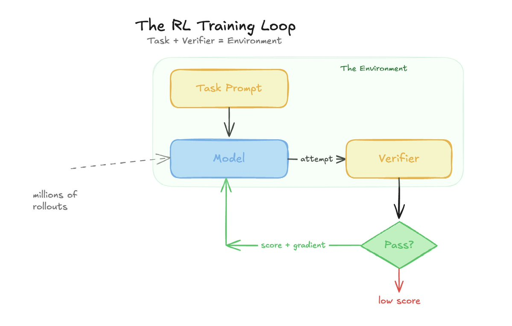
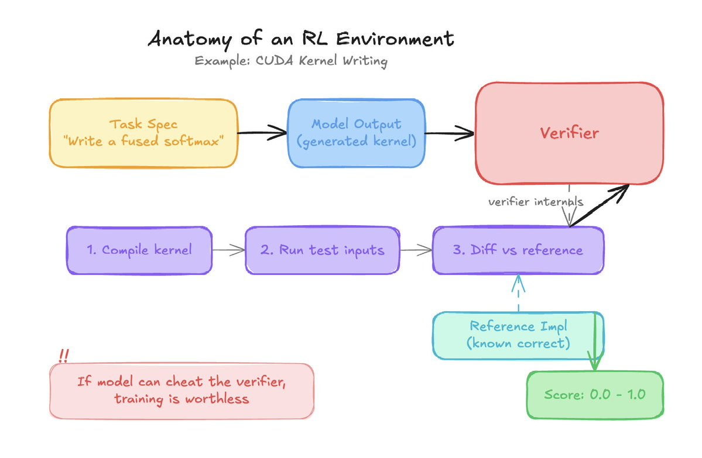
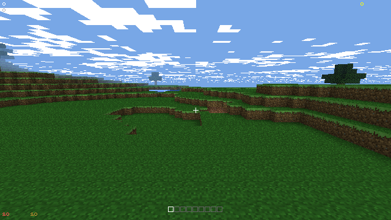
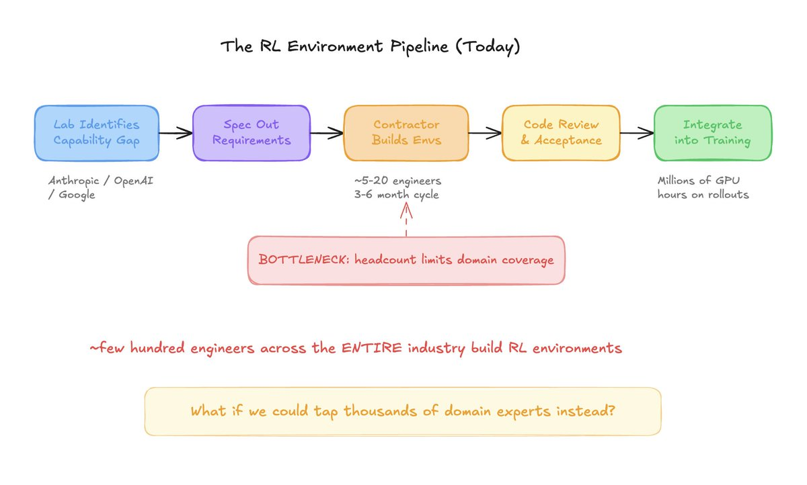
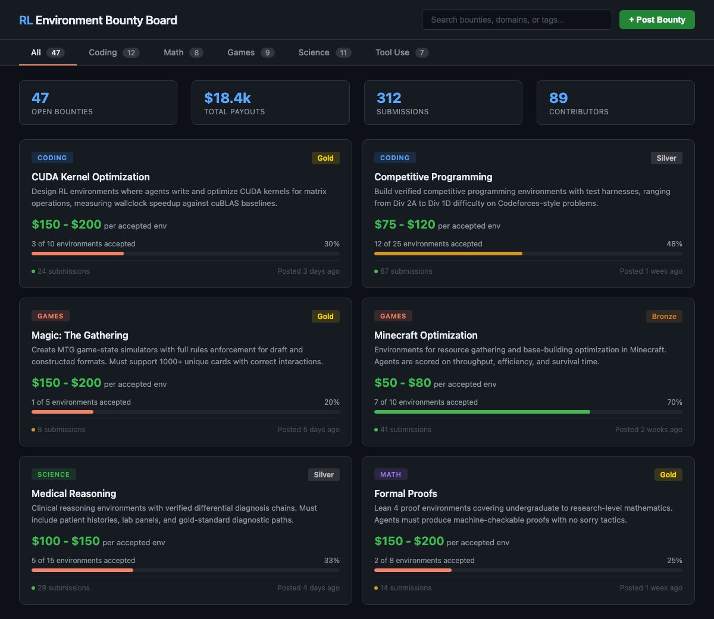
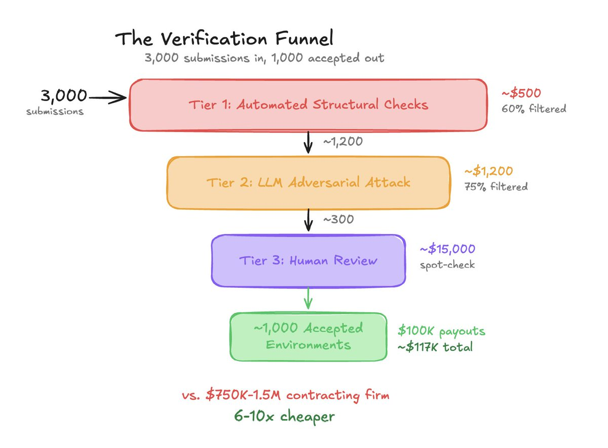
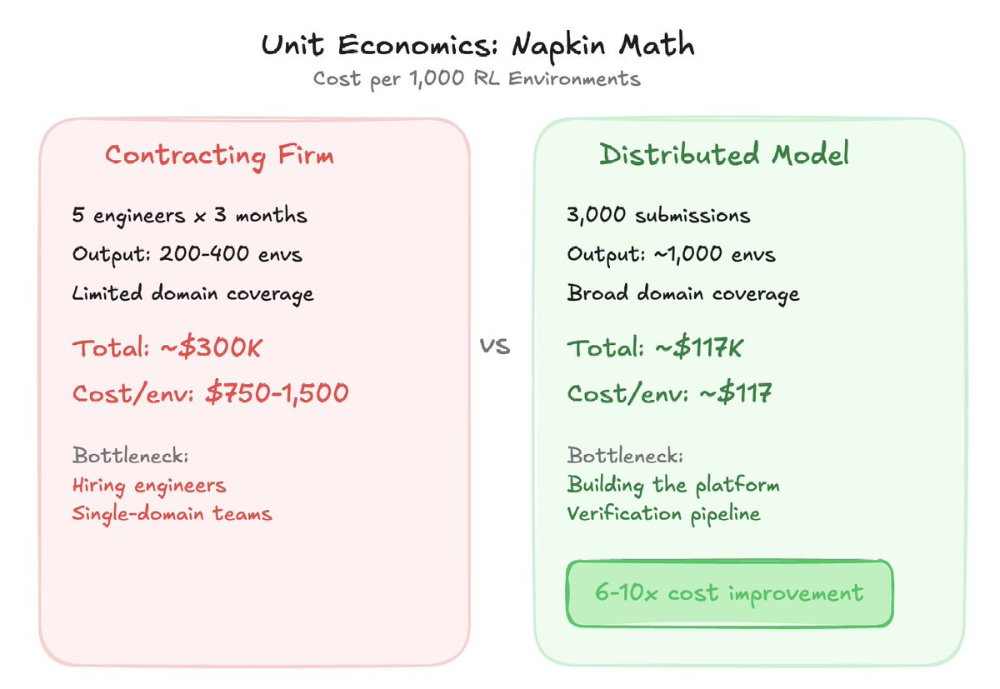
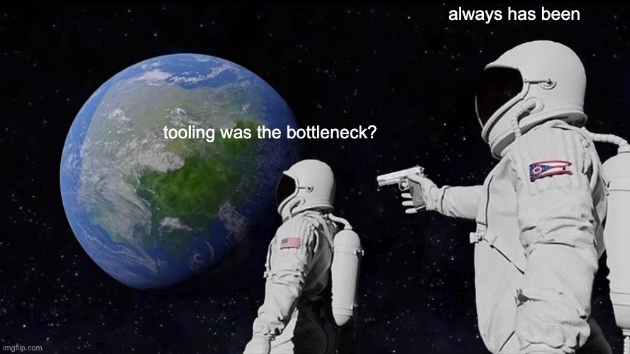

# The RL Environment Business

**Author:** Elliot Arledge ([@elliotarledge](https://x.com/elliotarledge))
**Date:** March 14, 2026
**Source:** [https://x.com/elliotarledge/status/2032753593535574433](https://x.com/elliotarledge/status/2032753593535574433)
**Type:** X Article (long-form post)

## Engagement Stats

| Metric | Count |
|--------|-------|
| Views | 411,874 |
| Likes | 981 |
| Retweets | 84 |
| Replies | 25 |
| Bookmarks | 2,911 |

---

There's a hidden industry behind every frontier model you use. When Claude gets better at coding, when GPT gets better at math, when Gemini gets better at tool use -- that doesn't happen by magic. Someone had to build the training environments that made those improvements possible. And right now, that "someone" is a handful of small, mostly stealth companies operating on contracts with the big labs.

I've spent the last couple years deep in GPU programming -- I made a 12-hour CUDA course for FreeCodeCamp, I'm writing "CUDA for Deep Learning" with Manning, and I built KernelBench v3, a multi-platform GPU kernel benchmark suite. All of that work orbits the same question: how do you rigorously evaluate whether code actually works, and how do you do it at scale? That question is at the heart of RL environment design.

*https://elliotarledge.com/kernelbench-v3 / https://github.com/Infatoshi/KernelBench-v3*

I'm going to explain how this business likely works based on what's publicly known, why it matters, and why I think the next generation of it looks less like boutique contracting firms and more like a massive distributed workforce -- potentially thousands of people building RL environments for whatever domain they're expert in.

## What Even Is an RL Environment?

Let's start from zero.

When you fine-tune a language model with reinforcement learning, you need three things: a task for the model to attempt, a way to score the model's output, and a feedback loop that pushes the model toward higher scores over millions of attempts.

The "task + scorer" combination is the RL environment. Think of it like a gym for the model.

Here's a concrete example. Say you want your model to get better at writing CUDA kernels. Your environment might look like this:

- **Task:** "Write a CUDA kernel that performs a fused softmax operation on a tensor of shape (B, H, S, S) where B=batch, H=heads, S=sequence length."
- **Reference implementation:** A correct, optimized kernel that produces known outputs for known inputs.
- **Verifier:** A program that compiles the model's submitted kernel, runs it on a set of test inputs, checks numerical correctness against the reference (within floating point tolerance), and optionally benchmarks throughput.
- **Score:** Binary pass/fail on correctness, or a continuous score based on performance relative to reference.

The model generates thousands of attempts. The verifier scores each one. Gradients flow. The model gets better at writing CUDA kernels. Repeat across hundreds of different kernel tasks and you've meaningfully improved the model's GPU programming ability.

The key constraint: **the verifier must be non-reward-hackable.** If the model can find a shortcut that gets a high score without actually solving the problem -- returning hardcoded outputs, exploiting edge cases in the test suite, finding patterns in the test inputs -- the whole thing breaks. You're training the model to cheat, not to code.

Building a good verifier is harder than it sounds. I know this firsthand.

## Why Verifiers Are Hard: Lessons from Benchmarking and Minecraft

When I built KernelBench v3, the core challenge wasn't writing the kernels -- it was building reliable evaluation. You need test cases that cover edge cases, numerical tolerances that are tight enough to catch bugs but loose enough to handle legitimate floating point variation across hardware, and performance baselines that are actually fair. Every corner you cut in the verifier is a potential reward hack waiting to happen when a model trains against it.

But kernel verification is honestly the *easy* case. You have deterministic inputs, deterministic (ish) outputs, and clear correctness criteria. It gets way harder in open-ended domains.

I've been trying to vibe-code a Minecraft clone recently, and it's a perfect illustration of the verifier problem. Minecraft has this deceptively complex game logic -- block physics, crafting recipes, mob AI, redstone circuits, inventory management. If you wanted to build an RL environment where a model learns to play Minecraft (collect resources, craft items, survive, progress toward the Ender Dragon), your verifier needs to simulate all of that correctly. And "correctly" is a moving target -- does your verifier handle the edge case where a creeper blows up the crafting table the model was about to use? Does it account for tick-perfect timing on furnace smelting?

My experience trying to get AI to help me build even a simplified Minecraft clone made something very clear: **the tooling is the bottleneck, not the concept.** The idea of "train a model to play Minecraft" is straightforward. The reality of building a headless Minecraft server that runs fast enough for millions of RL rollouts, with a verifier that correctly evaluates whether the model actually achieved its objective, is a massive engineering challenge. And that's for a game with well-defined rules -- imagine trying to build verifiers for creative writing, or strategic negotiation, or scientific reasoning.

*Half-working vibe-coded Minecraft clone = "this is harder than it looks"*

This is why some domains are just out of scope for RL environments right now. Not because the domain isn't important, but because we don't have the tooling to build reliable verifiers for it. The verifier problem is fundamentally a tooling problem, and the domains where RL training works best are the ones where verification is cheapest and most reliable -- code execution, math proofs, game outcomes with deterministic rules.

## How the Business Probably Works Today

Based on public information -- job postings, research papers, conference talks, and the general structure of how labs operate -- the RL environment pipeline at a frontier lab likely looks roughly like this:

*Today's Pipeline*

1. **The lab identifies capability gaps.** Researchers decide they want their model to get better at, say, multi-file codebase navigation. Or long-horizon planning. Or formal proof writing.
2. **They spec out environment requirements.** What domains, what difficulty distribution, what the verifier needs to check, what edge cases matter.
3. **A contracting company builds the environments.** A small team of engineers -- often domain experts like GPU programmers building kernel environments, or competitive programmers building algorithm environments -- designs and implements the full environment suite: task generators, reference solutions, verifiers, test harnesses.
4. **Code review and acceptance.** The lab reviews the submitted environments. They check for reward-hacking vulnerabilities, test coverage, correctness of reference solutions, and whether the difficulty distribution actually matches what they need.
5. **Integration into training.** Accepted environments get plugged into the lab's RL training infrastructure. The model runs millions of rollouts against these environments. This is the expensive part -- compute-wise -- but it's entirely automated. No humans in the loop at training time.

The contractor gets paid on acceptance. The lab gets a capability improvement.

The problem? **This doesn't scale.**

Right now we're talking about maybe a few hundred engineers across the entire industry building RL environments for frontier models. The demand for diverse, high-quality environments is growing way faster than the supply of people building them. Every new domain the labs want to improve requires domain-specific expertise. You can't have the same CUDA kernel expert also building environments for medical reasoning or legal analysis or game theory.

## The Distributed Model: What If Thousands of People Built Environments?

Here's where it gets interesting. xAI has their tutor program -- they hire people to do RLHF data, basically rating model outputs and providing demonstrations. That's the human feedback side. But the same organizational model could work for RL environments.

Imagine this: instead of contracting a company to build kernel environments, you post a bounty. "We need 500 RL environments for Python algorithm challenges, difficulty range Codeforces 1200-1800, verifier must handle edge cases X, Y, Z, payout $50-200 per accepted environment." Thousands of competitive programmers around the world see the bounty and start building.

Or: "We need RL environments for Magic: The Gathering game states where the model must identify optimal plays. Verifier: Monte Carlo simulation of 10,000 games from the given state to confirm the chosen play has highest win rate." Now you've tapped into an entirely different talent pool -- game theorists, MTG pros, hobbyist programmers who happen to be great at both coding and card games.

Or even: "We need RL environments for Minecraft resource optimization. Given a world seed and starting position, the model must collect and craft a target set of items in minimum ticks. Verifier: run the model's action sequence in a headless Minecraft server and check inventory state." (Good luck with the verifier on this one -- but that's what makes it interesting.)

*Claude Code generated bounty board UI mockup.*

The point is that **domain expertise is distributed across the population in a way that doesn't match the hiring pipeline of a 20-person contracting firm.** The person best qualified to build a medical reasoning environment is probably a doctor who codes on the side, not a full-time ML engineer.

## The Hard Part: Verification at Scale

Okay, but here's the thing everyone immediately asks: **how do you verify the verifiers?**

Today's approach is thorough human code review by a small team of senior engineers. They inspect the verifier logic, try to break it, check edge cases. That works when you're reviewing 50 environments a quarter. It doesn't work when you're reviewing 5,000 a month from anonymous contributors.

You need a verification pipeline that's mostly automated, with humans only at the final gate. Here's how I think it could work in tiers:

*The Verification funnel*

**Tier 1 -- Automated structural checks (cost: near zero)**

- Does the environment conform to the API spec?
- Does the verifier compile and run?
- Does it correctly accept known-good solutions?
- Does it correctly reject known-bad solutions (empty output, random output, trivially wrong output)?
- Does the test suite have sufficient coverage?
- Are there obvious code smells -- hardcoded values, suspiciously simple logic, etc.?

This catches maybe 60% of bad submissions. The classic "verifier that always returns true" dies here.

**Tier 2 -- LLM adversarial attack (cost: ~$0.50-2.00 per environment)**

This is where it gets fun. You take the submitted environment and you literally ask a frontier model to break it. "Here is a verifier for CUDA kernel correctness. Find a submission that passes the verifier without actually implementing a correct kernel." The model generates adversarial solutions. If any of them pass the verifier without being correct, the environment fails review.

Current models are surprisingly good at this. They can identify test suite gaps, find edge cases the verifier doesn't handle, and generate reward-hacking exploits. Using LLMs to attack RL environments is honestly one of the highest-leverage applications of current models that nobody's really talking about.

You run this from multiple angles -- different attack strategies, different models, maybe even fine-tune an attacker model specifically for finding verifier vulnerabilities.

**Tier 3 -- Human expert review (cost: $20-100 per environment)**

Only environments that survive Tier 1 and Tier 2 reach a human reviewer. At this point, you're looking at maybe 10-20% of original submissions. The human checks for subtle issues that automated systems miss -- is the difficulty calibration right? Is the task distribution representative? Are there implicit biases in the test cases?

The math on this works out. If you're paying contributors $50-200 per accepted environment and spending $25-100 on the full verification pipeline per submission, your all-in cost per verified environment is maybe $75-300. That's dramatically cheaper than having a contracting firm build them from scratch at $500-2000+ per environment (rough estimate including salary overhead, management, etc.).

## The Unit Economics (Napkin Math)

Let's sketch this out. Imagine you want 1,000 new RL environments for coding tasks.

*Unit Economics Comparison*

**Contracting firm model:**

- ~5 engineers for ~3 months = ~$300K fully loaded
- Output: ~200-400 high-quality environments
- Cost per environment: $750-1,500
- Bottleneck: hiring and retaining engineers, limited domain coverage

**Distributed model:**

- Post bounties, receive ~3,000 submissions (assuming ~33% attempt rate on a pool of people who see it)
- Tier 1 automated filtering: ~$500 compute (trivial)
- Tier 2 LLM adversarial review on ~1,200 surviving submissions: ~$1,200 (at ~$1/environment, call it maybe 500K input tokens and 200K output tokens per environment across multiple attack runs at current API rates)
- Tier 3 human review on ~300 survivors: ~$15,000 (at ~$50/review)
- Payouts on ~1,000 accepted environments at avg $100 each: $100,000
- **Total: ~$117,000**
- Cost per environment: ~$117
- Bottleneck: building the platform and verification pipeline

That's roughly a 6-10x cost improvement, and you get broader domain coverage because you're tapping a much larger talent pool. The numbers are rough -- the real costs depend heavily on acceptance rates, payout structure, and how good your automated verification gets -- but the directional economics are pretty clear.

The compute cost of actually *training* on these environments is a separate budget entirely and dwarfs the environment creation cost. Running RL on thousands of GPUs for weeks costs millions. The environments themselves are a small fraction of total training spend, which means even modest efficiency gains in environment creation free up budget for more training compute.

## Trust, Bad Actors, and the Security Model

The elephant in the room: what if someone submits a deliberately backdoored environment?

The threat model has a few levels:

**Level 1 -- Lazy fraud.** Someone submits garbage to try to collect bounties. Tier 1 automated checks catch this trivially.

**Level 2 -- Clever reward hacking.** Someone submits an environment where the verifier looks correct but has a subtle hole that a model could exploit during training. This is the main threat. Tier 2 LLM attacks are specifically designed to catch this -- you're essentially fuzzing the verifier.

**Level 3 -- Adversarial poisoning.** A state actor or competitor submits environments specifically designed to introduce subtle biases or vulnerabilities into the trained model. This is the nightmare scenario and honestly, no fully automated system will catch everything here. This is why you still need Tier 3 human review, and why the highest-sensitivity domains (safety-relevant training, alignment-relevant behaviors) should probably stay with trusted, vetted teams.

The practical defense is a reputation system. New contributors start with low-value, low-risk bounties. Their environments get maximum scrutiny. As their acceptance rate increases and their work proves reliable over time, they get access to higher-value bounties with slightly less overhead review. One caught bad submission tanks your reputation permanently.

This is essentially how open source works. New contributors to Linux don't get commit access to the kernel scheduler. They fix typos in documentation. Trust is earned through consistent good work.

## What's Actually Out of Scope (For Now)

Not every domain can have an RL environment. Domains where RL environments work well have a few properties: the task has a clear objective, the verifier can run fast (you need millions of rollouts), and correctness is unambiguous. Code execution, math, games with defined rules, and formal proofs all fit this mold.

Domains that are currently out of scope -- or at least very hard -- include anything where evaluation is subjective (creative writing, persuasion, design), anything where the simulation environment itself is prohibitively expensive to build or run (full-fidelity Minecraft, real-world robotics without sim-to-real transfer), and anything where the verifier would need superhuman judgment to score correctly.

*I just had to.*

The boundary is moving, though. Better tooling pushes more domains into scope. A year ago, multi-step tool use was hard to build environments for. Now it's tractable. Two years from now, maybe someone cracks fast headless Minecraft simulation and suddenly game-playing RL is viable at scale.

## What This Means for the Frontier Labs

I think we're at an inflection point. The labs that figure out how to scale RL environment creation will have a meaningful training advantage. It's not about having more compute -- everyone's buying the same GPUs. It's about having better training signal, across more domains, with faster iteration.

Right now, OpenAI, Anthropic, and Google are all doing this through small contracting firms and internal teams. It works, but it's bottlenecked on headcount. A newer lab like xAI, for example (this may be something they should consider given the reconstruction of the company happening as we speak) that builds distributed environment creation into their workflow from day one, with the right verification pipeline and incentive structure layered on top of their existing tutor program, could potentially scale to 10x the environment diversity at a fraction of the cost.

The platform to do this doesn't exist yet. But all the pieces are there: LLMs good enough to do adversarial verification, a huge population of domain experts who'd build environments for $100-200 a pop (or more for the REALLY good ones), and containerized execution environments (think: sandboxed Docker containers where submitted environments run safely) that are commodity infrastructure at this point.

Someone's gonna build this.
