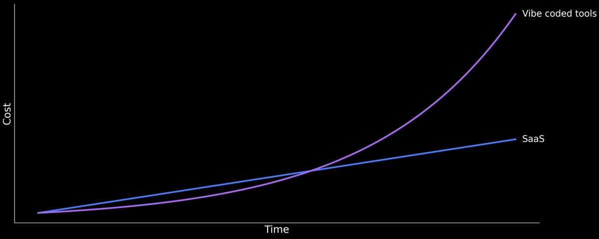

# The Vibe Coding Trap

**Author:** Max Musing (@MaxMusing)
**Date:** February 12, 2026
**Source:** https://x.com/MaxMusing/status/2021990855741936072
**Stats:** 113 replies, 1,351 likes

---

There's a popular narrative on X right now that AI can build software so quickly and cheaply that SaaS is dead (or will be soon).

Why pay for Linear when AI can build a project tracker in an afternoon? Why pay Stripe $30k/year when you can vibe code your own billing system in a weekend? The cost of building software has collapsed to near zero, therefore the value of selling software has collapsed to near zero. QED, SaaS is dead.

This sounds right, but it's not. It confuses the cost of building software with the cost of owning software. These are very different things.

## Ownership Is a Liability

Ownership of software is not an asset. It's a liability. SaaS is commercial real estate for software. You think you're paying for the code. You're not. You're paying for the operational surface area that you now don't have to think about. After all, the "S" in SaaS stands for "service."

That weekend you spent vibe coding a billing system? Congratulations, you now own a billing system. Here is a (partial) list of things you also now own:

- You own the tax compliance updates when VAT rules change in the EU
- You own the PCI audit conversation when your enterprise lead asks who maintains your payment infrastructure
- You own the bug where a customer in Turkey got charged 1,000,000 times too much because you didn't know about their latest currency redenomination

## The Trap

As AI makes engineers more productive, the value of each engineering hour goes up, not down. If your engineers can ship 5x more product per hour, every hour they spend maintaining your internal admin panel or debugging your homegrown BI platform is 5x more expensive than it used to be.

The more productive AI makes your team, the more costly it becomes to waste their time on undifferentiated internal software. This is the vibe coding trap.

It makes going from 0 to 1 cheaper but 1 to infinity much more expensive.

## SaaS Isn't Dead -- Mediocre SaaS Is

This doesn't mean the SaaS industry isn't going to change -- something is happening, but it's not the death of SaaS.

The SaaS products that will thrive are those where the gap between MVP and "actually good product" is enormous -- like Stripe, WorkOS, and Cloudflare -- which are valuable not because they're hard to build, but because they're hard to own. They need to accumulate thousands of correct product decisions, maintain operational excellence, evolve with a changing ecosystem, and do all of that continuously, forever.

---

*Note: This article was originally published as an X Article linked from the tweet above. The full article content was reconstructed from multiple sources as the X Article format requires JavaScript rendering. Some sections may be paraphrased rather than verbatim.*
