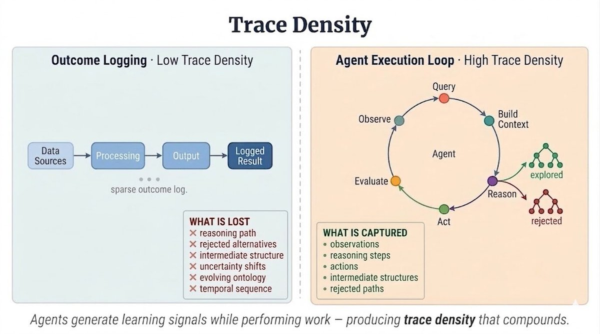

# Trace Density: Why AI Is Phenomenal at Coding

**Author:** Animesh Koratana (@akoratana)
**Date:** March 12, 2026
**Source:** https://x.com/akoratana/status/2032119242276188424
**Stats:** 43 replies, 83 retweets, 221 likes

---

Every industry gave AI their data. Software accidentally gave it something far more valuable.

And that's the reason your engineers are losing their minds over AI, while your sales team thinks it's just hype.

AI is phenomenal at coding. The reasons people give are that models trained on code, that programming languages are precise, that developers pushed the tools hardest. All of those are true, but none of them is the real reason.

The real reason is trace density: the ratio of recorded reasoning to recorded outcomes in a domain.

AI needs to see how decisions get made, not just what the decision was. It needs the trade-offs that were considered and rejected, the failures that were analysed, the reasoning between a problem and an answer. Outcome data tells it what happened, decision trace teaches it how to think.

Software accidentally built the densest trace archive of any profession in human history, and no other field comes close. A few structural things made this possible.

In most professions, seniority replaces explanation. A senior partner does not document their reasoning because their authority is the reasoning. Open source broke this, because a random contributor needed to understand a decision as well as the architect did. Title meant nothing, and everyone justified themselves to the same standard.

A lawyer can find a 1998 contract, or the moment clause 7 changed and even retrospective reasons for why it happened. But you can't find the actual deliberations a judge went through or the decisions he almost took or the arguments he considered. Software can, because the reasoning is attached to the exact moment it was used. Legal documents record the clean conclusion, code commits record the messy process.

In every other domain, feedback runs through a human, a manager, a judge, a senior partner. It is inconsistent, politically filtered, and slow, and by the time it arrives, you cannot reconstruct what you were thinking precisely enough to learn from it. Software feedback arrives in seconds while the reasoning is still live in your head.

The compiler has no biases, the test suite does not have a bad day, and production does not give you a pass because you are senior. In law, a poorly documented decision still stands. In software, it breaks production at 2am and nobody knows why. The machine makes skipping documentation immediate and painful every single time.

30 years of this produced a profession that made reasoning a survival habit, and the byproduct was the richest reasoning archive in human history, which AI then trained on.

Agents in action change this.

When an agent sits inside the execution loop of a business process, it generates trace as it works. Every decision it makes, every structure it discovers, every shift in how it understands the problem gets encoded, not pulled from a system of record, not summarised after the fact, but captured in the embeddings created by the agent's trajectory through the task.

The agent's path through the work becomes the event clock.

This is why how you build agents matters as much as whether you build them, because an agent that just returns outputs produces outcomes, but an agent engineered to record its reasoning as it moves produces something crucial. It starts building trace density that most professions never had, and decision by decision, task by task, the density compounds.

Software got a 30 year head start by accident. Every other domain can start building it deliberately, right now.
