# A sneak preview behind an embedded software factory. I suspect rapid application dev is back.

**Author:** geoff (@GeoffreyHuntley)
**Date:** 2026-03-08
**Source:** https://x.com/GeoffreyHuntley/status/2030683143360119292
**Stats:** 10 replies, 7 retweets, 51 likes, 68 bookmarks, 2,518 views

---

Every second counts; even sixty seconds for CI/CD is too long. The natural destination from here for @latentpatterns is live editing programming memory. Sure, I could move content from the file system to the database.

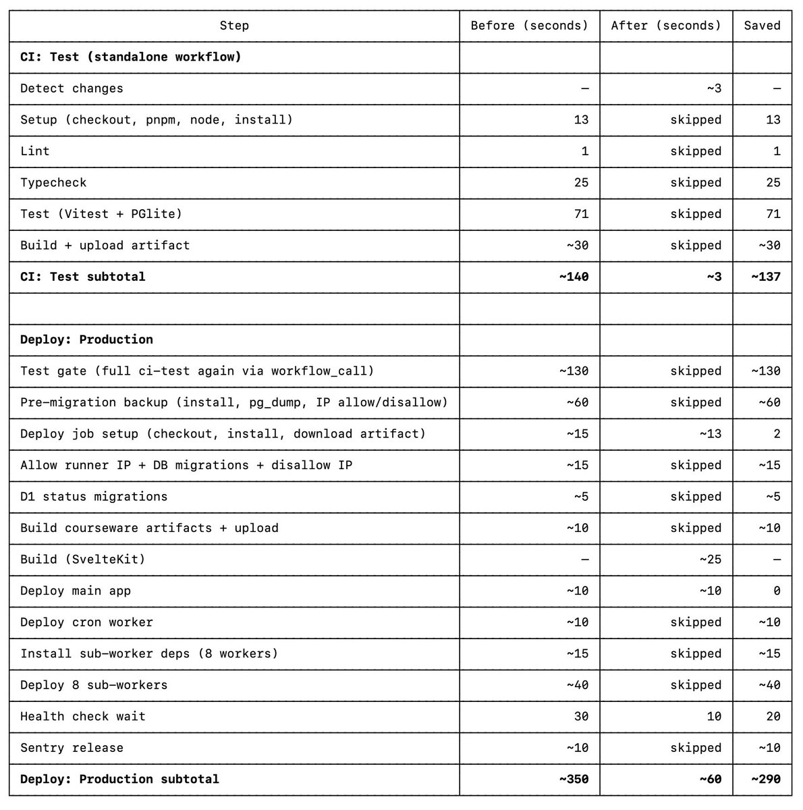

But the more interesting thing is the application code. How can we kill CI/CD as it is today and instead safely live-edit the program's memory?

If you build with the mindset and awareness that inferencing speed will be near-instantaneous in the future, then it just makes sense that the logical destination is for anyone to be able to develop the product from within the product, and for the product to become the IDE itself.

For the last couple of weeks, I've been cryptically tweeting about a hidden mode within @latentpatterns that I use to build @latentpatterns, and how the product is now the IDE. Over the last couple of days, I've opened up and started showing people in SF.

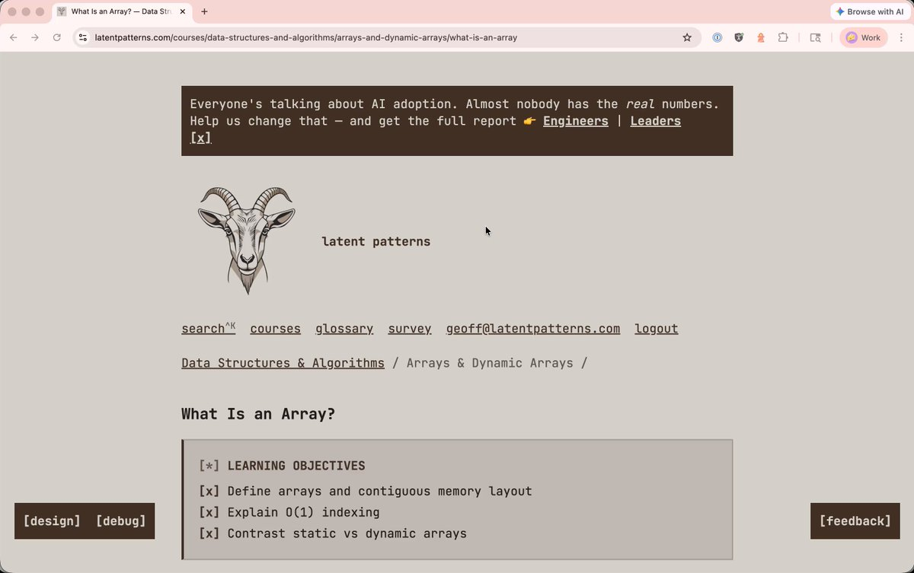

If I want to make a change to something, I pop on designer mode, and this allows me to develop LP in LP. I can make changes to the copy or completely change the application's functionality using the designer substrate directly from within the product, then click the launch agent to ship.

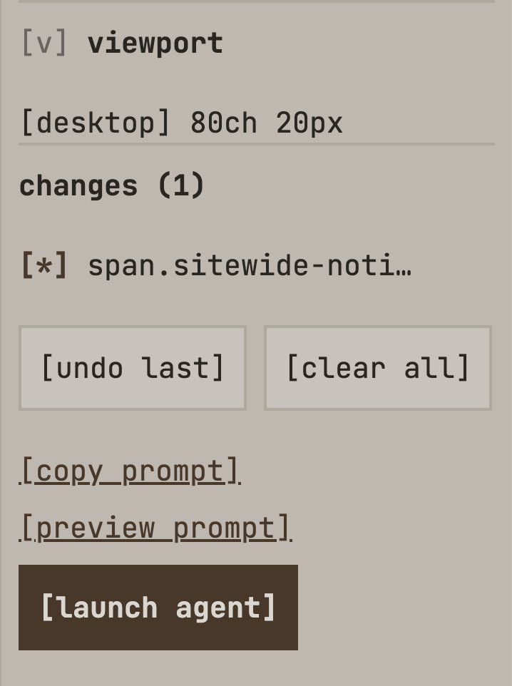

If I click Launch Agent, then it utilises @cursor_ai's new Cloud Agents and Workflow Automations to ship it straight into production using a risk-based approach.

*I guess you're wondering right now why I would not have my own agents for code editing? Well, that's because they're commodities now. Last month, Cursor hooked me up with a preview of their new stuff, and now that it's out, this is how I've been using it. You could do this with any background execution utility service.*

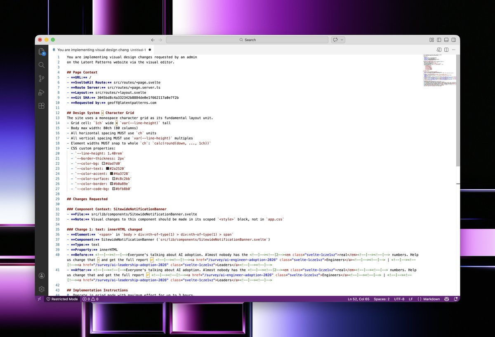

*Here's what the prompt roughly looks like. It depends on what the functionality has been changed, whether it's a content change or an actual application logic change.*

Instead of having a manual code review for everything, I just ship it. If something is high enough on the risk matrix, for example, a database schema migration, then it halts the shipping, and I have to do a manual review. Having said that, I'll repeat something I've said again and again over the years. You need to watch the loops. Watch the inferencing because that's where your learning is at. When I want something built, I just open up my phone and watch the output get made. I'm supervising it. I'm on the loop, not in the loop.

I think we're entering into an era of hyper-personalised software, and our industry actually works in circles. The last time we had hyper-personalised software for business was Microsoft Access, Delphi and Visual Basic. You see, back in the year 2000, every business had hyper-personalised software

They didn't have to bend or conform to someone else's product vision on how they should operate their business. They didn't need Zapier or all these workflow automation systems stitching together SaaS. No, they had rapid application development, and these businesses had hyper-personalised software.

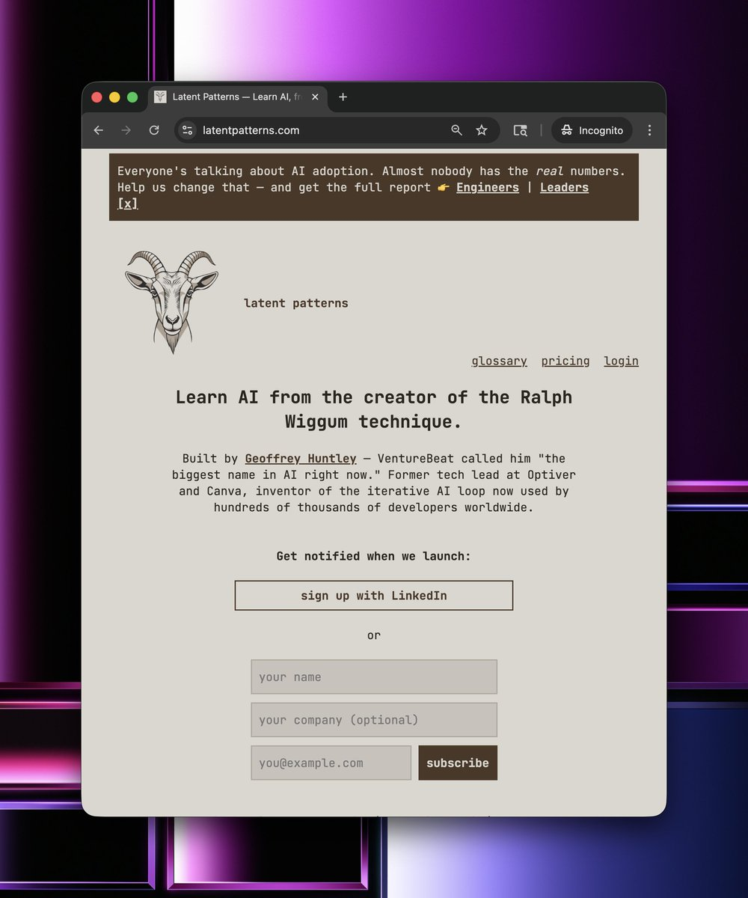

All businesses need the following "widgets" / components:

- Analytics
- CRM
- Support Desk
- Newsletters
- Meeting Scheduling

So, for the last couple of weeks, I've been doing some window shopping...

So the first thing I did was model the notion of a user and have a customer management functionality. Consider how long it would take in traditional software developer to build such functionality. A very simple user management database with a front end. Before AI, this would have taken weeks at most corporations. Before our industry went backwards, this used to take seconds. Back in the year 2000, it used to be seconds. This used to be just Microsoft Access tables.

So let's pull up my own customer record and have a look at what's inside.

Seems pretty from vanilla, right? But do you notice the acquisition section? @latentpatterns has first-party analytics built in and is horizontally and vertically integrated throughout the platform. To do this, I literally just ripped a fart into my coding harness and said, "Hey, I want @posthog. Make it happen".

The 'coming-soon' UTM is my landing page. You see, LP has not launched *yet*. I'm building it out in the open and hitting the pavement in San Francisco, New York, and around the world to validate the business case and am doing steak-and-handshake deals to shape the product through conversations with prospective customers. Doing all the unscalable things. Instead of doing LLM outreach and sales automation that way, I'm doing it the old-fashioned way.

Once someone signs up via LinkedIn or provides information in the three fields above, they get registered as a customer within the database. That might seem quite vanilla, but it's anything but.

Through the usage of @peopledatalabs I can automatically step up who they are, where they work, any achievements they've had in life, and insights such as their likely salary or whether they have decision-making power to purchase. When you take this information and you throw it into a perplexity search, you get this...

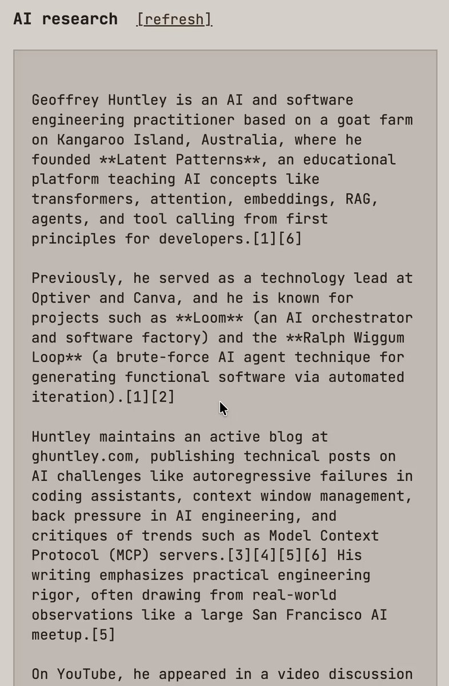

This is baseline functionality that every business needs, and it needs to be first-party within their application. By having all this first-party data in my data tables, I can then layer agents on top of it to automatically prioritise my day via an agentic personal assistant.

The next thing every business needs is a support desk and a customer relationship management tool. Classically, in most companies today, these are two separate things, and you have to build workflow automations to keep them in sync. No. In LP, they are a first-party thing, and they were built by ripping a fart into my coding agent of "Hey, I want @pipedrive, Trello, and @Zendesk"

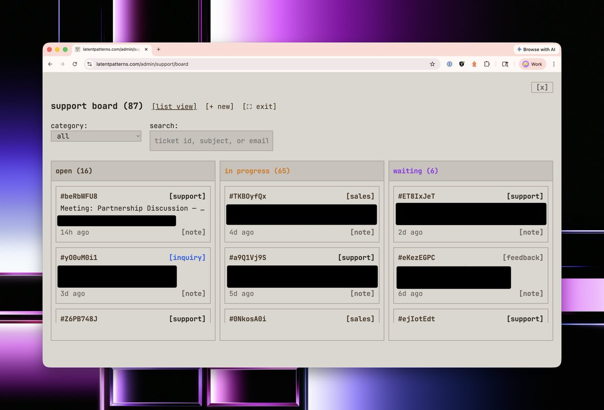

On top of every customer interaction, the analysis is top and centre. It is deliberately there because it forces me to read this information again before I interact with the customer. This information is automatically refreshed by a background job every night.

Underneath this summary for similar reasons is also another summary of all the activity this person has done if they're in my Discord community at https://latentpatterns.com/discord.

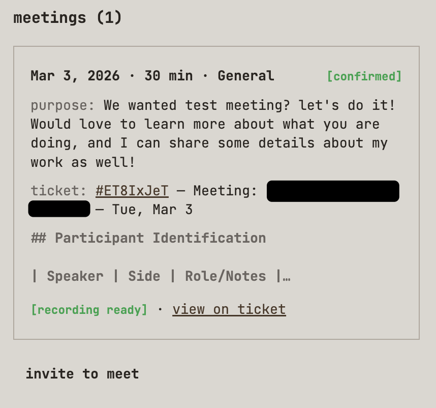

Then, finally, before I even get to the support desk ticket, I have to scroll past and review all the meetings I've had with the person. You see, I ripped a fart into my coding harness, and I asked it to clone @Calendly...

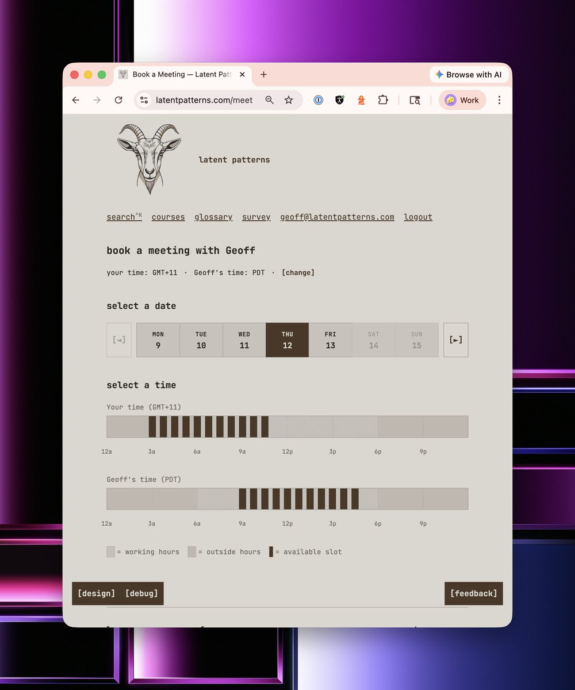

Throughout the website, various marketing funnels generate support desk tickets and offer the option to meet with me.

The calendar integration does exactly what you think it does, but with some twists. You see, I also ripped a fart into my coding harness and said that I want my own meeting transcription bot that automatically joins these meetings and asks for consent to take notes and record the meeting.

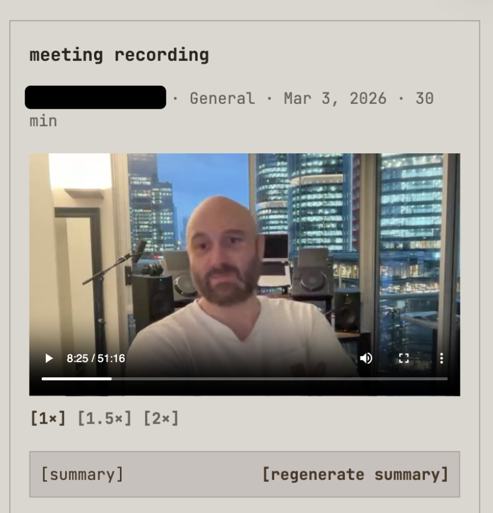

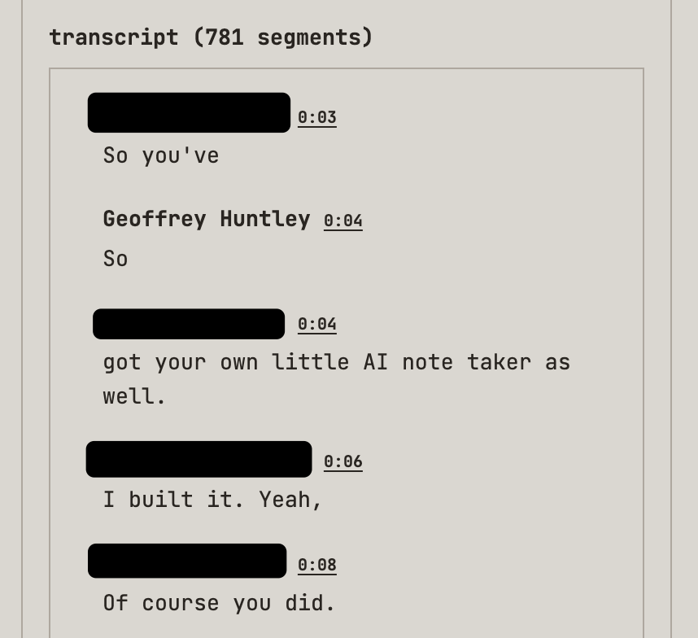

At the end of the meeting, I rip an agent over the transcription and apply sales automation using a mixture of Challenger-based sales and SPIN Selling as a series of LLM prompts. You see, in a previous life, I was also a sales engineer.

Items captured include:

- Competitive Landscape
- Budget & Approval Process
- Seat Sizing & Expansion Potential
- Reseller & Training Partner Potential
- Signals & Sentiment
- Buying signals
- Champion indicators
- Rapport notes
- Information Gaps
- Decisions Made
- Follow-Up Items
- Product Demo (What was shown, Questions They Asked)
- Content Interest & Feature Requests
- Perception of the product demo
- Pain Points & Needs

From there, it's just not so easy, but it's a skill that you can learn. Shut up and become curious. When someone says something, just ask why they said it.

All you need to do is get folks talking, and the more they share about their needs and pain points, the more information the LLM prompts can process.

The more data you can gather, the more effective the follow-up meetings, especially if it's an initial meeting. And with that data, you can then rip an agent over the top of it to do more business automation.

Thanks for reading, folks. I hope you enjoyed this sneak peek of what a model-first company looks like behind the scenes.

If you're new here, I'm Geoff. Some folks might know me as the person who created the "[Ralph Wiggin loop](https://venturebeat.com/technology/how-ralph-wiggum-went-from-the-simpsons-to-the-biggest-name-in-ai-right-now)". I've taken some of the ideas behind "[The Weaving Loom](https://www.youtube.com/watch?v=zX_Wq9wAyxI)" and inverted them, put them into the product itself and have perhaps accidentally created a better @Lovable.

Having said that, the focus for @latentpatterns is about teaching people. I'm living, breathing, and teaching what it means to be a model-first company. I'm building with a recursive latent space, teaching it from my experiences as a one-man company.

LP is an educational platform for learning AI concepts. No fluff, no filler. Just the concepts you need, explained clearly. LP will be launching shortly. If you want to know when we launch, leave your digits [here](https://latentpatterns.com), or if you're a company that wants to discuss employee education, fill in [this form](https://latentpatterns.com/for/enterprise).

I'll be in SF for @daytonaio's [event tomorrow](https://compute.daytona.io/) and hanging around until Wednesday night, and then heading to New York. I'll be in New York for a week, then I'm heading to Auckland, Lithuania, Estonia, Sydney, Australia, Miami, Washington DC and then back to San Fran. It's about 90 days of travel. Cya ya'll all soon.
