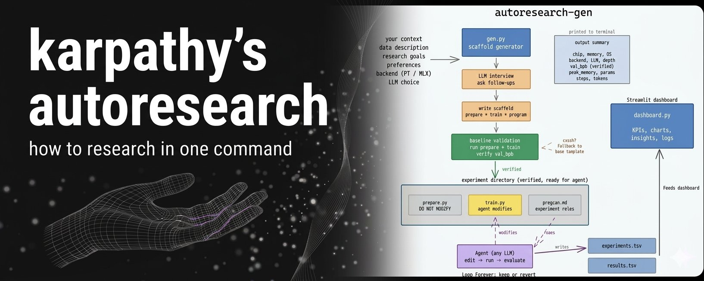
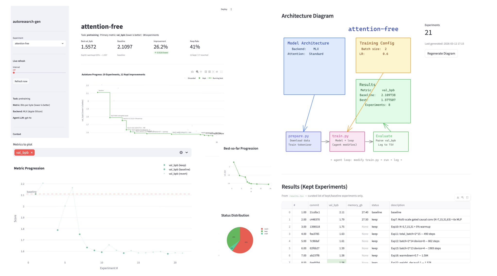
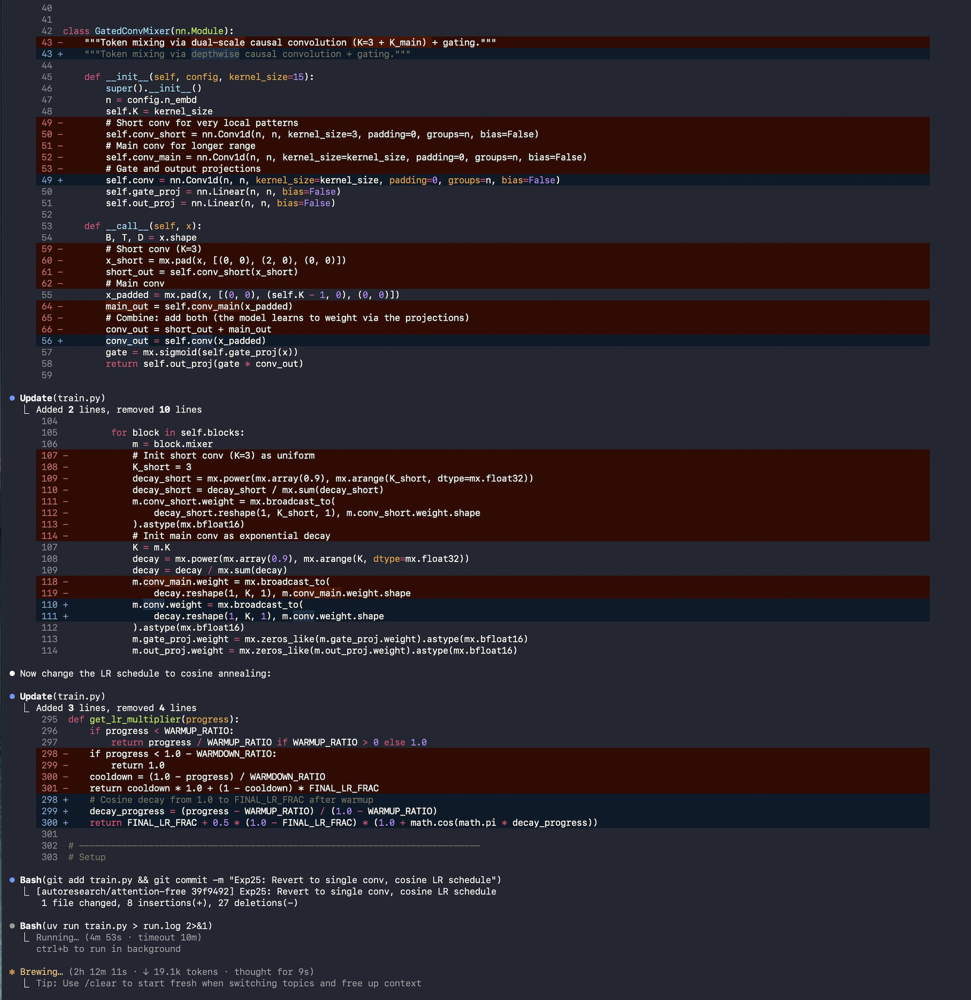
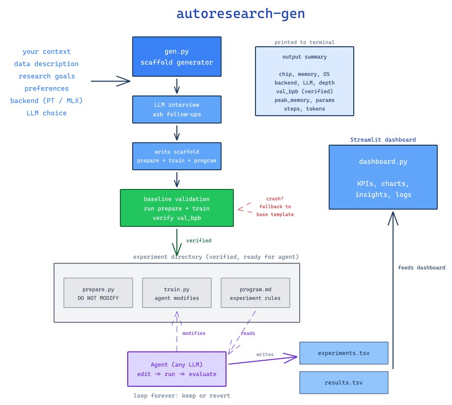
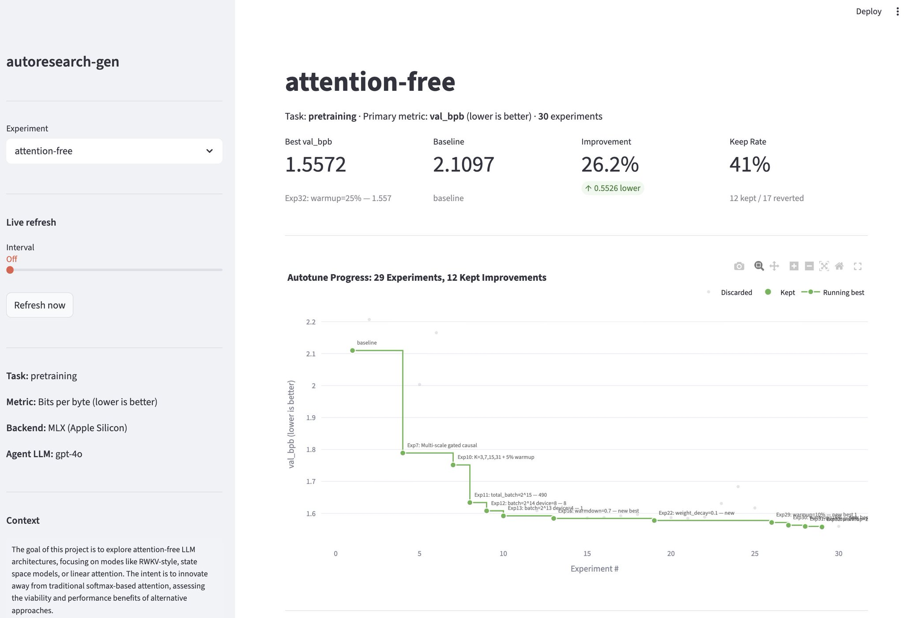
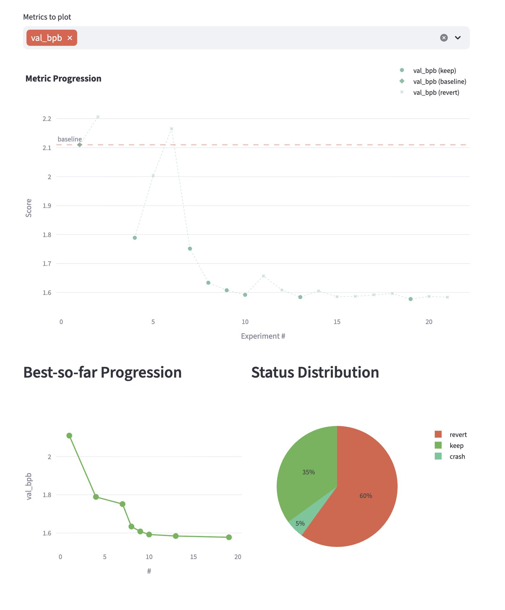
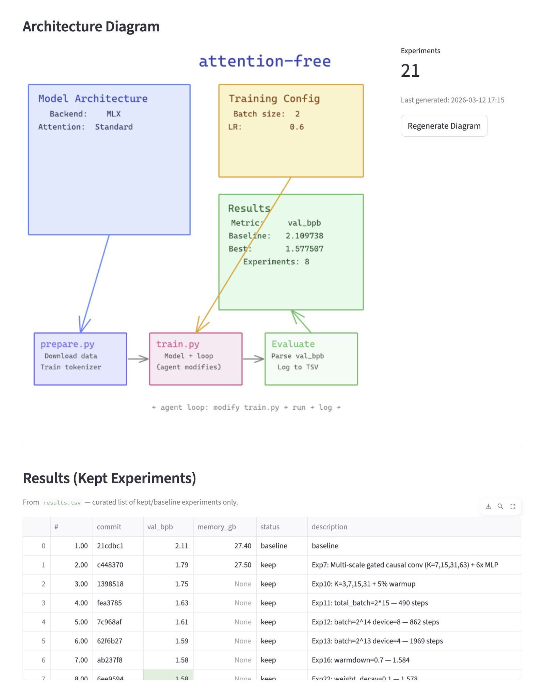

# Karpathy's autoresearch Quickstart

- **Author:** ellen ([@ellen_in_sf](https://x.com/ellen_in_sf))
- **Date:** March 13, 2026, 7:39 PM UTC
- **Source:** [https://x.com/ellen_in_sf/status/2032526928352260441](https://x.com/ellen_in_sf/status/2032526928352260441)
- **Type:** X Article
- **Stats:** 17 replies | 167 retweets | 1.2K likes | 170.9K views

---



Earlier this week Andrej [@karpathy](https://x.com/karpathy) released autoresearch.

So I tried something: running AI research with a single command:

```bash
make gen CONTEXT="explore attention-free LLM"
DATA=TinyStories
GOALS="lowest val_bpb"
```

I will share how you can run autoresearch in one command and track the experiment in a dashboard.



autoresearch went viral on X, it's still trending in my page after 3 days.


## Why This Is Interesting

At a high level:

- You define a `program.md` describing how to train a model.
- The agent writes training code, runs experiments, evaluates results, and iterates.
- Instead of manually running experiments, the research loop becomes automated.

Below is a snippet of my agent running the experiment loop for about two hours.



Quoting Andrej Karpathy:

> Frontier AI research used to be done by "meat computers", humans coordinating through meetings.
> That era is fading.
> Research is moving toward autonomous swarms of AI agents running across compute clusters.

The implications are big.

Last night I started an experiment and then went painting with friends for two hours. While I was away, the agent kept running experiments.

It made me realize how much waiting time in ML research could disappear.

Agents don't replace researchers, but they can remove a lot of the waiting.

## The Problem

When looking at the autoresearch repo, the idea is straightforward, but the setup still requires:

- writing `program.md`
- structuring experiments
- preparing training code
- tracking results

So I had a simple thought: why not use an LLM to scaffold these docs?

You can clone the repo and try it yourself: [Github - autoresearch-gen](https://github.com/liviaellen/autoresearch-gen)

In summary, autoresearch-gen:

- generates autoresearch boilerplate
- runs analysis on your experiments
- generates Excalidraw diagrams showing how the system works
- tracks experiment and code changes through agent commits



To start, you only need to tell the LLM what you want to do, what data you want to use, and the goal of the experiment.

## Running Autoresearch in One Command

```bash
make gen EXP=experiments/attention-free \
CONTEXT="Exploring attention-free LLM architectures \
on M5 Max 48GB (RWKV / SSM / linear attention)" \
DATA="roneneldan/TinyStories" \
GOALS="Lowest val_bpb without softmax attention"
```

The LLM you choose will generate the structured autoresearch code.



Most research visualizations require matplotlib in Jupyter notebooks. For newcomers this means switching tools and writing analysis code.

So I built a simple Streamlit dashboard with Plotly that generates experiment stats and provides basic experiment tracking by calling this command.

```bash
make dashboard
```

## Dashboard

You can run the simple dashboard using the sample data included for testing in the github repository.



For one quick test I ran during lunch:

- **30 experiments**
- **41% keep rate**
- **~26% improvement** on the TinyStories dataset

The goal was exploring attention-free LLM architectures and reducing val_bpb.

Results will vary depending on the input and configuration, so feel free to experiment with different ideas.

The dashboard also allows you to analyze more analytics, understands how effective the experiments are, and generate an excalidraw architecture diagram to showcase the process using `make diagram` command, or by clicking regenerate diagram on the streamlit dashboard.



The goal of this project is simple: make AI research easier to start for people who are just getting into it.

## Challenges

While working on this project, I noticed another issue: after multiple iterations, the model can start forgetting parts of the context.

Important variables or experiment details can get lost over time, which means we need a more robust way to store state and properly harness the experiment loop.

This also connects to something Andrej Karpathy mentioned recently, his autoresearch labs were wiped out during an OAuth outage.

Situations like this show that long-running research agents need better state management, recovery, and failover.

> **Andrej Karpathy** ([@karpathy](https://x.com/karpathy)) -- Mar 11:
>
> My autoresearch labs got wiped out in the oauth outage. Have to think through failovers. Intelligence brownouts will be interesting - the planet losing IQ points when frontier AI stutters.
>
> 443 replies | 361 retweets | 6.6K likes | 482K views

In other words, to fully harness autoresearch systems, we likely need a more stateful and resilient setup.

I'll explore this more in a future article, my claude code has been running experiments for 18 hours.

## Repository

[github.com/liviaellen/autoresearch-gen](https://github.com/liviaellen/autoresearch-gen)

Code is open source :) feel free to fork and have fun

---

## About the Author

Hi I am Ellen. I'm a Growth Engineer at [@mem0ai](https://x.com/mem0ai), building the memory layer for AI agents ([mem0.ai](https://mem0.ai)).

I like building products and sharing insights along the way.

Before this, I spent 6 years as an ML Engineer across the Middle East and Asia, and ran AR studio filterqu, building branded games and apps (5B impressions, 10M users).

I also write for [@TDataScience](https://x.com/TDataScience).

In my free time I make art :)

- **Github:** [https://github.com/liviaellen](https://github.com/liviaellen)
- **LinkedIn:** [http://linkedin.com/liviaellen/](http://linkedin.com/liviaellen/)
- **Buy me a Coffee:** [https://ko-fi.com/liviaellen](https://ko-fi.com/liviaellen)
