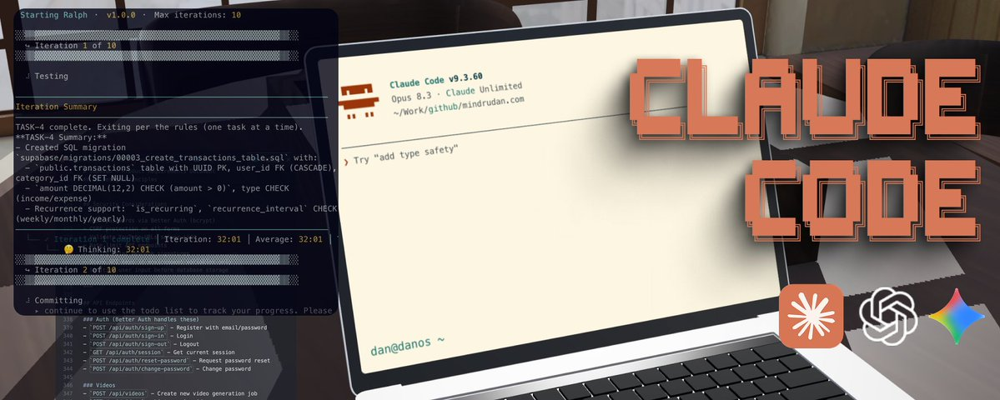
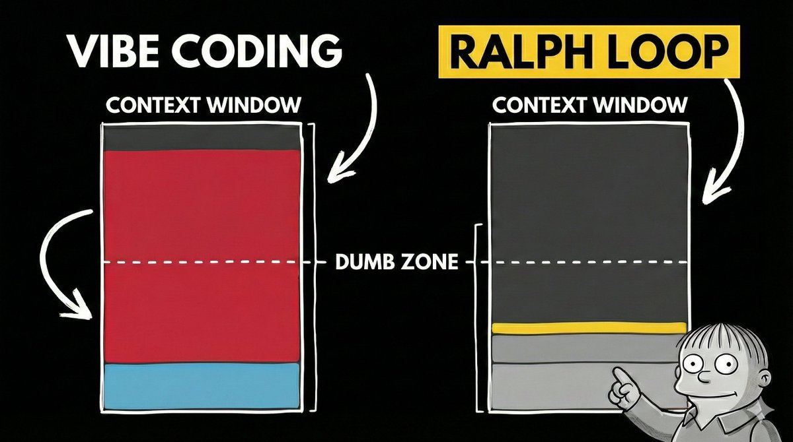
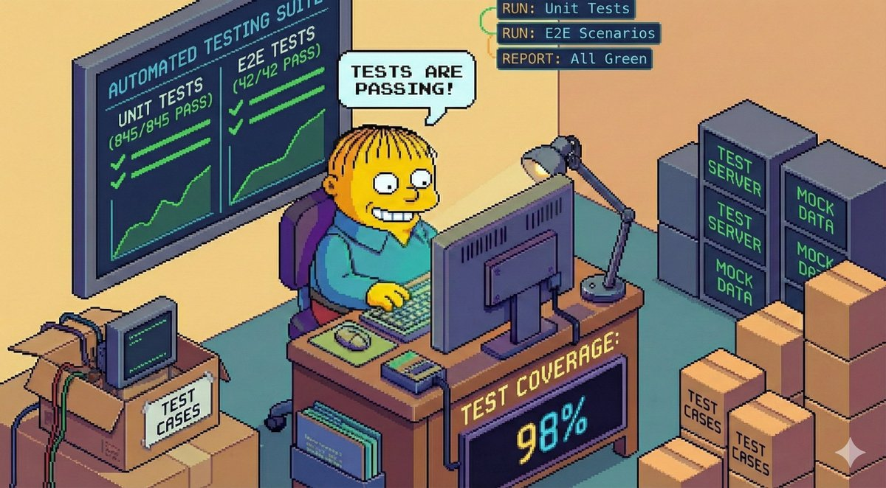

# My Ralph Loop setup for long running AI Agents

**Author:** Dan (@d4m1n)
**Date:** February 23, 2026
**Source:** https://x.com/d4m1n/status/2026032801322356903
**Stats:** 18 replies, 56 retweets, 586 likes, 2,011 bookmarks, 255,682 views

---



I used this workflow to ship four separate projects now. Longest run went **37 hours straight**, completed **250 tasks** from a **2,000-line requirements document**. All while I was AFK.

This guide gets you from zero to a running Ralph Loop in under 10 minutes.

If video is your jam, [here's the full walkthrough](https://www.youtube.com/watch?v=3TL8Ez66I3o).


## What Happened?!

Everyone saved a bunch of Ralph Loop articles. Almost nobody actually set it up.

The concept is simple, but the gap between "cool idea" and "working workflow" is huge. You need the right prompts, the right task structure, the right validation criteria.

Most people never got past the bookmark.

I spent weeks closing that gap. Iterating on prompts, restructuring tasks, tuning the validation loop.

Everything I learned is packaged into a single install command. This guide walks you through it.

## What You'll Need

Two things:

- **[Docker](https://www.docker.com/)** -- the loop runs in a sandboxed container
- **[Claude Code](https://docs.anthropic.com/en/docs/claude-code/overview)** -- Anthropic's CLI for agentic coding

That's it. Everything else is installed automatically.

> You can swap Claude Code for [Codex](https://github.com/openai/codex), [Gemini CLI](https://github.com/google-gemini/gemini-cli), Copilot CLI, Open Code or Kiro. See [full list of supported agentic CLIs here](https://docs.docker.com/ai/sandboxes/agents/).

## 1. Bootstrap Your Project

You don't strictly need this step, but it saves tokens and gives you a better foundation.

Scaffold your project with whatever stack you prefer. For example:

```
npx @tanstack/cli@v0.59.0 create lib --add-ons shadcn,eslint,form,tanstack-query --no-git
```

Regardless of the setup, install [Playwright](https://playwright.dev/) and [Vitest](https://vitest.dev/) for testing. The Ralph Loop uses tests to verify its own work. Without them, the agent moves forward without actually checking if things work.

Prepare your API keys in a **.env** file. Database, payment provider, LLM keys (DO NOT COMMIT / add to .gitignore).

Whatever your project needs. Without these, the agent will skip verifying integrations and you'll have nasty surprises later.

## 2. Install the Ralph Loop

One command:

```
npx @pageai/ralph-loop
```

This creates an **.agent/** directory with everything the loop needs:

```markdown
.agent/
├── PROMPT.md          # Main iteration instructions
├── SUMMARY.md         # Project summary for context
├── STEERING.md        # Steer the agent mid-run
├── tasks.json         # Task lookup table
├── tasks/             # Individual task specifications
├── prd/               # Product requirements documents
├── logs/              # Progress tracking
├── history/           # Iteration outputs
└── skills/            # Reusable agent capabilities
```

## 3. Create Your PRD

This usually is the most difficult part, but I got you.

**The command installed a skill that takes care of all of this + converting to tasks that scale with the loop.**

Open Claude Code and use the included **prd-creator** skill to generate a Product Requirements Document:

```markdown
Use the prd-creator skill to help me create a PRD and task list for these requirements:

You are building an app that does X.

- It should support sign up via email and Google
- It should have a dashboard with a sidebar
- It should integrate with [some API] — see @docs/API_DOCS.md
- Use Next.js, TailwindCSS, shadcn/ui
// ... dump everything in your head
```

Write in your own words. Be specific about UI, flows, integrations, and tech choices. The skill expands your brain dump into a structured PRD, asks clarifying questions, then breaks it into tasks.

Looking for a complete example? [Check the video](https://www.youtube.com/watch?v=3TL8Ez66I3o)

**Don't skip the review.** Read each generated task. If the agent misunderstood something, fix it now. It's much cheaper to correct a task spec than to revert 10 bad commits.

Three tips for better requirements:

1. **Point to exact docs.** Save third-party documentation as markdown files in your project and reference them with **@docs/FILE.md**. This prevents the agent from guessing.
2. **Prepare API keys early.** Write them into **.env** before the loop starts so every integration gets tested for real.
3. **If you're unsure, say so.** Add "Interview me about the payment integration" to your requirements. The agent will ask you the right questions.

## 4. Log In to Docker

The loop runs inside a Docker sandbox. Claude Code gets full permissions in there, but it can't touch your host machine.

```
docker sandbox run claude .
```

Answer yes to bypass permissions mode. Exit. You only need to do this once to authenticate.

## 5. Run the Loop

Start small:

```
./ralph.sh -n 2
```

Watch what it does. Check the commits. If it looks good, scale up:

```
./ralph.sh -n 10
```

When you're confident, let it run overnight:

```
./ralph.sh -n 30
```

That's it. Ralph picks the highest priority task, implements it, runs tests, commits, and moves on. When all tasks pass, it stops.

## Steer Mid-Run

While the loop runs, you can edit **.agent/STEERING.md** to redirect priorities. The agent reads this file at the start of each iteration.

Found a critical bug? Write it in STEERING .md and the agent will handle it before continuing with the task list.

## Review the Output

Ralph leaves a trail:

- **.agent/logs/LOG.md** -- chronological log of completed work
- **.agent/history/** -- full output from each iteration
- **git log** -- every completed task is a commit

If something went wrong, **git revert** the bad commit. The task's tests will fail, and Ralph will re-attempt it on the next run.



## Why The Loop Works Works

Most AI coding sessions die when the context window fills up. The model starts forgetting earlier instructions. Output quality drops. You've hit the "dumb zone."

Ralph avoids this entirely. Each iteration starts with a **fresh context**. The AI reads a task list, picks the next task, implements it, verifies it, commits, and exits. The next iteration starts clean.

State lives in text files and git commits. Not in the context window.

This is how you scale AI coding from "help me write a function" to "build me an app."



## Where Ralph Shines

- **Prototyping and MVPs.** Idea to working app, fast
- **Automated testing.** Writing E2E and unit tests that would take you hours
- **Migrations.** Moving an entire codebase to a new framework version
- **Repetitive tasks.** Bulk refactoring, boilerplate, file restructuring

## Where It Struggles

- **Pixel-perfect design.** Nuanced UX and interaction flows
- **Novel architecture.** Truly unique systems with no patterns to follow
- **Security-critical code.** Where edge cases absolutely cannot exist

## The Important Bit

Your role changes. You stop being the one who writes every line and start being the one who plans, delegates, and reviews.

That means the most important skill in 2026 isn't typing code faster. It's **describing what you want clearly**: UI specs, flows, constraints, integrations. This is the key.

Ralph is just a loop. The real work is in the setup around it and getting requirements + passing criteria right. Figure those out, and the loop handles the rest.

That's exactly why I spent weeks putting this together.

## Links

- [video with step by step instructions and examples](https://www.youtube.com/watch?v=3TL8Ez66I3o)
- **[in-depth article](https://pageai.pro/blog/long-running-ai-coding-agents-ralph-loop)** with all details and pro tips
- **[@pageai/ralph-loop on GitHub](https://github.com/PageAI-Pro/ralph-loop)** scripts, prompts, and skills
- [Supadata transcript API](https://supadata.ai) used in the PRD

---

## Resources

- **[Docker Sandboxes](https://docs.docker.com/ai/sandboxes/)** isolated execution environment
- **[Anthropic's research on long-running agents](https://www.anthropic.com/engineering/effective-harnesses-for-long-running-agents)** the research behind the task format
- **[skills.sh](https://skills.sh/)** additional agent skills
