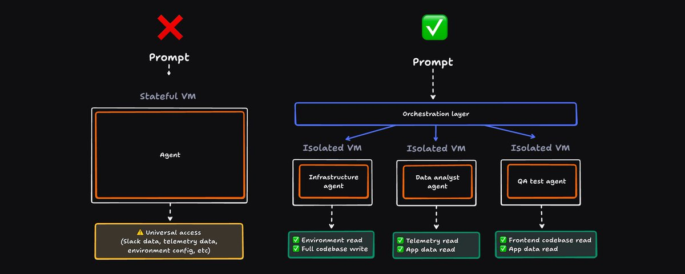

# You're thinking about cloud agents wrong

**Author:** Zach Lloyd (@zachlloydtweets) - Founder @warpdotdev
**Date:** March 10, 2026
**Source:** https://x.com/zachlloydtweets/status/2031501189486121276
**Stats:** 7 replies, 13 retweets, 213 likes, 526 bookmarks, 48,569 views

---

Cloud computers are [all the rage](https://x.com/levie/status/2027884295268991104?s=46) these days, yet they are the wrong abstraction for moving agents to the cloud. Instead of "cloud computers" with universal access to your data, we should be moving towards an abstraction of "cloud agents," with scoped authentication and team orchestration at the core. This distinction is most important for enterprise use cases.

By "cloud computer," I mean the model of an end-user getting a dedicated, long-lived server that runs in the cloud with its own filesystem, toolchain, long-running processes, etc. The key idea is that these machines are stateful and the agent is logged into a bunch of services *as though it was the user* (e.g. into the *user's email, calendar, etc*).

The idea broke into the mainstream with OpenClaw -- partly because people didn't want these agents running on their personal machines, and partly because managing dedicated hardware is a pain.

This cloud computer gives you isolation from your local environment, which is quickly becoming table-stakes for agents to do real work at scale -- completing tasks when you're away from your computer, parallelizing work without fighting for dev server ports, and closing the loop on development tasks via [computer use](https://docs.warp.dev/agent-platform/capabilities/computer-use).

## The problem

The issue isn't with moving to the cloud, it's *how* we're doing so.

We have two problems:

- A small problem: these servers are stateful.
- A bigger problem: the identity and authentication model is wrong.

I won't spend much time on the small problem, but anyone who has built web servers knows to avoid statefulness where they can because it's inherently fragile (you lose state when the server dies) and not scalable. This is why we're using a lambda-based architecture for [Oz](http://oz.dev/), our own "cloud agent" solution.

The bigger problem is that the world we are moving towards is one where you want agents to be acting as themselves, not as the end user. You need multiple agents with their own identities, not one agent that has access to everything acting as the user.

The reason we want this is because we want to be able to:

- Lock down permissions on a per agent basis (e.g. a "Data Analyst agent" should have different permissions from a "GTM agent")
- Get audit trails of what's been done by an agent as opposed to a person (I want to know if the agent deleted my database, or if Greg, the human, deleted it).
- Have shared agent definitions that anyone on a team can launch or configure (and track that info separately).

Dedicated cloud computers don't make this impossible, but they encourage the wrong pattern: a single agent with universal permissions, instead of a fleet of agents with separate permissions and goals.

The right pattern is to think of agents more like users in your system with their own capabilities. If you wanted to make an OpenClaw-type system work with this pattern, you wouldn't give it a persistent computer, you would instead separate out the constituent primitives it needs to do its work:

- A database or other persistent store with roll-based permissions for data access.
- Timers and triggers to spin up agents on this computer.
- Subagents that have their own permission to interact with that data store with the right access levels.

An organization would grant various privileges before running, define tasks to accomplish, and let agents get to work. We've been exploring a manager agent <> subagent pattern for orchestration that works like so:

- The manager agent fires up on some external trigger (schedule, Slack mention, Github issue filed, etc).
- The manager agent fires up to read its instructions.
- The agent begins delegating to subagents.
- Each subagent runs in its own container with its own auditing, permissions, etc.
- Subagents are given a messaging system to communicate as they work, managed via database or distributed file system.
- Everything is tracked, logged, steerable, etc.

For personal OpenClaw use, this is obviously overkill. But for the deployment of agents at scale at an organization, something like this is table stakes.

We may end up supporting a Cloud Computer use case in Oz for simple stuff, but the much more interesting system to figure out is how to deploy agents that scale, and this is where the majority of our focus is going.

---

If you're interested in solving this problem, we are [hiring](https://warp.dev/careers). Come work with us!
