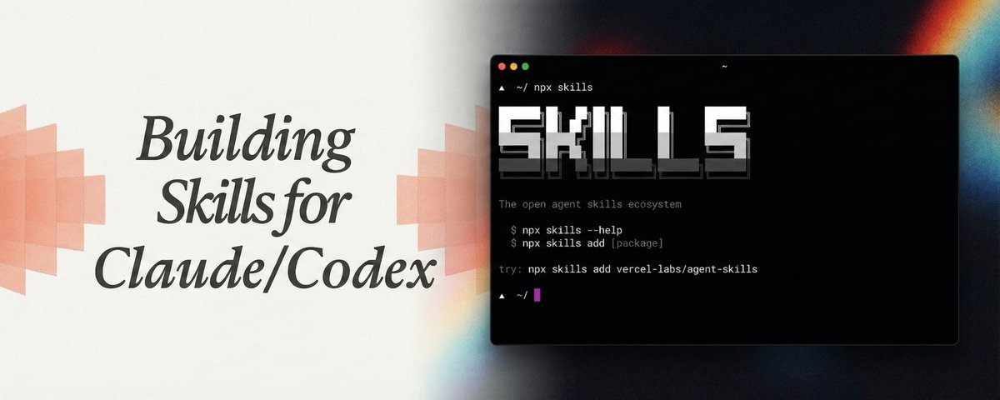

# The Complete Guide to Building Skills for Claude/Codex

**Author:** Rohit (@rohit4verse)
**Date:** February 11, 2026
**Source:** https://x.com/rohit4verse/status/2021622526112358663
**Stats:** 35 replies, 190 retweets, 2,096 likes, 1,027,360 views, 8,005 bookmarks

---



The era of treating ai as a generic chatbot is officially over. while 99% of users are still writing basic prompts, the top 1% are building skills. this is the difference between having a toy and having a specialized, 24/7 employee.

but to get there, you need to stop writing prompts and start shipping code using skills.

here is the complete technical guide to the new skills standard.

launched by anthropic in october 2025, skills are not just instruction they are dynamic, organized packages that allow agents to load context on demand. it was exclusive feature now evolved into an open standard, with major platforms like openai and microsoft adopting the specification, and tools like vercel's [skills.sh](https://skills.sh) cli making skill management accessible to developers worldwide.

## Agent Skills Breakdown

unlike traditional function calling or code execution, skills operate through sophisticated prompt expansion and context modification, they teach the agent how to think about and approach problems rather than simply executing predefined functions.

a skill is deceptively simple in structure:

```
your-skill-name/
├── SKILL.md              # Required - main skill file
├── scripts/              # Optional - executable code
│   ├── process_data.py
│   └── validate.sh
├── references/           # Optional - documentation
│   ├── api-guide.md
│   └── examples/
└── assets/               # Optional - templates, fonts, icons
    └── report-template.md
```

the heart of every skill is the [skill.md](https://skill.md) file, which contains yaml frontmatter for metadata and Markdown content for instructions:

```yaml
---
name: project-workspace-setup
description: Automates complete project workspace creation including pages, databases, and templates. Use when user asks to "set up a new project", "create a workspace", or "initialize a project structure".
---

# Project Workspace Setup

## Instructions
[Step-by-step guidance for Claude to follow]

## Examples
[Concrete usage scenarios]

## Troubleshooting
[Common issues and solutions]
```

skills are very simple and intentional, it makes skills accecssible to non-developers while remaining robust enough for enterprise-scale deployments.

## How Skills Actually Work

understanding how skills work under the hood is crucial for building effective ones. according to a deep technical analysis, skills represent a prompt-based meta-tool architecture that operates fundamentally differently from traditional ai tools.

**the three-level progressive disclosure system**

**level 1 - yaml frontmatter (always loaded):** the skill name and description are injected into claude's system prompt. this provides just enough information for claude to decide when to load the full skill without consuming unnecessary tokens.

**level 2 - [SKILL.md](https://SKILL.md) body (loaded when relevant):** when claude determines a skill is relevant, it loads the complete instructions from the markdown body. this contains detailed step-by-step guidance, examples, and best practices.

**level 3 - linked resources (loaded as needed):** additional files in the scripts/, references/, and assets/ directories are accessed only when specifically needed, further minimizing token usage.

this progressive disclosure approach means skills can be incredibly detailed without overwhelming the context window claude only loads what it needs, when it needs it.

the two-message pattern and meta-communication

one of the most ingenious aspects of skills is how they handle visibility. when claude activates a skill, the system sends two types of messages:

- **user-visible messages** (isMeta: false): these appear in the conversation transcript
- **meta messages** (isMeta: true): these contain the full skill instructions and are sent to claude's api but never shown to users

this separation solves a critical UX problem: users need transparency about which skills are running, but they don't need to see thousands of words of technical instructions cluttering their chat interface.

## Building Your First Skill

step 1: identify your use case

before writing any code, identify 2-3 concrete scenarios your skill should handle. the most common categories are:

**category 1: document & asset creation**
used for creating consistent, high-quality outputs like documents, presentations, or designs. example: the frontend-design skill that produces professional web interfaces instead of generic ai slop.

**category 2: workflow automation**
multi-step processes that benefit from consistent methodology. example: the skill-creator skill that guides users through building new skills.

**category 3: mcp enhancement**
providing workflow guidance on top of model context protocol (mcp) server integrations. example: sentry's code review skill that automatically analyzes and fixes bugs in github pull requests using error monitoring data.

step 2: define success criteria

how will you know your skill works? set measurable targets:

- **triggering accuracy:** skill should load on 90% of relevant queries
- **tool efficiency:** complete workflows in X tool calls (compared to baseline)
- **error rate:** zero failed api calls per workflow
- **consistency:** same task yields similar outputs across sessions

step 3: write effective descriptions

the description field is crucial, it's what claude uses to decide when to load your skill. use this structure:

```
[What it does] + [When to use it] + [Key capabilities]

Good Example:

description: Analyzes Figma design files and generates developer handoff documentation. Use when user uploads .fig files, asks for "design specs", "component documentation", or "design-to-code handoff".

Bad Example:
description: Helps with projects.
```

include trigger phrases users would actually say, mention relevant file types, and clearly state what problem the skill solves.

step 4: structure your instructions

```markdown
---
name: your-skill
description: [Clear, specific description]
---

# Your Skill Name

## Instructions
Step 1: [First major step with clear explanation]
Step 2: [Second major step]
...

## Examples
Example 1: [Common scenario]
User says: "Set up a new marketing campaign"
Actions:
1. Fetch existing campaigns via MCP
2. Create new campaign with provided parameters
Result: Campaign created with confirmation link

## Troubleshooting
Error: [Common error message]
Cause: [Why it happens]
Solution: [How to fix]
```

step 5: test iteratively

the most effective approach is to iterate on a single challenging task until claude succeeds, then extract that approach into your skill. test for:

- **triggering:** does it load when it should? does it avoid false positives?
- **functionality:** does it produce correct outputs consistently?
- **performance:** is it better than the baseline (no skill)?

## The SKILLS.sh CLI

in early 2026, vercel released [skills.sh](https://skills.sh) a command-line tool that has become the npm for ai agents. this cli helps install, and manage skills across different ai platforms.

basic installation:

```bash
# Install a skill from GitHub
npx skills add vercel-labs/agent-skills

# Install a specific skill from a repo
npx skills add vercel-labs/agent-skills@vercel-react-best-practices

# Install from a direct path
npx skills add https://github.com/vercel-labs/agent-skills/tree/main/skills/web-design-guidelines

# List installed skills
npx skills list

# Check for updates
npx skills check

# Update all skills
npx skills update
```

the [skills.sh](https://skills.sh) cli automatically detects which ai coding agents you have installed and configures skills appropriately. It currently supports 35+ agents including claude code, cursor, codex, open code, windsurf and many more.

the platform includes popularity rankings based on installation telemetry, categorized browsing by use case, search functionality for finding relevant skills, direct installation links for one-command setup

## Real-World Use Cases

**case study 1: frontend design transformation**

when tasked with creating a landing page, claude code without the frontend-design skill produces a generic-looking result functional but unmistakably ai-generated. however, with the skill loaded, the same task yields a professional, modern website with sophisticated design patterns, proper spacing, and contemporary UI elements.

this illustrates a key principle: skills encode expert knowledge that goes beyond claude's training data. the frontend-design skill contains distilled wisdom from professional designers color theory, layout principles, accessibility guidelines packaged as procedural knowledge.

**case study 2: enterprise document creation**

anthropic's pre-built skills for powerpoint, excel, word, and pdf demonstrate enterprise-grade capabilities. these skills enable:

- **brand consistency:** automatically apply corporate style guides
- **template adherence:** follow organizational document structures
- **formula intelligence:** generate complex excel formulas correctly
- **pdf form filling:** programmatically complete fillable pdf forms

organizations using these skills report tasks that previously took 30+ minutes now complete in under 3 minutes.

**case study 3: multi-mcp orchestration**

consider a design-to-development workflow that spans multiple services:

```yaml
Phase 1: Design Export (Figma MCP)
- Export design assets from Figma
- Generate design specifications
- Create asset manifest

Phase 2: Asset Storage (Google Drive MCP)
- Create project folder
- Upload all assets
- Generate shareable links

Phase 3: Task Creation (Linear MCP)
- Create development tasks
- Attach asset links to tasks
- Assign to engineering team

Phase 4: Notification (Slack MCP)
- Post handoff summary
- Include asset links and task references
```

a skill orchestrating this workflow eliminates the need for manual coordination, ensures steps happen in the correct order, and handles error recovery automatically.

## Advanced Patterns and Best Practices

pattern 1: context-aware tool selection

smart skills adapt based on context. for file storage:

```markdown
Decision Tree:
1. Check file type and size
2. Determine best storage:
   - Large files (>10MB): Cloud storage MCP
   - Collaborative docs: Notion/Docs MCP
   - Code files: GitHub MCP
   - Temporary files: Local storage
3. Execute with appropriate tool
4. Explain choice to user
```

this pattern provides transparency while optimizing for the specific use case.

pattern 2: domain-specific intelligence

skills can embed specialized knowledge. a financial compliance skill might:

```markdown
Before Processing (Compliance Check):
1. Fetch transaction details via MCP
2. Apply compliance rules:
   - Check sanctions lists
   - Verify jurisdiction allowances
   - Assess risk level
3. Document compliance decision

Processing:
IF compliance passed:
  - Process transaction
  - Apply fraud checks
ELSE:
  - Flag for review
  - Create compliance case
```

this embeds regulatory expertise that claude doesn't inherently possess.

pattern 3: iterative refinement

for quality-critical outputs:

```markdown
Initial Draft:
- Generate first version
- Save to temporary file

Quality Check:
- Run validation script
- Identify issues

Refinement Loop:
- Address each issue
- Regenerate affected sections
- Re-validate
- Repeat until quality threshold met
```

this pattern is particularly effective for document generation, code review, and data analysis.

## Security and Trust Considerations

skills are powerful, they can execute code and invoke tools. this power demands careful security considerations:

the trust model

anthropic strongly recommends using skills only from trusted sources:

- **anthropic-created skills:** professionally maintained and verified
- **self-created skills:** you control the code
- **partner skills:** from verified commercial partners

community skills should be reviewed before installation, as a malicious skill could direct claude to execute unintended operations.

restricted capabilities

skills run in controlled environments:

- **[claude.ai](https://claude.ai):** restricted to pre-installed packages, limited network access
- **claude code:** full network access but local to user's machine
- **api:** runs in code execution container with configurable permissions

the yaml frontmatter can specify allowed-tools to limit which api's a skill can access:

```yaml
allowed-tools: "Bash(python:*) Bash(npm:*) WebFetch"
```

## The Future of Agent Skills

the ai industry is shifting focus from raw model capabilities to practical utility.

skills represent this evolution moving from impressive demos to production workflows that deliver measurable business value.

based on current trajectories:

**1. skills as competitive differentiator**
companies with robust skill libraries will have a productivity advantage. early movers are building internal skill repositories as strategic assets.

**2. skill marketplaces**
we're already seeing commercial skill marketplaces emerge, similar to app stores, where specialized skills can be purchased for specific industries or use cases.

**3. ai-assisted skill creation**
the skill-creator skill demonstrates ai building ai capabilities. this recursive improvement will accelerate future versions might generate complex skills from natural language descriptions.

**4. skills for agent orchestration**
as multi-agent systems become more common, skills will evolve to coordinate multiple ai agents working in concert on complex projects.

**5. regulatory and compliance skills**
in highly regulated industries (finance, healthcare, legal), skills encoding compliance rules and audit trails will become essential.

## Practical Recommendations

for individual developers:

**start small:** build a skill for something you do repeatedly. the time investment pays off quickly when you eliminate repetitive work.

**use the skill-creator:** anthropic's skill-creator skill (available in [claude.ai](https://claude.ai) and claude code) can scaffold your first skill in 15-30 minutes.

**join the community:** explore the skills directory at [skills.sh](https://skills.sh), install popular skills, and learn from real-world examples.

for teams and organizations:

**identify high-value workflows:** where do team members repeatedly explain the same processes to ai? those are prime skill candidates.

**create a skills repository:** version control your organizational skills in Git. share them across teams and iterate based on feedback.

**standardize on the open spec:** build skills using the open standard to ensure portability as the ai landscape evolves.

**invest in skill maintenance:** like any code, skills need updates. assign ownership and establish review processes.

for enterprises

**leverage organizational deployment:** use admin controls to provision skills workspace-wide for consistent operations.

**partner with vendors:** many saas tools now offer official skills (atlassian, notion, figma, etc.). these integrate seamlessly with your existing workflows.

**develop compliance skills:** encode regulatory requirements as skills to ensure ai-assisted work meets standards.

**measure roi:** track time savings, error reduction, and consistency improvements. skills should demonstrate clear business value.

## Troubleshooting Common Issues

**skill won't trigger**

**problem:** skill never loads automatically
**solution:** revise your description to include specific trigger phrases users would actually say. test variations of how users might phrase the request.

**skill triggers too often**

**problem:** skill loads for irrelevant queries
**solution:** add negative triggers and be more specific about scope. example: do not use for simple data exploration (use data-viz skill instead).

**instructions not followed**

**problem:** skill loads but claude doesn't follow the instructions
**solution:**

- keep instructions concise with bullet points
- put critical instructions at the top with headers like `## CRITICAL`:
- for deterministic validation, consider bundling executable scripts instead of relying on natural language

**mcp connection failures**

**problem:** skill loads but mcp calls fail
**solution:**

- verify mcp server is connected (settings > extensions)
- check api keys and authentication
- test mcp independently without the skill
- verify tool names match mcp server documentation exactly (case-sensitive)

## Conclusion

agent skills represent a fundamental evolution in how we work with ai. instead of treating each conversation as a blank slate, skills enable us to build up organizational knowledge, encode best practices, and create specialized ai assistants that truly understand our domains.

the open standard ensures this isn't a proprietary lock-in, it's an ecosystem where innovation can flourish. whether you're a solo developer building productivity tools, a team standardizing workflows, or an enterprise deploying ai at scale, skills provide the framework to transform general-purpose ai into specialized partners.

the barrier to entry has never been lower. with tools like the [skills.sh](https://skills.sh) cli and skills marketplace creating and deploying a skill takes minutes, not days. the learning curve is gentle start with a simple skill for a task you do often, and grow from there.

as we look toward a future where ai agents handle increasingly complex work, skills will be the differentiator between organizations that simply use ai and those that truly leverage it as a strategic advantage.

the question isn't whether to invest in skills it's how quickly you can start building them.

welcome to the era of specialized ai agents. welcome to the era of skills.
