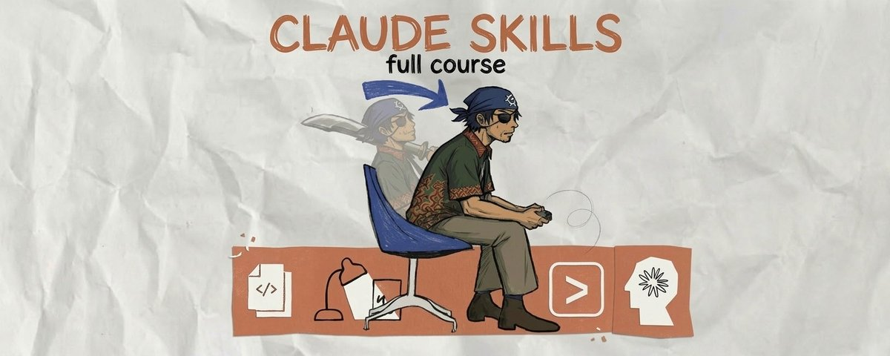

# I want to learn how to use Claude Skills (full course)

**Author:** hoeem (@hooeem)
**Date:** March 11, 2026
**Source:** https://x.com/hooeem/status/2031755971265974632
**Stats:** 43 replies, 726 retweets, 4,887 likes, 15,973 bookmarks, 1,892,393 views

---



I have combined every resource I have found to create a full course on Claude Skills. In less than 10 minutes you'll have built and deployed your first custom skill. After reading this article you will understand Claude Skills better than 99% of people (yes, really).

You're about to be given a full course on creating a Claude Skill, a permanent instruction file that tells Claude exactly how to execute a specific task.

Here's how to utilise this article:

- Module 1: foundations
- Module 2: architecture
- Module 3: testing and iteration
- Module 4: production deployment

# Module 1: Foundations

In every module I will give you the foundations + how to get AI to help you so that you 1: understand what's going on, and 2: build it correctly without needing technical skills.

Let's get straight into it...

## SKILLS vs PROJECTS vs MCP:

Before you build anything, you need to understand where Skills fit inside Claude. Three tools, three different jobs:

Projects = your knowledge base. Upload a brand guideline PDF and you're telling Claude: "Here's what you need to know." Static. Reference material. A library.

Skills = your instruction manual. You're telling Claude: "Here's exactly how you perform this task, step by step." Procedural. Automated. A trained employee.

MCP (Model Context Protocol) = your connection layer. This plugs Claude into live data sources (your calendar, your database, your inbox). Skills then tell Claude what to do with that data.

Do you need a skill? If you've typed the same instructions at the start of more than three conversations, that's a Skill begging to be built, or if you want to help Claude become a professional operator in various tasks then creating skills help it become an "employee" in different sectors.

## ANATOMY OF A SKILL:

Here's where most guides overcomplicate this (and your Claude will help you create this anyway so I wouldn't panic about this):

A Skill is a folder on your computer. Inside that folder is a text file. That's it.

A folder with a text file called SKILL.md.

The folder follows three rules:

The Root Folder must use kebab-case naming. That means lowercase, words separated by hyphens. invoice-organiser. email-formatter. csv-cleaner. No spaces. No underscores. No capitals.

SKILL.md is the brain. This is case-sensitive. Not skill.md. Not README.md. Exactly SKILL.md. All your instructions live here.

references/ is optional. If your instructions need a massive brand guide or a long template, drop it in this subfolder instead of pasting it into SKILL.md.

Drop the whole folder into ~/.claude/skills/ on your machine.

Claude finds it automatically.

I want you to have this basic understanding so you understand it.

## WHERE DO THEY RUN?

This matters more than most guides tell you.

Claude Code is the command-line tool for developers. Skills here live in your project directory under .claude/skills/ or globally at ~/.claude/skills/. They have access to the file system, bash commands, and can execute code. This is where you build Skills that manipulate files, run scripts, and interact with your codebase.

Claude Desktop (CoWork) is the desktop agent for non-developers. Skills here work through the desktop interface, and can interact with your screen, applications, and files through the agent's capabilities. Same SKILL.md format. Different execution environment.

If you are ever unsure you can always use this prompt:

```markdown
I want you to help me identify whether I need a Claude Skill.

Here's how this works:

1. Ask me to describe the 3-5 tasks I repeat most often when
   using AI assistants. For each one, ask me:
   - What instructions do I typically give at the start?
   - How often do I repeat this task per week?
   - Does the output need to follow a specific format, tone,
     or structure every time?

2. After I describe each task, score it on a "Skill Readiness"
   scale of 1-10 based on:
   - Repetition frequency (higher = more ready)
   - Instruction complexity (more specific instructions =
     more ready)
   - Output consistency requirements (stricter format needs =
     more ready)

3. Rank my tasks from highest to lowest Skill Readiness score.

4. For my top-scoring task, tell me:
   - Why this is the best candidate for my first Skill
   - What the Skill would need to contain
   - An estimate of time saved per week if I automate it
   - Whether this is better suited for Claude Code or
     Claude Desktop (CoWork)

Start by asking me about my first repeated task.
```

## BUILDING YOUR FIRST SKILL:

> Step 1: Define the Job

Before you write a single word, answer three questions:

What does this Skill do? Be ruthlessly specific. "Help with data" is useless. "Transform messy CSV files into clean spreadsheets with proper headers, enforce YYYY-MM-DD date formatting, and strip empty rows" is a Skill that works.

When should it fire? Think about what you'd actually type. "Clean up this CSV." "Fix these headers." "Format this data." Those are your triggers.

What does "good" look like? You need a concrete example of the finished output. Not a description. An actual before-and-after.

Listen closely. This step is where 90% of bad Skills are born. Vague instructions create vague outputs. Every time.

Don't trust yourself to get specific enough? This prompt forces the precision out of you.

PROMPT: THE SKILL DEFINITION INTERVIEW:

```markdown
You are a Skill Definition Specialist. Your job is to interview
me until we have a razor-sharp definition of the Claude Skill
I want to build. You will not let me get away with vague answers.

Run this interview process:

PHASE 1 - THE TASK
Ask me: "What task do you want to automate?"
After I answer, pressure-test my response:
- If my answer is vague (e.g., "help with emails"), push back
  and ask me to describe EXACTLY what the Skill should do,
  with a specific input and specific output.
- Keep asking "Can you be more specific?" until the task
  description is concrete and actionable.
- Confirm the final task definition back to me in one sentence.

PHASE 2 - THE TRIGGERS
Ask me: "What would you actually type into Claude to activate
this Skill? Give me 5 different ways you might phrase the request."
After I answer:
- Suggest 3-5 additional trigger phrases I probably missed.
- Ask me about negative boundaries: "What similar-sounding
  requests should NOT trigger this Skill?"

PHASE 3 - THE QUALITY STANDARD
Ask me: "Show me or describe exactly what a PERFECT output
looks like for this task."
After I answer:
- Ask me to describe what a FAILED output looks like
  (so we know what to avoid).
- Ask me about edge cases: "What's the weirdest or most
  broken input this Skill might receive? How should it handle it?"

PHASE 4 - THE SUMMARY
Compile everything into a structured "Skill Definition Brief"
with these sections:
- Skill Name (in kebab-case)
- One-Sentence Purpose
- Trigger Phrases (positive)
- Negative Boundaries (when NOT to fire)
- Input Description
- Output Description
- Quality Standard (what "good" looks like)
- Edge Cases to Handle

Present this brief and ask me to confirm or revise before
we proceed.

Start Phase 1 now.
```

> Step 2: Write the YAML Triggers

At the top of your SKILL.md file, you write a block of metadata between --- lines. This is called YAML frontmatter. It tells Claude when to activate your Skill.

Here's an example:

```markdown
---
name: csv-cleaner
description: Transforms messy CSV files into clean spreadsheets. Use this skill whenever the user says 'clean up this CSV', 'fix the headers', 'format this data', or 'organise this spreadsheet'. Do NOT use for PDFs, Word documents, or image files.
---
```

Three rules that make or break your triggers:

Write in third person. "Processes files..." not "I can help you..."

List exact trigger phrases. Claude is conservative about activation. You need to spell out what the user might say. Be pushy.

Set negative boundaries. Tell Claude when NOT to fire. This prevents your Skill from hijacking unrelated conversations.

Here's the thing most people miss. The description field is the single most important line in your entire Skill. If it's weak, your Skill never fires. If it's too broad, it fires when you don't want it to.

This prompt generates a battle-tested YAML header from your definition:

PROMPT: THE YAML TRIGGER GENERATOR:

```markdown
You are a YAML Frontmatter Specialist for Claude Skills.
Your job is to write the most effective possible YAML trigger
block for the top of a SKILL.md file.

Here is my Skill definition:
[PASTE YOUR SKILL DEFINITION BRIEF HERE, OR DESCRIBE YOUR
SKILL IN 2-3 SENTENCES]

Generate the YAML frontmatter following these strict rules:

1. The "name" field must be in kebab-case (lowercase,
   hyphens only, no spaces or underscores).

2. The "description" field must be "pushy" - meaning it
   should aggressively list trigger scenarios because Claude
   is conservative about skill activation. Include:
   - A clear one-sentence summary of what the skill does
     (written in third person: "Processes..." not "I can...")
   - At least 5-7 explicit trigger phrases the user might say,
     formatted as: "Use this skill whenever the user says
     '[phrase 1]', '[phrase 2]', '[phrase 3]'..."
   - Negative boundaries: "Do NOT use this skill for [X],
     [Y], or [Z]."
   - Context clues: "Also activate when the user uploads
     [file type] and asks for [action]."

3. Keep the entire description under 300 words but make
   every word count.

Output ONLY the YAML block (between --- markers), ready to
paste directly into a SKILL.md file. No explanation needed.

Then, below the YAML block, provide a "Trigger Confidence
Report" that rates:
- Activation likelihood on relevant requests: X/10
- False positive risk (firing when it shouldn't): X/10
- Coverage of common phrasings: X/10

If any score is below 7/10, suggest specific improvements.
```

> Step 3: Write the Instructions

Below the --- marks, you write your workflow in plain English. Structured with headings. Sequential. Under 500 lines.

Two components make this work:

The Steps. Break the workflow into a logical sequence:

- First, read the provided file to understand its structure
- Identify the row containing the true column headers
- Remove any empty rows or rows containing only commas
- Enforce proper data types (dates must be YYYY-MM-DD)
- Output the cleaned file with a summary of changes made

The Examples. This is where the magic lives. A single concrete example showing input and expected output is worth more than 50 lines of abstract description.

PROMPT: THE SKILL INSTRUCTION ARCHITECT:

```markdown
You are a Claude Skill instruction writer. Your job is to
generate the complete instruction body for a SKILL.md file
that is clear, sequential, and under 500 lines.

Here is my Skill definition:
[PASTE YOUR SKILL DEFINITION BRIEF FROM STEP 1]

Here is the YAML frontmatter already written:
[PASTE YOUR YAML BLOCK FROM STEP 2]

Now generate the full instruction body that goes BELOW the
closing --- of the YAML block. Follow these rules precisely:

STRUCTURE RULES:
1. Start with a one-paragraph "Overview" that states what
   this skill does and when it activates, written for Claude
   (not for a human reader).
2. Break the workflow into numbered steps under a
   "## Workflow" heading. Each step must be:
   - One clear action
   - Written as an imperative command ("Read the file..."
     not "The file should be read...")
   - Specific enough that there is only ONE way to
     interpret it
3. Include a "## Output Format" section that specifies
   exactly how the final output should be structured
   (file type, formatting, sections, tone, etc.)
4. Include a "## Edge Cases" section that tells Claude
   how to handle:
   - Missing or incomplete input
   - Ambiguous requests
   - Conflicting instructions
   - Unexpected file formats or data types

EXAMPLE RULES:
5. Include at least 2 concrete examples under a
   "## Examples" heading:
   - Example 1: A straightforward "happy path" showing
     normal input -> expected output
   - Example 2: An edge case showing unusual input ->
     how Claude should handle it
   Each example must show ACTUAL input and ACTUAL expected
   output, not abstract descriptions.

QUALITY RULES:
6. Total length: aim for 100-300 lines. Cut anything
   that doesn't directly instruct Claude on how to
   execute the task.
7. Never use vague language like "handle appropriately"
   or "format nicely." Every instruction must be specific
   and testable.
8. If the skill requires referencing external files
   (brand guides, templates), add a "## References"
   section with the instruction: "Read [filename] from
   the references/ directory before beginning the task."

Output the complete instruction body as markdown, ready to
paste directly below the YAML frontmatter in a SKILL.md file.

After the instructions, provide a "Quality Checklist" that
confirms:
- [ ] Every step is a single, unambiguous action
- [ ] At least 2 concrete examples included
- [ ] Edge cases are covered
- [ ] Output format is explicitly defined
- [ ] Total length is under 500 lines
- [ ] No vague or interpretable language remains
```

> Step 4: The One Level Deep Rule (References)

If your instructions reference a massive brand guideline or template, don't paste it all into SKILL.md.

Save it as a separate file inside the references/ folder. Then link to it directly from your instructions.

But here's the critical constraint: never have reference files linking to other reference files. Claude will truncate its reading and miss information. One level deep. That's it.

If you have existing documents (brand guides, style sheets, templates, SOPs) that your Skill needs to reference, this prompt converts them into properly formatted reference files:

PROMPT: THE REFERENCE FILE ORGANISER:

```markdown
You are a Skill Reference File Organiser. I have documents
that my Claude Skill needs to reference during execution.
Your job is to prepare them for the references/ directory.

Here are my reference documents:
[PASTE OR UPLOAD YOUR BRAND GUIDE / TEMPLATE / SOP /
STYLE SHEET / ANY REFERENCE MATERIAL]

For each document, do the following:

1. ASSESS: Is this document short enough to include
   directly in the SKILL.md file (under 50 lines of
   relevant content)? If yes, recommend inlining it
   instead of creating a separate reference file.

2. COMPRESS: If it needs to be a separate reference file,
   extract ONLY the sections that are directly relevant
   to the Skill's task. Remove all preamble, background
   context, and information the Skill will never need.
   Aim to reduce the document by 50%+ while keeping all
   actionable instructions.

3. FORMAT: Structure the compressed reference file with:
   - Clear markdown headings
   - Bullet points for rules and constraints
   - Bold text for critical requirements
   - A "Quick Reference" summary at the top (under 10 lines)
     that captures the most important rules

4. NAME: Suggest a kebab-case filename for each reference
   file (e.g., brand-voice-guide.md, email-template.md).

5. LINK: Write the exact line I should add to my SKILL.md
   file to reference this document, e.g.:
   "Before beginning the task, read the brand voice guide
   at references/brand-voice-guide.md"

6. VALIDATE: Check for the "One Level Deep" rule. Flag
   any reference file that links to or depends on
   ANOTHER reference file. If found, merge them into a
   single file.

Output each prepared reference file in full, ready to save
directly into the references/ directory.
```

> Step 5: Assemble and Deploy

You've now got every component. Time to put it together.

Your folder structure should look like this:

```markdown
your-skill-name/
├── SKILL.md          (YAML header + instructions from Steps 2-3)
└── references/       (optional, from Step 4)
    └── your-ref.md
```

Drop the folder into ~/.claude/skills/ on your machine.

Done.

But wait. Before you deploy, you want to make sure the whole thing is airtight. This prompt does a final quality assurance pass on your complete SKILL.md file:

PROMPT: THE SKILL QA AUDITOR

```markdown
You are a Claude Skill Quality Assurance Auditor. I have
built a complete SKILL.md file and I need you to audit it
before I deploy it.

Here is my complete SKILL.md file:
[PASTE YOUR ENTIRE SKILL.MD FILE HERE]

Run the following audit checks and report results:

## 1. YAML FRONTMATTER AUDIT
- [ ] name field exists and is valid kebab-case
- [ ] description field exists and is over 50 words
- [ ] description is written in third person
- [ ] At least 5 trigger phrases are listed
- [ ] Negative boundaries are defined (when NOT to activate)
- [ ] Description is "pushy" enough (would Claude actually
      fire this skill on a relevant request?)
SCORE: X/10

## 2. INSTRUCTION CLARITY AUDIT
- [ ] Every step is a single, unambiguous action
- [ ] No vague language ("handle appropriately",
      "format nicely", "as needed")
- [ ] Instructions are in imperative voice ("Read the
      file" not "The file should be read")
- [ ] Sequential logic is correct (no step depends on
      information from a later step)
- [ ] Total instruction length is under 500 lines
SCORE: X/10

## 3. EXAMPLE QUALITY AUDIT
- [ ] At least 2 examples are included
- [ ] Examples show ACTUAL input and ACTUAL output
      (not abstract descriptions)
- [ ] At least one edge case example is included
- [ ] Examples are realistic (represent real-world usage)
SCORE: X/10

## 4. EDGE CASE COVERAGE AUDIT
- [ ] Missing/incomplete input is handled
- [ ] Ambiguous requests are handled
- [ ] Unexpected file types or data formats are handled
- [ ] The skill knows when to ask for clarification
      vs. make a reasonable assumption
SCORE: X/10

## 5. REFERENCE FILE AUDIT (if applicable)
- [ ] All referenced files are at one level deep only
- [ ] No circular references
- [ ] Reference instructions in SKILL.md are clear
      ("Read X before beginning")
SCORE: X/10

## OVERALL DEPLOYMENT READINESS: X/50

If any section scores below 7/10, provide SPECIFIC
rewrites for the failing sections. Output the corrected
text ready to paste directly into the file.

If overall score is 40+/50, confirm: "READY TO DEPLOY."
If below 40, list the critical fixes needed before
deployment, in priority order.
```

## AUTOMATE BUILDING YOUR FIRST SKILL:

If everything above feels like too much effort, there's a shortcut.

Anthropic built a meta-skill called skill-creator that constructs Skills for you through conversation.

Here's how it works:

1. Open a new chat. Type: "Use the skill-creator to help me build a skill for [your task]."

2. Upload your assets. Templates you use. Examples of past work. Brand guidelines. Anything that shows Claude what "good" looks like.

3. Answer the interview. The skill-creator asks you clarifying questions about your process, your edge cases, and your quality standards.

4. It generates everything. The formatted SKILL.md. The pushy description. The folder structure. Packaged and ready.

5. Save the folder to ~/.claude/skills/. Done.

Next time you ask Claude to perform that task, your Skill fires automatically.

Module 1 complete. You now have a deployed Skill. In Module 2, you're going to learn how to utilise architecture.

# Module 2: Architecture

You'll eventually have quite a few skills, this is where architecture becomes an important part of your arsenal.

Again, I will teach you the manual version of this and then give you prompts to get this done for you, but it's good to know why you're building architecture, that's why I've kept the manual section in...

## WHEN INSTRUCTIONS AREN'T ENOUGH:

Everything you've built so far uses plain English instructions. Claude reads them, follows them, produces output.

But some tasks need computation. They need code that runs. Calculations that execute. Data transformations that are too precise for natural language instructions.

That's what the scripts/ directory is for.

## WHEN TO USE SCRIPTS:

Use instructions when: The task is about judgement, language, formatting, or decision-making. "Rewrite this in our brand voice." "Categorise these meeting notes." "Draft an email." Claude's language capabilities handle these perfectly.

Use scripts when: The task requires precise computation, file manipulation, data transformation, or integration with external tools. "Calculate the running average of these numbers." "Parse this XML file and extract specific fields." "Resize all images in this folder to 800x600."

Use both when: The task requires computation AND judgement. "Process this CSV (script), then write a human-readable summary of the anomalies found (instructions)."

How Scripts Work Inside a Skill

Your Skill's instructions tell Claude when and how to execute the scripts. The scripts themselves live in the scripts/ folder and do the actual computation.

Here's a complete example:

```markdown
data-analyser/
├── SKILL.md
├── references/
│   └── analysis-template.md
└── scripts/
    ├── parse-csv.py
    └── calculate-stats.py
```

In your SKILL.md, you reference the scripts like this:

```markdown
## Workflow

1. Read the uploaded CSV file to understand its structure.

2. Run scripts/parse-csv.py to clean the data:
   - Command: `python scripts/parse-csv.py [input_file] [output_file]`
   - This removes empty rows, normalises headers, and
     enforces data types.

3. Run scripts/calculate-stats.py on the cleaned data:
   - Command: `python scripts/calculate-stats.py [cleaned_file]`
   - This outputs: mean, median, standard deviation, and
     outliers for each numeric column.

4. Read the statistical output and write a human-readable
   summary following the template in references/analysis-template.md.
   Highlight any anomalies or outliers that would concern
   a non-technical reader.
```

The key insight: The scripts handle the computation. The instructions handle the judgement. They work together.

Script Best Practices

Keep scripts focused. One script, one job. parse-csv.py doesn't also calculate statistics. That's a separate script.

Make scripts accept arguments. Your script should take input/output file paths as command-line arguments, not hardcode them. This makes the Skill flexible.

Include error handling. Your script should exit with a clear error message if the input is malformed, missing, or the wrong format. Claude can then read the error and communicate it to the user.

Document the interface. At the top of each script, include a comment block explaining: what the script does, what arguments it expects, what it outputs, and what errors it might throw.

Here's a prompt that builds scripts for your Skill:

PROMPT: THE SKILL SCRIPT BUILDER:

```markdown
I have a Claude Skill that needs executable scripts for
tasks that require computation rather than language processing.

Here is my current SKILL.md:
[PASTE YOUR SKILL.MD]

Here are the computational tasks that can't be handled by
instructions alone:
[DESCRIBE EACH TASK THAT NEEDS A SCRIPT, e.g.:
- "Parse XML files and extract specific fields"
- "Calculate statistical summaries of numeric data"
- "Resize and compress images in a folder"]

For each task, build a script that follows these rules:

1. Language: Use Python unless the task specifically requires
   another language. Python is available in both Claude Code
   and CoWork environments.

2. Interface: Accept all inputs as command-line arguments.
   No hardcoded file paths. Print output to stdout or write
   to a specified output file.

3. Error handling: Catch all common failure modes (missing
   files, malformed data, wrong types) and exit with a clear
   error message that Claude can parse.

4. Documentation: Include a comment block at the top with:
   - What the script does
   - Required arguments
   - Expected output format
   - Possible error conditions

5. Dependencies: Use only Python standard library where
   possible. If external packages are required, list them
   in a requirements.txt.

After generating the scripts:

6. Update the SKILL.md workflow to reference each script
   with the exact command syntax Claude should use.

7. Add error handling instructions to SKILL.md: what should
   Claude tell the user if a script fails?

Output:
- Each script file ready to save to scripts/
- Updated SKILL.md with script references
- requirements.txt (if external packages needed)
```

## MULTI-SKILL ORCHESTRATION:

Here's what happens after you build your fifth Skill. You start noticing conflicts.

For example: Your Brand Voice Enforcer fires when you wanted the Email Drafter. Your Code Review Assistant activates on a code snippet you just wanted formatted, not reviewed. Two Skills both think they should handle the same request.

This is the multi-skill orchestration problem. And it gets worse the more Skills you build.

## WHY & HOW?

When you make a request, Claude scans all available Skills and evaluates their YAML descriptions against your prompt. The selection process works roughly like this:

1. Claude reads all available Skill descriptions
1. It scores each description against your request for relevance
1. The highest-scoring Skill fires
1. If no Skill scores above the activation threshold, none fires

The problem: If two Skills have overlapping trigger phrases, the wrong one might win. If descriptions are too vague, Skills fire on irrelevant requests. If descriptions are too narrow, Skills never fire at all.

## RULES FOR MULTI-SKILL HARMONY:

Rule 1: Non-overlapping territories. Every Skill must have a clearly defined domain that doesn't bleed into another Skill's domain. The Brand Voice Enforcer handles voice compliance. The Email Drafter handles email composition. The Content Repurposer handles format transformation. No overlap.

Rule 2: Aggressive negative boundaries. Every Skill's YAML description must explicitly list the other Skills' territories as exclusions. Your Email Drafter should say "Do NOT use for brand voice checks or content repurposing." Your Brand Voice Enforcer should say "Do NOT use for drafting emails from scratch or repurposing content."

Rule 3: Distinctive trigger language. Each Skill should have trigger phrases that are unique to its function. "Check the voice" should only match the Brand Voice Enforcer. "Draft an email" should only match the Email Drafter. If you find yourself using the same trigger phrase for two Skills, one of them has a scope problem.

Diagnosing Skill Conflicts

When the wrong Skill fires, the problem is almost always in the YAML description. Here's a prompt that audits your entire Skill library for conflicts:

PROMPT: SKILL CONFLICT AUDITOR

```markdown
I have multiple Claude Skills deployed and I'm experiencing
conflicts (wrong Skills firing, Skills not firing when they
should, or overlapping functionality).

Here are the YAML descriptions for ALL of my deployed Skills:

SKILL 1:
[PASTE THE FULL YAML DESCRIPTION FROM SKILL 1]

SKILL 2:
[PASTE THE FULL YAML DESCRIPTION FROM SKILL 2]

SKILL 3:
[PASTE THE FULL YAML DESCRIPTION FROM SKILL 3]

[ADD MORE AS NEEDED]

Run the following conflict analysis:

## 1. TERRITORY MAP
For each Skill, define its territory in one sentence.
Visualise the territories as a list and identify any overlaps.

## 2. TRIGGER PHRASE COLLISION TEST
List every trigger phrase from every Skill.
Flag any phrase that could match more than one Skill.
For each collision, recommend which Skill should own
the phrase and suggest an alternative for the other.

## 3. NEGATIVE BOUNDARY AUDIT
For each Skill, check whether its negative boundaries
explicitly exclude the territories of ALL other Skills.
Flag any missing exclusions.

## 4. AMBIGUOUS REQUEST TEST
Generate 10 realistic user requests that are ambiguous
(could potentially match multiple Skills).
For each, predict which Skill would fire and whether
that's the correct choice.

## 5. DEAD ZONE CHECK
Identify any common user requests that would NOT trigger
any of the deployed Skills but probably should.

## 6. RECOMMENDED FIXES
For each issue found, provide the corrected YAML description
ready to paste directly into the SKILL.md file.

Present findings as a structured report with priority-ranked
fixes.
```

## REFERENCE STRATEGIES:

Module 1 covered the basics: one reference file, one level deep, keep it compressed.

But what happens when your Skill needs to reference a 50-page brand guide, a 30-page style manual, AND a library of templates?

You need to help it from burning its context window on references it doesn't need for the current task at hand:

PROMPT: REFERENCE ARCHITECTURE DESIGNER:

```markdown
I have a Claude Skill that needs to reference multiple large
documents. I need help designing the reference file architecture
so Claude loads only what it needs for each request.

Here are the documents my Skill needs access to:
[LIST EACH DOCUMENT WITH ITS APPROXIMATE LENGTH AND PURPOSE,
e.g.:
- Brand voice guide (50 pages, covers tone, vocabulary,
  formatting)
- Email templates (10 templates for different situations)
- Client list with preferences (200 entries)
- Style manual (30 pages, covers visual and written style)]

Here is my SKILL.md:
[PASTE YOUR CURRENT SKILL.MD]

Design a reference architecture that:

1. Splits large documents into focused sub-files that can
   be loaded independently.

2. Creates a "quick reference" version of each major
   document (under 30 lines) that covers 80% of use cases.

3. Writes conditional loading instructions for the SKILL.md
   that tell Claude which references to read based on the
   type of request.

4. Ensures the "one level deep" rule is maintained (no
   reference file links to another reference file).

5. Estimates the token savings vs. loading everything
   every time.

Output:
- Complete folder structure diagram
- Each reference file (compressed and formatted)
- Updated SKILL.md with conditional loading instructions
- Token efficiency estimate
```

Module 2 complete. You now understand the advanced architecture: scripts for computation, multi-skill orchestration for conflict-free deployment, and reference strategies that scale.

In Module 3, you're going to learn how to prove your Skills work. Not "try it and see." Prove it with data.

# Module 3: Testing + Iteration

The difference between a Skill that "kind of works" and a Skill that runs like a trained employee is this module. Testing, debugging, iterating until the failure modes are eliminated.

## FAILURE MODES:

Before you test anything, you need to know what you're testing for. Every Skill failure falls into one of five categories. Learn to diagnose the category and the fix becomes obvious.

Failure Mode 1: The Silent Skill (Never Fires)

Symptoms: You type a request that should trigger your Skill. Claude responds normally without using the Skill. No indication it was even considered.

Root cause: Your YAML description is too weak. Claude's activation threshold requires a strong match between the user's request and the description. If your description is vague, generic, or missing key trigger phrases, it never crosses the threshold.

Diagnosis: Look at your description. Does it explicitly list the words and phrases you just typed? If you said "clean up this spreadsheet" but your description only mentions "CSV files," you've found the gap.

Fix: Make your description more pushy. Add more trigger phrases. Add context clues. The description should be almost embarrassingly explicit about when to activate.

Failure Mode 2: The Hijacker (Fires on Wrong Requests)

Symptoms: You ask Claude something unrelated and your Skill activates. You wanted to draft an email but the Content Repurposer fired instead.

Root cause: Your YAML description is too broad, or your negative boundaries are missing. The description matches too many types of requests.

Diagnosis: Look at what you typed and find which words in your request matched the Skill's description. Then check whether those words should have been excluded.

Fix: Add negative boundaries. "Do NOT use for [list every similar-but-different task]." Tighten your trigger phrases to be more specific to your Skill's actual function.

Failure Mode 3: The Drifter (Fires But Produces Wrong Output)

Symptoms: The Skill activates correctly but the output doesn't match what you expected. It's close but not right. Formatting is off, tone is wrong, or it skips steps.

Root cause: Your instructions are ambiguous. There's more than one way to interpret what you wrote, and Claude chose a different interpretation than you intended.

Diagnosis: Read your instructions as if you've never seen them before. Find the sentences that could mean two different things. That's where the drift happens.

Fix: Replace ambiguous language with specific, testable instructions. "Format nicely" becomes "Use H2 headings for each section, bold the first sentence of each paragraph, keep paragraphs to 3 lines max." Leave zero room for interpretation.

Failure Mode 4: The Fragile Skill (Works Sometimes, Breaks on Edge Cases)

Symptoms: The Skill works perfectly on clean, well-formed inputs. But when you give it something slightly weird (incomplete data, unusual formatting, missing fields), it collapses.

Root cause: Your edge case handling is incomplete. You didn't anticipate the messy reality of real-world inputs.

Diagnosis: Feed your Skill the worst-case version of every input. Missing fields. Extra fields. Wrong data types. Partially corrupted files. Mixed languages. See where it breaks.

Fix: Add explicit edge case instructions. For every scenario where it breaks, add a specific instruction: "If [condition], then [specific action]."

Failure Mode 5: The Overachiever (Adds Things You Didn't Ask For)

Symptoms: The Skill produces the requested output but also adds unsolicited commentary, extra sections, or creative embellishments you didn't want.

Root cause: Your instructions tell Claude what TO do but not what NOT to do. Without constraints, Claude defaults to being maximally helpful, which sometimes means doing more than you asked.

Diagnosis: Look at the extra output. Then check your instructions for explicit constraints about scope and output boundaries.

Fix: Add explicit scope constraints. "Do NOT add explanatory text, commentary, or suggestions unless the user asks for them. Output ONLY the [specified format] and nothing else."

PROMPT: THE FAILURE MODE DIAGNOSTIC:

```markdown
My Claude Skill is not working as expected. I need help
diagnosing and fixing the problem.

Here is my complete SKILL.md:
[PASTE YOUR SKILL.MD]

Here is what happened:
- What I typed: [PASTE THE EXACT REQUEST YOU MADE]
- What I expected: [DESCRIBE EXPECTED BEHAVIOUR]
- What actually happened: [DESCRIBE ACTUAL BEHAVIOUR]

Diagnose this against the 5 Failure Modes:

1. Silent Skill (never fired) — Is the YAML description
   strong enough to match my request?
2. Hijacker (fired on wrong request) — Is the description
   too broad? Missing negative boundaries?
3. Drifter (wrong output) — Are instructions ambiguous?
4. Fragile Skill (broke on edge case) — Was my input
   an edge case not covered?
5. Overachiever (added unrequested content) — Are scope
   constraints missing?

For the identified failure mode:
- Explain exactly what caused the failure
- Provide the specific fix (corrected YAML, instruction,
  or edge case handling)
- Show the corrected section of SKILL.md ready to paste
- Suggest a test prompt to verify the fix works
```

## TESTING YOUR SKILL:

Here's the thing most people get wrong.

They build a Skill, try it twice, it looks "fine," and they move on. Then it fails spectacularly on the third edge case they didn't anticipate.

The Skills 2.0 update killed the guesswork. You now have professional-grade testing built in to Claude so go and use it!

Evals: Write test prompts. Define exactly what the expected behaviour should be. The system runs your Skill against those prompts and returns a Pass/Fail grade. Not "looks okay." Pass. Or Fail.

Benchmarks: Track your Skill's pass rate, token consumption (cost), and execution speed over time. You can see whether your version 3 rewrite actually made things better or just felt like it did.

A/B Comparator: Run a blind test between two versions of your Skill's instructions. Hard data on which one wins.

Description Optimiser: Tells you definitively whether your YAML triggers will fire correctly when users ask for the task.

Keep iterating until two consecutive evaluation runs show no significant improvement. That's your signal. Your Skill is production-ready.

Module 3 complete. You now have a production-grade skill.

Module 4 is the final piece: deploying skills that work across sessions.

# Module 4: Production Deployment

Your Skills work. They're tested. They're deployed.

Now the question shifts from "does it work?" to "does it work at scale, over time, across sessions?"

## STATE MANAGEMENT:

When you're running a Skill across multiple sessions (writing a book, building a complex app, managing a multi-week project), Claude's context window eventually fills up.

It forgets what happened yesterday.

Expert Skill builders solve this with a "shift handover" system. Inside your SKILL.md, you add one instruction:

"At the start of every session, read context-log.md to see what we completed last time. At the end of every session, write a summary of what you finished and what's still pending."

That's it. Claude reads its own notes from the previous session and picks up exactly where it left off.

Think of it like a hospital shift change. The incoming doctor reads the chart. They know exactly what happened, what's pending, and what to watch for. Your AI works the same way.

## FINALLY...

You can keep opening Claude every morning and typing the same instructions you typed yesterday. And the day before. And the day before that. Burning through minutes that compound into hours that compound into weeks of lost output.

Or you can spend 10 minutes right now, build one Skill, and never type those instructions again.

The people who build Skills are operating Claude like a custom-built system tuned to their exact specifications.

Everyone else is using it like a chatbox.

Build your first Skill today. Pick the one task you repeat most often. Follow the steps above. Deploy it. Time how much faster your next session runs.

Then build another one.

Which task are you automating first? Drop a comment. I read every one.

P.S. The skill-creator meta-skill can build your first Skill in under 5 minutes through conversation alone. If you're still on the fence, start there.

EVERY WEEK:

I put together a newsletter including everything I deem important about modern technology and finance:

You can read every Sunday's free newsletter here:

[sevenc.substack.com](https://sevenc.substack.com)

Citation list:

- Anthropic's Official Agent Skills Documentation: Covers the core principles of skill authoring, proper directory structures, and the progressive disclosure loading system.
- The Complete Guide to Building Skills for Claude: Anthropic's comprehensive 32-page guide detailing foundational rules, YAML frontmatter reference, and workflow patterns for building standalone skills.
- The SKILL.md Pattern: Provides a deep dive into implicit versus explicit invocation.
- The Busy Person's Intro to Claude Skills: A practical, community-driven breakdown of how to build a skill quickly and the fundamental differences between Skills and the Model Context Protocol (MCP).
- Skills 2.0 Testing and Frameworks: Explanations of the new evaluation tools, including Evals, Benchmarks, multi-agent parallel testing, and blind A/B comparators.
- The Skill-Creator Meta-Skill: Details on using Anthropic's automated workflow tool to generate, test, and refine explicit skill descriptions and prompts.
