# CLAUDE.md Masterclass: From Start to Pro-Level User with Hooks & Subagents

**Author:** Joe Njenga (Claude Code Masterclass)
**Date:** January 28, 2026
**Source:** https://newsletter.claudecodemasterclass.com/p/claudemd-masterclass-from-start-to

---

### The Claude Code brain most developers ignore (and why it's a huge mistake)

Since the first issue of Claude Code Masterclass Introduction, I've been overwhelmed by your response -- encouragement, support, and so many new pledges. Thank you.

Your feedback made one thing clear: you want structure.

So I've organized this newsletter into three tracks -- Masterclass Series, Deep Dive Series, and Quick Updates. Check the About page for the full breakdown.

This issue brings you the second article in the Claude Code Masterclass series -- Mastering CLAUDE.md File

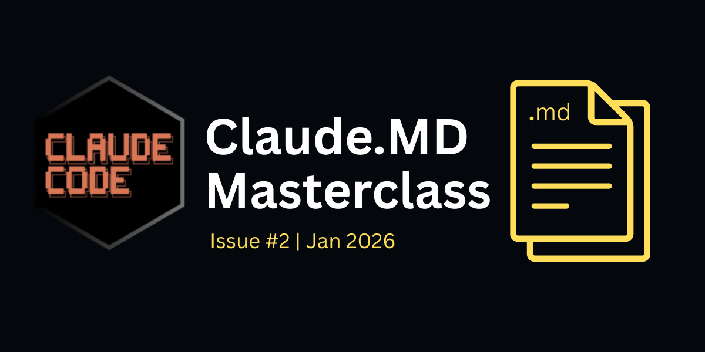

---

## Every Claude Code session starts the same way -- Claude knows nothing about your project.

- It doesn't know your tech stack.
- It doesn't know your folder structure.
- It doesn't know that you prefer tabs over spaces or that your team uses a specific branch naming convention.

So you should explain your project every single time.

"This is a FastAPI project. We use SQLAlchemy for the database. Tests are in the /tests folder. Run pytest to execute them. Oh, and we follow PEP 8 with 100-character lines."

This creates a problem of constantly explaining your project details, and that is the problem CLAUDE.md solves.

CLAUDE.md is a markdown file that gives Claude persistent memory about your project. Create it once, and Claude reads it automatically at the start of every session.

In this guide, I'll take you from creating your first CLAUDE.md to building pro-level configurations that compound with hooks and subagents.

We'll cover the hierarchy system, the anatomy of a well-structured file, and everything you should know about the CLAUDE.md file.

Let's start with the basics.

---

## What is CLAUDE.md?

Most developers think of CLAUDE.md as a documentation file, which is wrong!

CLAUDE.md is a configuration file that becomes part of Claude's system prompt.

This distinction matters because Claude treats system-level instructions differently from user prompts. Here is an illustration:

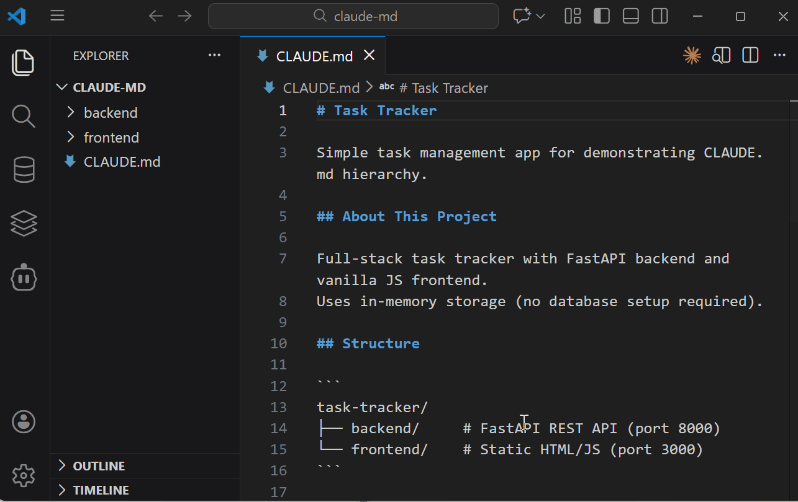

When you put instructions in CLAUDE.md, Claude follows them more strictly than anything you type in the chat.

This is why a well-crafted CLAUDE.md transforms your entire workflow, and it sets the operational boundaries for every conversation.

### Why Claude Will Ignore Your CLAUDE.md

Claude Code wraps your CLAUDE.md with a system reminder that tells Claude to ignore irrelevant content.

The actual wrapper looks like this:

```
<system-reminder>
  IMPORTANT: this context may or may not be relevant to your tasks.
  You should not respond to this context unless it is highly relevant to your task.
</system-reminder>
```

This means if you stuff your CLAUDE.md with instructions that aren't universally applicable, Claude will ignore them.

This is why "less is more" is the best trick when creating your CLAUDE.md file.

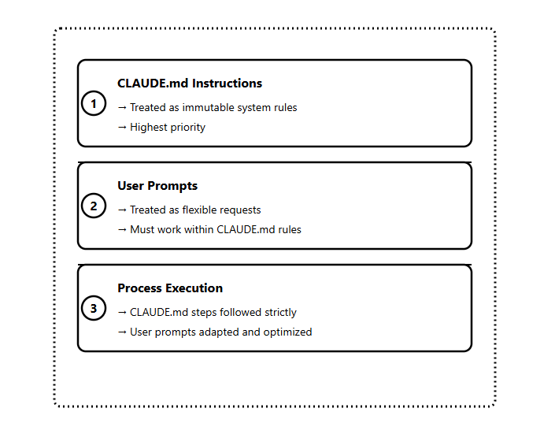

**Mental Model**

Think of CLAUDE.md as three things:

1. Project Memory -- Claude remembers your setup across sessions
2. Operational Boundaries -- Rules Claude won't break
3. Context Primer -- Claude starts informed, not blank

When you understand this mental model, you stop treating CLAUDE.md like a README since it's the best leverage configuration point you have in Claude Code.

---

## CLAUDE.md Hierarchy System

CLAUDE.md files can live in multiple locations, and Claude reads them in a specific order.

Understanding this hierarchy lets you create global rules that apply everywhere and project-specific rules that apply only where needed.

### Three Levels

The CLAUDE.md hierarchy consists of three levels:
1. Global level (across all projects)
2. Project root level
3. Nested directory level

**How Each Level Loads**

When Claude accesses files in your project, it loads CLAUDE.md files in this order:
1. Global CLAUDE.md (if it exists at the system level)
2. Project root CLAUDE.md
3. Directory-specific CLAUDE.md (based on which folder Claude is working in)

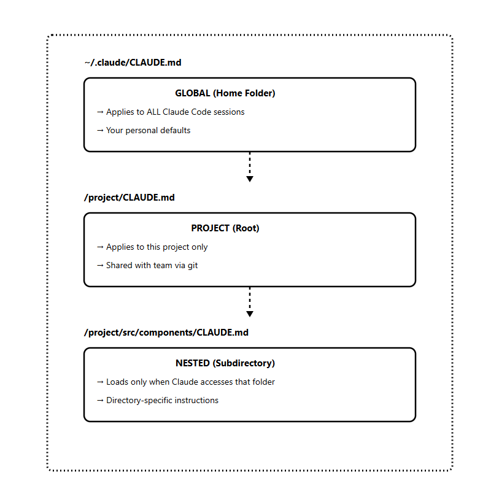

Let's look at a practical example:

**Monorepo Setup**

```
my-monorepo/
├── CLAUDE.md                    # Monorepo-wide rules
├── apps/
│   ├── web/
│   │   └── CLAUDE.md            # Frontend-specific rules
│   └── api/
│       └── CLAUDE.md            # Backend-specific rules
├── packages/
│   └── shared/
│       └── CLAUDE.md            # Shared library rules
└── tests/
    └── CLAUDE.md                # Testing conventions
```

The nested files only load when Claude accesses files in those directories. This keeps your main context lean until Claude needs that specialized knowledge.

**File Naming Options**

- `CLAUDE.md` -- Standard, commit to git, share with the team
- `CLAUDE.local.md` -- Add to `.gitignore`, personal overrides

Use `.local.md` for personal preferences, you don't want to push to the repo.

---

## Anatomy of a Great CLAUDE.md

A well-structured CLAUDE.md answers three questions for Claude:

- WHAT -- The tech stack, project structure, key files
- WHY -- The purpose of the project, what each part does
- HOW -- Commands to run, workflows to follow, conventions to respect

### Core Sections

```
# Project Context

Brief description of what this project is and your working philosophy.

## About This Project

Tech stack, architecture pattern, key dependencies.

## Key Directories

- `src/` — Source code
- `tests/` — Test files
- `docs/` — Documentation

## Commands

```bash
npm run dev      # Start development server
npm run test     # Run tests
npm run build    # Production build
```
```

**Standards**

- Coding conventions
- Testing requirements
- Commit message format

**Workflows**

Step-by-step processes for common tasks.

**Notes**

Gotchas, warnings, things Claude should know.

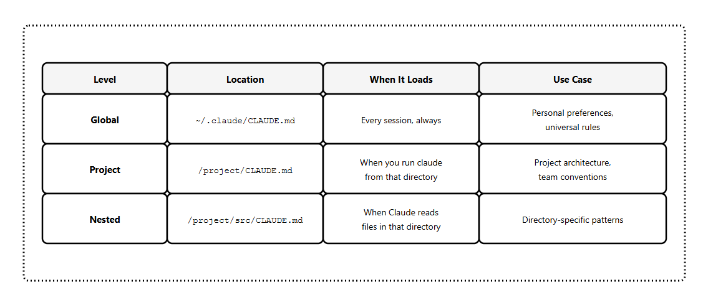

### A Real Example

Here's a CLAUDE.md for a FastAPI project:

```markdown
# Project Context

When working with this codebase, prioritize readability over cleverness.
Ask clarifying questions before making architectural changes.

## About This Project

FastAPI REST API for user authentication and profiles.
Uses SQLAlchemy for database operations and Pydantic for validation.

## Key Directories

- `app/models/` — Database models
- `app/api/` — Route handlers
- `app/core/` — Configuration and utilities
- `tests/` — Test files (fixtures in `tests/conftest.py`)

## Commands

```bash
uvicorn app.main:app --reload  # Dev server
pytest tests/ -v               # Run tests
alembic upgrade head           # Run migrations
```

**Standards**

- Type hints required on all functions
- pytest for testing
- PEP 8 with 100-character lines
- All routes use `/api/v1` prefix

**Notes**

- JWT tokens expire after 24 hours
- Rate limiting is 100 requests/minute per IP
- Never commit .env files
```

The best approach is to keep each section focused. If a section grows too long, it's a sign you should move that content to a separate file and reference it.

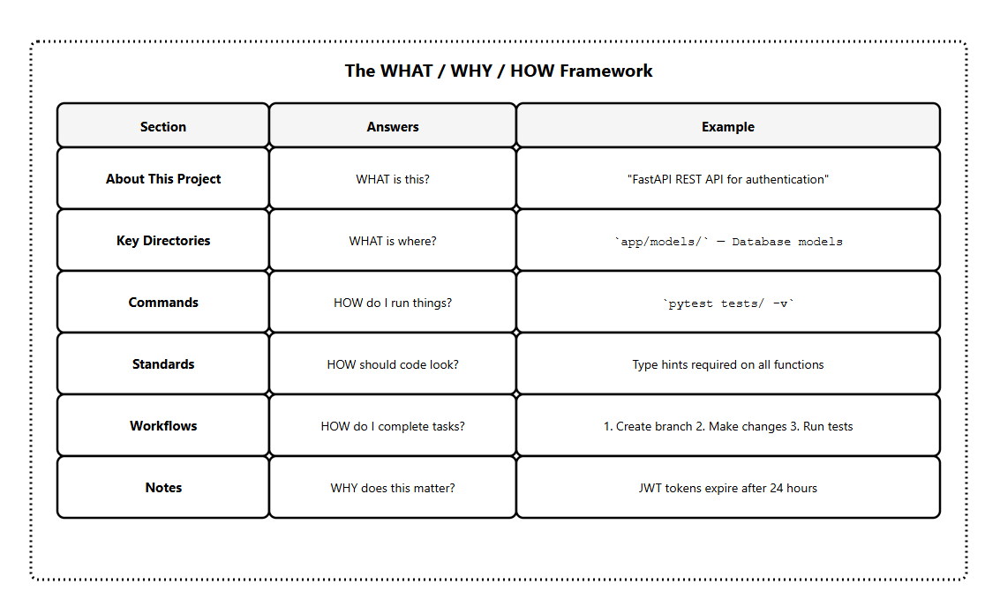

---

## CLAUDE.md Content

Most CLAUDE.md problems come from including too much, not too little. It's a delicate balance that can only be measured by my four rules:

### 1) 150-200 Instruction Limit

Research shows that frontier LLMs can reliably follow approximately 150-200 instructions.

Beyond that, instruction-following quality degrades; not just for new instructions, but uniformly across all of them.

Claude Code's system prompt already contains approximately 50 instructions.

That leaves you with roughly 100-150 instructions before Claude starts ignoring things.

This is why less is more, since every unnecessary instruction reduces Claude's ability to follow the important ones.

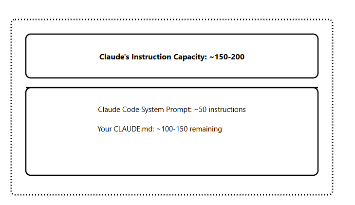

**Always include:**

- Project overview (1-2 sentences)
- Tech stack and key dependencies
- Essential commands (build, test, run)
- Directory structure (key folders only)
- Critical conventions that cause bugs if missed

**Include if universally applicable:**

- Branch naming conventions
- Commit message format
- Testing requirements
- Deployment process

**Never include:**

- Sensitive information (API keys, credentials, connection strings)
- Detailed code style guidelines (use a linter instead)
- Task-specific instructions (use separate files)
- Everything Claude could figure out by reading your code

**Move to separate files:**

- Database schema details
- Complex workflow procedures
- Architecture deep-dives
- Onboarding documentation

### 2) Progressive Disclosure

Instead of adding everything into CLAUDE.md, keep task-specific instructions in separate files and tell Claude where to find them.

As an example:

```
project/
├── CLAUDE.md                        # Core instructions only
└── agent_docs/
    ├── building_the_project.md
    ├── running_tests.md
    ├── code_conventions.md
    ├── database_schema.md
    └── deployment_process.md
```

In your CLAUDE.md, reference these files:

```
## Additional Documentation

Before starting specific tasks, read the relevant documentation:

- Building: `agent_docs/building_the_project.md`
- Testing: `agent_docs/running_tests.md`
- Database work: `agent_docs/database_schema.md`
- Deployment: `agent_docs/deployment_process.md`

Read only what's relevant to your current task.
```

Claude loads these files only when needed, keeping your main context lean.

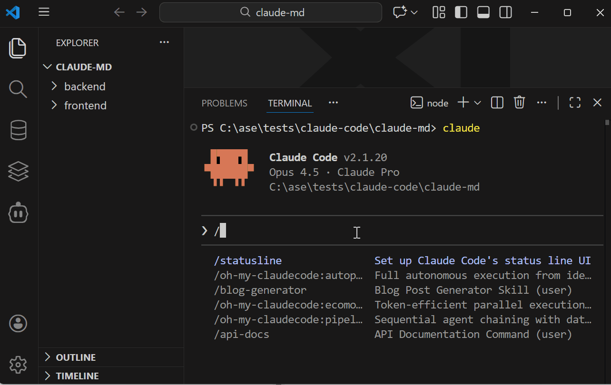

### 3) Don't Use CLAUDE.md as a Linter

This is a common mistake I see many developers make: adding extensive code style guidelines.

```
# Don't do this

## Code Style
- Use 2 spaces for indentation
- Always use semicolons
- Prefer const over let
- Use arrow functions for callbacks
- Add trailing commas in arrays
- Use single quotes for strings
...50 more rules
```

Use proper tools:

- ESLint/Prettier for JavaScript
- Black/Ruff for Python
- rustfmt for Rust

My approach for this problem is to set up a pre-commit hook or use Claude Code hooks to run your linter automatically.

### 4) My Golden Rule

If an instruction isn't relevant to 80%+ of my Claude Code sessions, it doesn't belong in CLAUDE.md. I move it to a separate file or a custom slash command.

Before we move to the advanced patterns, let's see how to create the CLAUDE.md file.

---

## How to Create Your CLAUDE.md

You have three ways to create a CLAUDE.md file. Each serves a different purpose.

### Method 1: The /init Command

The fastest way to get started. Claude analyzes your entire codebase and generates a starter CLAUDE.md.

```
cd your-project
claude
/init
```

Claude examines your package files, existing documentation, configuration files, and code structure. It generates a CLAUDE.md with:

- Build commands
- Test instructions
- Key directories
- Coding conventions it detected

**Important:** treat `/init` as a starting point, not a finished product. The generated file captures obvious patterns but misses nuances specific to your workflow. Always review and refine.

You can also run `/init` on projects that already have a CLAUDE.md. Claude will suggest improvements based on what it learns from exploring your codebase.

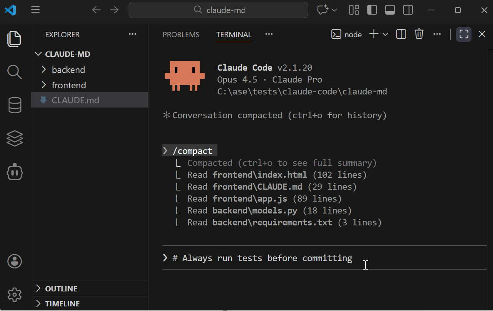

### Method 2: Manual Creation

Create the file yourself in any markdown editor:

```
touch CLAUDE.md
```

Or use your editor of choice. There's no required format -- save it as `CLAUDE.md` (all caps) in your project root.

When to use manual creation:

- You want full control from the start
- You're following a specific template
- You want to avoid the bloat that `/init` sometimes generates

### Method 3: The # Memory Shortcut

Add instructions on the fly while working in Claude Code. Type `#` followed by your instruction:

```
# Always run tests before committing
```

This is powerful for capturing insights as you work. When you find a new potential addition to CLAUDE.md, add it with `#`.

### My Recommendation

Start with `/init` to get a baseline, then refine manually. Use `#` to add instructions as you discover new ideas, and keep this in mind: the best CLAUDE.md files are built iteratively.

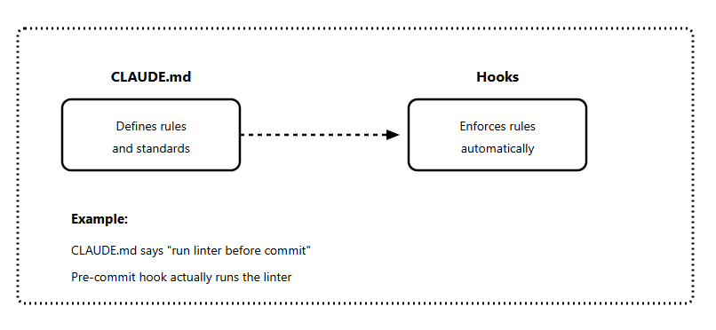

---

## Advanced CLAUDE.md Patterns

Once you've mastered the basics, these patterns take your CLAUDE.md to the next level.

### Pattern 1: Index Files for Large Codebases

For large or unfamiliar codebases, create index files that help Claude navigate efficiently.

**Step 1:** Generate a general index

```
# general_index.md

## /src/api/
- `auth.py` — Authentication endpoints, JWT handling
- `users.py` — User CRUD operations
- `products.py` — Product catalog endpoints

## /src/models/
- `user.py` — User model, relationships to orders
- `product.py` — Product model, inventory tracking

## /src/utils/
- `validators.py` — Input validation helpers
- `formatters.py` — Response formatting utilities
```

**Step 2:** Reference it in CLAUDE.md

```
## Navigation

I have provided index files to help you navigate:

- `general_index.md` — File descriptions for each module
- `detailed_index.md` — Function signatures and docstrings

These indexes may or may not be up to date. Verify by checking
the actual files when needed.
```

The "may or may not be up to date" line is important -- it prevents Claude from relying solely on the index and encourages verification.

### Pattern 2: Modular CLAUDE.md Design

Break your CLAUDE.md into clear sections with markdown headers. This prevents instruction bleeding between different functional areas.

```
# CLAUDE.md

## Development Commands
<!-- Build, test, run instructions -->

## Code Standards
<!-- Conventions that apply everywhere -->

## Workflow Procedures
<!-- How to complete common tasks -->

## File Boundaries
<!-- What Claude can and cannot modify -->

## Tool Integration
<!-- MCP servers, custom commands -->
```

Each section is self-contained. Claude can focus on the relevant section without other instructions interfering.

### Pattern 3: Workflow Definitions

Define step-by-step workflows for complex tasks.

This prevents Claude from jumping straight into code without planning.

```
## Workflows

### Adding a New API Endpoint

1. Check if similar endpoint exists in `src/api/`
2. Create schema in `src/schemas/` if new data types needed
3. Implement endpoint in appropriate router file
4. Add tests in `tests/api/`
5. Update API documentation
6. Run full test suite before committing

### Database Schema Changes

1. Describe the change and why it's needed
2. Create migration: `alembic revision --autogenerate -m "description"`
3. Review generated migration file
4. Test migration: `alembic upgrade head`
5. Test rollback: `alembic downgrade -1`
6. Update relevant models and schemas
```

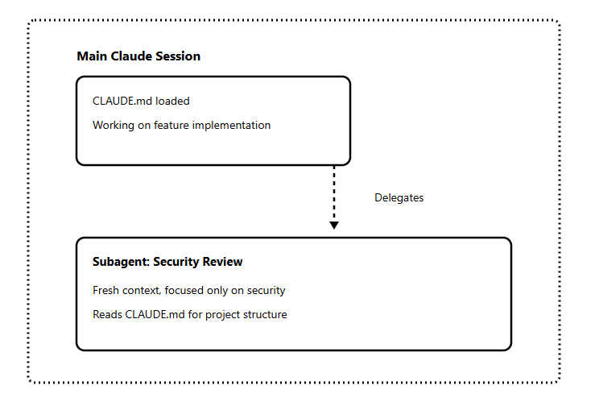

### Pattern 4: Context Swapping

For projects with distinct phases (development vs. deployment, frontend vs. backend), maintain multiple CLAUDE.md variants:

```
project/
├── CLAUDE.md                 # Active configuration
├── .claude/
│   ├── CLAUDE.development.md # Development focus
│   ├── CLAUDE.deployment.md  # Deployment focus
│   └── CLAUDE.debugging.md   # Debugging focus
```

Swap them as needed:

```
cp .claude/CLAUDE.deployment.md CLAUDE.md
```

This keeps Claude's focus tight and task-specific.

### Pattern 5: Conditional Instructions

Tell Claude to behave differently based on what it's working on:

```
## Conditional Rules

When working in `src/api/`:
- All endpoints must have OpenAPI documentation
- Use dependency injection for database sessions
- Return appropriate HTTP status codes

When working in `tests/`:
- Use fixtures from `conftest.py`
- Mock external services, never call them
- Each test file mirrors the source file structure

When working in `scripts/`:
- Scripts must be idempotent (safe to run multiple times)
- Include --dry-run option for destructive operations
- Log all actions for debugging
```

### Pattern 6: MCP Server Documentation

If you use MCP servers, document them in CLAUDE.md so Claude knows when and how to use them:

```
## MCP Integrations

### Slack MCP
- Posts to #dev-notifications channel only
- Use for deployment notifications and build failures
- Do not use for individual PR updates
- Rate limited to 10 messages per hour

### Database MCP
- Read-only access to production replica
- Use for data exploration, never for writes
- Prefer this over raw SQL when possible
```

This connects to the upcoming issue on the Claude Code MCP Masterclass.

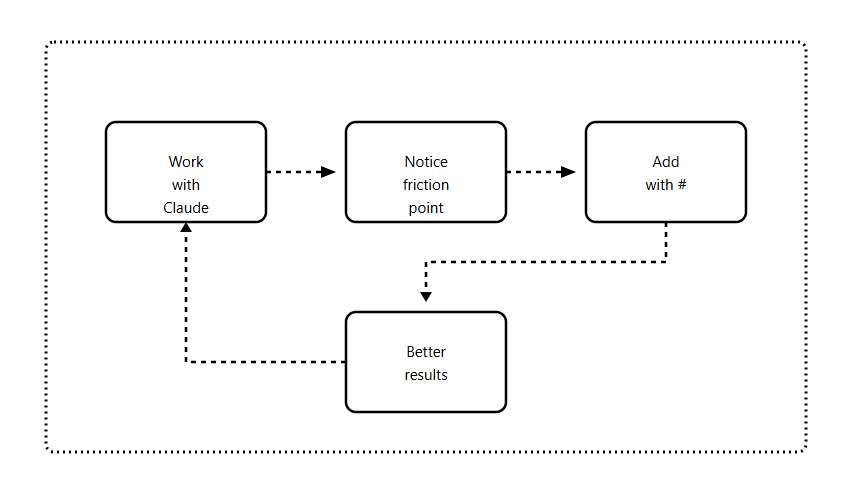

---

## CLAUDE.md + Hooks & Subagents

CLAUDE.md becomes more powerful when combined with other Claude Code features. Here's a preview of how they work together.

### CLAUDE.md + Hooks

Hooks are automated actions that run at specific points in Claude's workflow. Your CLAUDE.md can reference and coordinate with them.

Instead of asking Claude to check formatting (slow, expensive), set up a hook:

```
## Standards

Code must pass linting before commit.
A pre-commit hook runs `npm run lint` automatically.
Do not manually check formatting — the hook handles it.
```

The CLAUDE.md tells Claude the rule exists. The hook enforces it. Claude focuses on actual coding.

### CLAUDE.md + Subagents

Subagents are isolated Claude instances that handle specific tasks. They have their own context window, preventing information from one task from polluting another.

Your CLAUDE.md helps subagents understand the project quickly without needing the full conversation history.

```
## Subagent Guidelines

When delegating tasks to subagents:
- Security reviews: Use fresh subagent, don't carry implementation context
- Code exploration: Subagent should read general_index.md first
- Documentation: Subagent can access docs/ freely
```

CLAUDE.md alone is powerful. Combined with hooks and subagents, it becomes a complete automation system:

- CLAUDE.md defines the rules
- Hooks enforce them automatically
- Subagents handle specialized tasks with a clean context

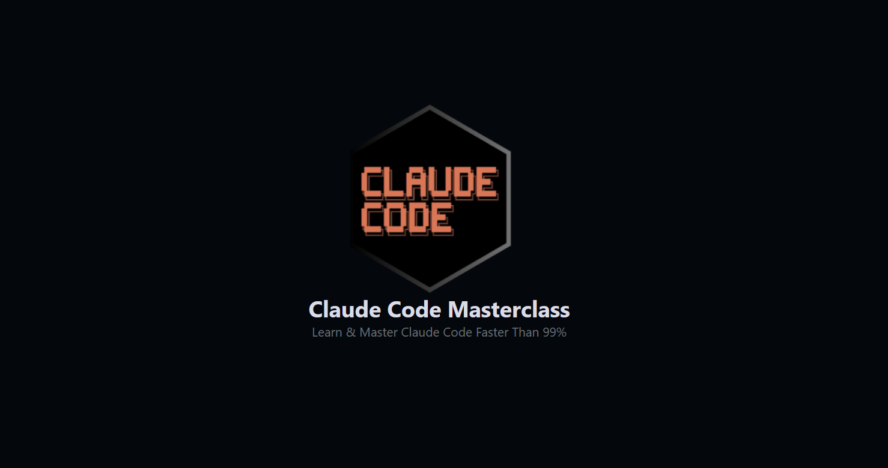

---

## CLAUDE.md Maintenance

CLAUDE.md isn't a "set and forget" file.

Projects change, teams learn better patterns, and new tools enter your workflow. Here's how to keep it current.

### Maintenance Best Practices

**1. Update with your PRs**

Add CLAUDE.md to your PR checklist:

- [ ] Code changes complete
- [ ] Tests passing
- [ ] Documentation updated
- [ ] **CLAUDE.md updated if workflows changed**

**2. Use the # shortcut continuously**

When you discover something Claude keeps missing, add it immediately:

```
# Always run database migrations before starting the dev server
```

These small additions compound into a CLAUDE.md that reflects reality.

**3. Review quarterly**

Set a reminder to review your CLAUDE.md every few months:

- Are all commands still accurate?
- Have any workflows changed?
- Is anything outdated or redundant?
- Can anything be removed?

**4. Version control it**

Commit CLAUDE.md to git. Your team benefits from improvements, and you can track what changed when.

---

## Final Thoughts

CLAUDE.md is the foundation of everything in Claude Code. When you get this right, every other feature (hooks, subagents, and MCP) works better.

**Key takeaways:**

- CLAUDE.md is a configuration file, not documentation
- Claude treats it as system-level rules, stricter than your prompts
- Less is more -- if it exceeds 100-150 instructions, you're doing too much
- Use the hierarchy: global -> project -> nested
- Progressive disclosure is better than bloated files
- Iterate continuously with the # shortcut

In the next Masterclass issue, we'll cover Hooks automation. Your CLAUDE.md will set the rules, and the hooks will enforce them.

### Resources

PS: I am working on our main Claude Code Masterclass Git repo, where I will add all these code snippets and templates for quick and easy access.

For this issue, I have these resources that will be added to the repo soon:

- Claude.md Templates by Project Type
- Claude.md Common Mistakes
- All the Code Snippets Shared In This Newsletter

---

### Next: Coming Up Issues

The next issues in this Masterclass Series will cover:

- Claude Code Hooks Masterclass -- Automation that runs without asking
- Claude Code Subagents Masterclass -- Building your AI team
- Claude Code MCP Masterclass -- Extending Claude's capabilities

Your CLAUDE.md is the foundation you need before moving to hooks, MCP servers, and subagents.

---

**What's your CLAUDE.md look like?**

Reply to this email with your current setup. I'll share interesting patterns in a future issue.

Finally, this newsletter belongs to all of us. If there's something that can make it better or something you don't like, please let me know.

**See you in the next one.**

---

## Claude Code Masterclass

Let's Build It Together

-- **Joe Njenga**
