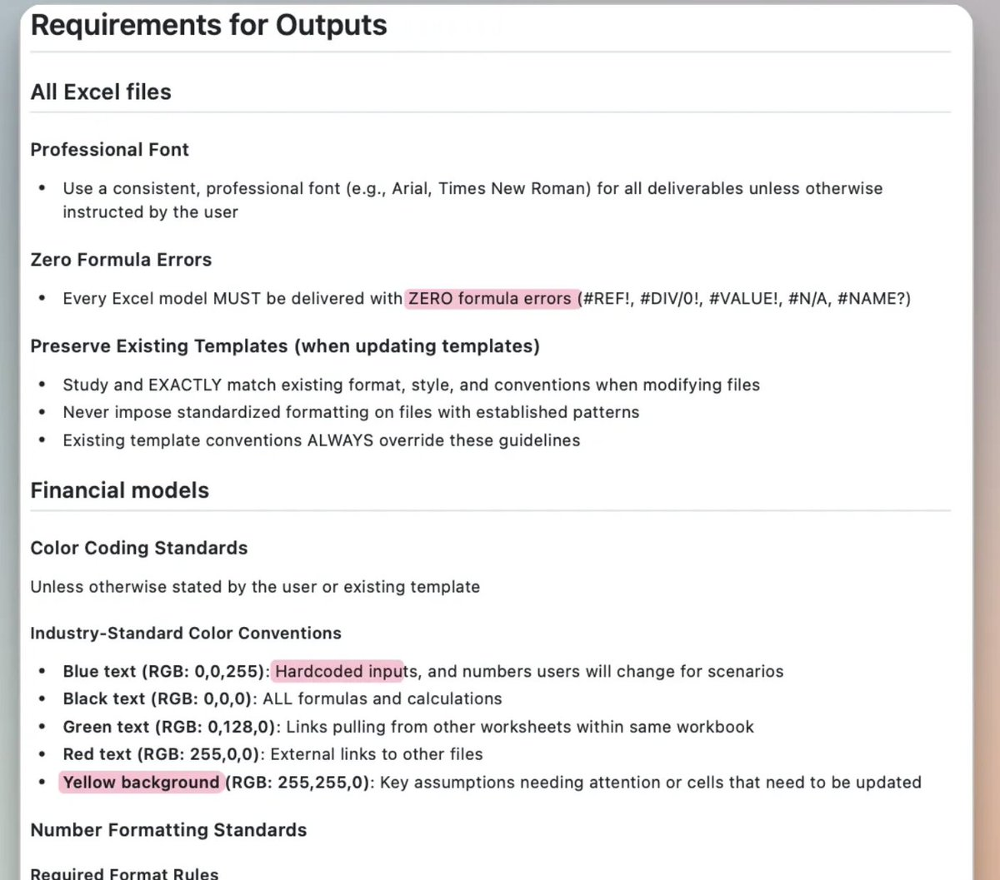
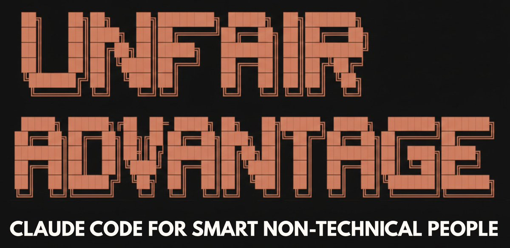
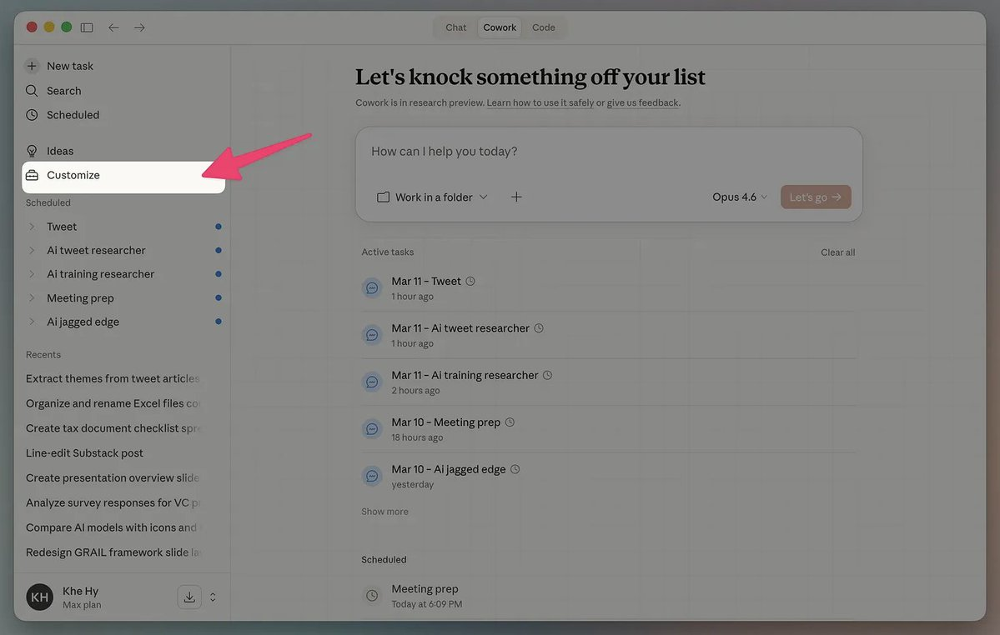
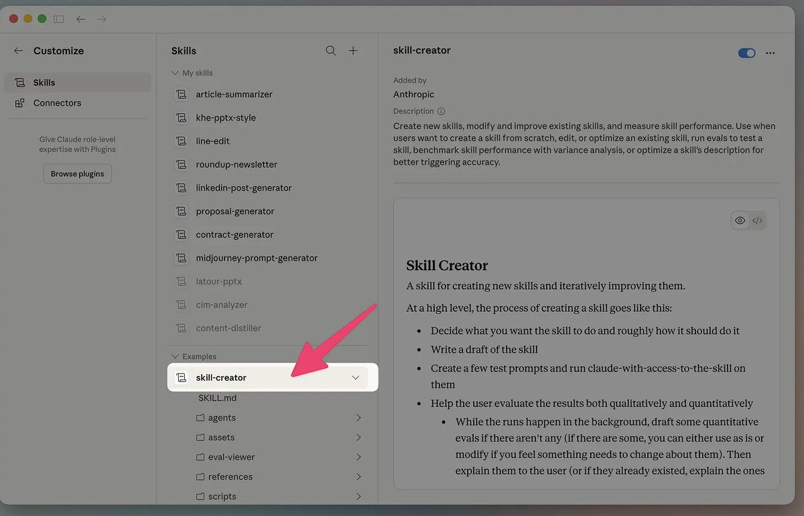
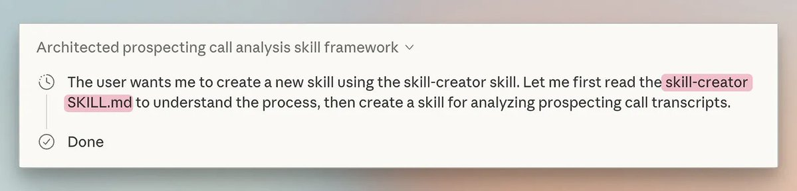
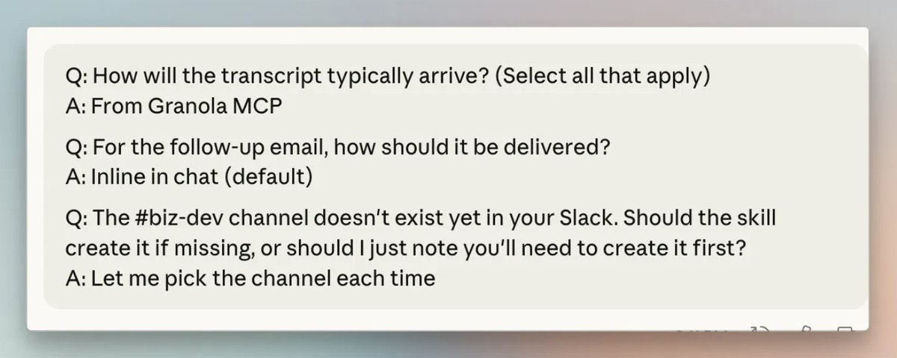
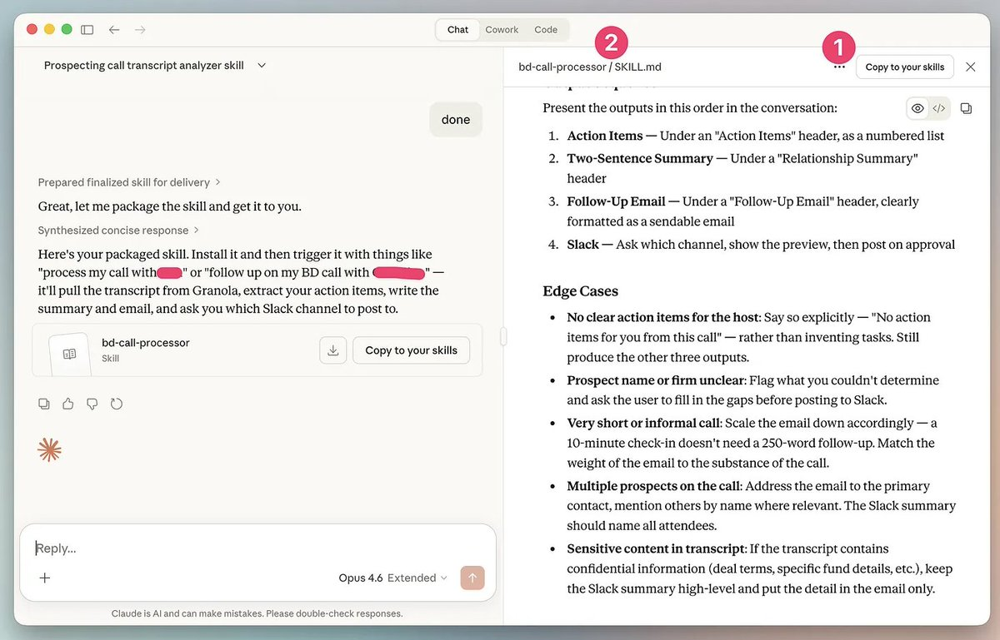
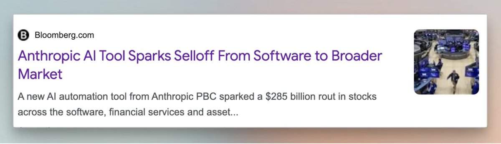

# The Complete Guide to Claude Skills (for non-coders)

**Author:** Khe Hy (@khemaridh)
**Date:** Mar 21, 2026
**Source:** https://x.com/khemaridh/status/2035431416436330624
**Stats:** 3 replies, 66 reposts, 558 likes, 1,579 bookmarks, 79,359 views

---

Skills.

That's what it takes to survive in this new AI-first world.

But we're not talking about skills like critical thinking, negotiation and public speaking. (Although those are still critical.)

We're talking about a good old fashioned text file.

Yup, a series of SKILL.md files is what separates AI power users from the normies.

And they are extremely easy to create.

## What is an Agent Skill?

A skill is a series of instructions that codify a workflow for an LLM.

According to Anthropic's official documentation:

> A skill is a set of instructions - packaged as a simple folder - that teaches Claude how to handle specific tasks or workflows. Skills are one of the most powerful ways to customize Claude for your specific needs. Instead of re-explaining your preferences, processes, and domain expertise.

Skills can be used to automate a series of tasks including:

- conducting research with consistent methodology
- creating documents that follow your team's style guide
- running the same analysis over different source material
- triggering multi-step workflows

To put this in more concrete terms, you could create a skill to:

- review an NDA using your firm's specific criteria
- write a standardized memo from a series of due diligence documents
- create a slide deck using your firm's branding
- collect market research from a specific list of resources

But like I said, at the end of the day, a skill is just a text file.

Here's an example of a skill that helps Claude make great Excel spreadsheets. (Funny enough, it's made by Anthropic -- so if you've had Claude Cowork create an Excel spreadsheet, you've already used it).

Here's how the skill defines the formatting:

I encourage you to read the entire skill in Anthropic's GitHub repository.

Now this probably looks daunting, but rest assured -- you don't have to type any of this out.

There's an easy shortcut we can all use.

Are you a non-coder looking to build agents using Claude Code? I built Unfair Advantage -- a 6-hour, self-paced course that takes you from zero coding experience to designing apps and agents in Claude Code. It walks you through real-world examples step by step, so you're actually building things (not just watching demos). By the end, you'll have the skills to turn your own ideas into working tools -- no engineering background required.

## Meet the "skill-creator" skill

Super meta, right?

Yes -- remember how you can have AI interview you for better prompts?

The same applies to skills. Claude can take your brain dump (usually done via WisprFlow) and magically turn it into a reusable skill.

First, you'll need to activate skill-creator by visiting the Customize section in the left toolbar:

Then you'll want to ensure that under "examples" the skill-creator skill is activated (i.e. in black versus grey).

Next you'll want to go back to the chat window to kickstart the process.

Today we'll create a skill to analyze the transcript from a Zoom call.

Here's the prompt to use:

> use the skill creator skill to help me come up with a skill to analyze, synthesize, and summarize transcripts
>
> The transcripts will be from prospecting calls for business development use cases. In these calls, I want you to extract a few key sections.
>
> First, you'll pull out the action items from the call and only do the ones that are assigned to me, the host.
>
> Next, you'll create a two-sentence summary so that someone who wasn't in the meeting but follows these relationships could quickly understand the gist of the call.
>
> Then you'll draft an email that acknowledges receipt of the action items, incorporates any next steps, and then has a casual sign-off. You'll try to incorporate 1-2 bits of the call in quotation marks using the prospect's exact languages and you'll share that you empathize with a few of their pain points or objections.
>
> Finally, you'll push the two-sentence summary along with the name of the prospect and their firm (if available) to the Slack channel #biz-dev.

The key language is to include "use the skill creator skill" which will make sure that the Anthropic skill gets triggered.

You'll also want to make sure that Claude confirms that it used the skill by looking at its "thinking audit trail."

When I ran this, Claude asked me 3 follow-up questions to dial-in the skill:

It then automatically ran the skill on one of my transcripts and asked for my feedback.

Here, it's very important that you iterate back and forth with Claude to nail all the nuances and edge cases of the skills.

Once you mark the skill complete, the actual SKILL.md file will appear in the right sidebar. I encourage you to read its contents (particularly to understand what's happening under the hood).

The last step is to activate it. First, take note of the skill name (#2) and then hit Copy to your Skills library (#1).

## Using your new skill

Now you're ready to use your new skill. Ours was called bd-call-processor.

I can attach a transcript and prompt:

> run the bd call processor skill on this attached transcript.

Once again, you want to look for that key step in Claude's audit trail that it actually found the skill. This is a very important step because without this acknowledgement you're just running a standard LLM prompt.

The skill then will proceed to run, ultimately ending with the notification into Slack.

Now you're probably asking yourself two questions:

### Question 1: Isn't this just a reusable prompt?

That's a fair mental model, but here's where it falls short. A detailed prompt is a good one-off instruction. (And yes, if you've written a good one, I used to encourage you to save them for reusability.)

A skill is more a reusable system that can also be bundled with specific examples and supporting scripts (which will cover in a latter post). And as a bonus, they are shareable with your colleagues.

### Question 2: Isn't this a glorified project?

Also a great question, but a bit off the mark.

Projects aggregate a series of relevant files (i.e. context). The skill is the workflow that can tap into that context.

Let's take a specific example. Say you're an investor with projects tied to specific investments. So you have a project for:

- NVIDIA fundamentals
- TSMC fundamentals

Each project has financials, management presentations and expert calls.

Now you have a skill called quarterly-memo-writeup, that you run each quarter. This skill sits on top of your projects. The project provides the context and the skill provides the instructions.

## Why skills are so powerful

The release of skills has played a role in the SaaS-pocalypse and the recent market sell-off.

When Anthropic released its legal skill, shares of RELX Plc and Wolters Kluwer NV both fell more than 10% on fears that it could consume large swaths of the legal market (both LegalTech and actual lawyers).

Now you know -- that this skill was just a really dialed-in markdown file (that was presumably written by a bunch of ex-lawyers).

Skills also have some really unique attributes:

### 1. Skills are composable

You can combine skills inside the same prompt:

> Retrieve my recent sales calls and run them through the proposal generator skill and use my writing style skill.

### 2. Skills are portable

Since they are just markdown files you can move them to different LLMs and save them to a centralized repository (like GitHub).

### 3. Skills are becoming a standard across LLMs

Anthropic pioneered the skills format (like it did with MCP) and other labs quietly began adapting them. My friend Jake Handy wrote a great piece on the broader skills ecosystem.

### 4. There are public repositories of skills

As a result, you can now go download skills from a variety of different sites, including:

- Skills.sh
- Anthropic's GitHub Repository
- ClawHub (for OpenClaw)

I've spent a bunch of time browsing these repositories just to get ideas on the types of skills folks are creating and how they are being structured.

### 5. Skills are efficient

Without getting too technical, skills use a technique called progressive disclosure. When an LLM loads a skill, it doesn't load the entire markdown file (nor the attached examples).

Instead, it "takes a peek" to see if the skill can be helpful with the given task. If it can't, it moves on. But if it can, it loads more of the skill into memory.

This makes skills very token-efficient -- which bodes well for agents.

### 6. Skills work well with your team

Skills embed best practices into every interaction making them an extremely consistent tool. Furthermore, they're likely to be created by your team's most proficient AI user -- which provides immediate leverage to the rest of your less savvy AI colleagues.

## It's your turn to build a skill

It's real easy.

1. Think of a repeatable workflow. (If you're at a loss for ideas, do a customized summarization skill.)
2. Load up the skill-creator skill.
3. Start your brain dump
4. Save the skill
5. Then kiss that workflow goodbye for the rest of your life!
