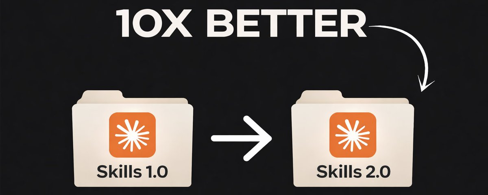
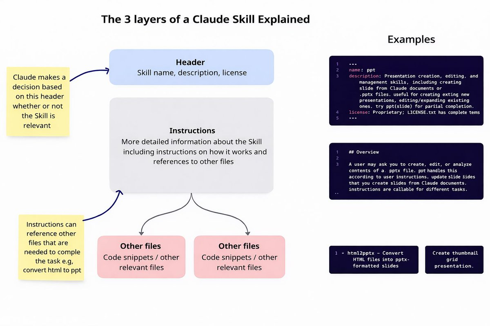
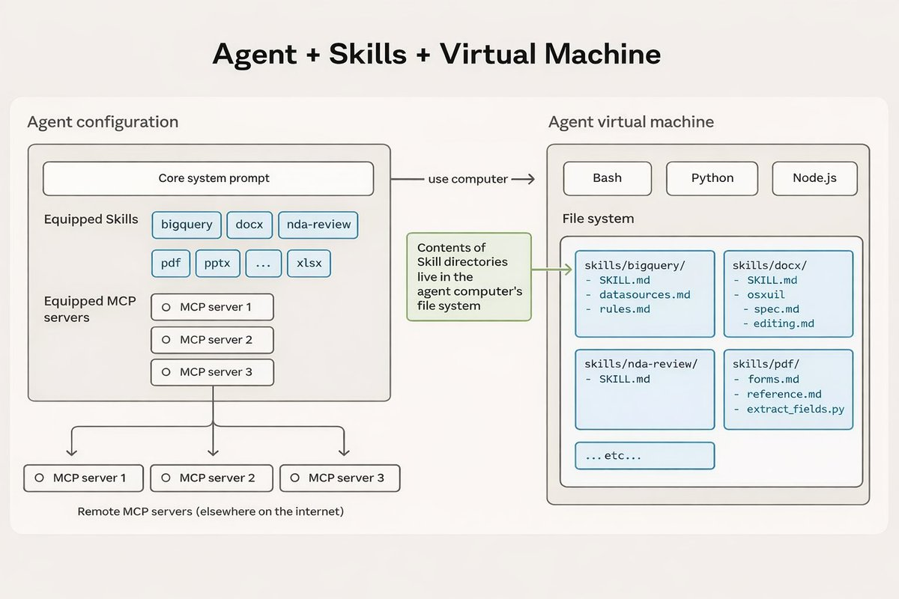
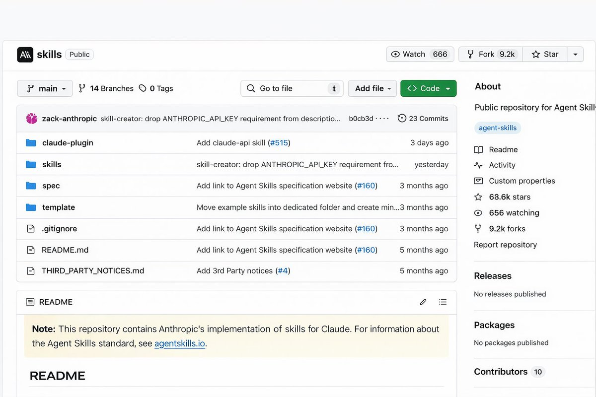
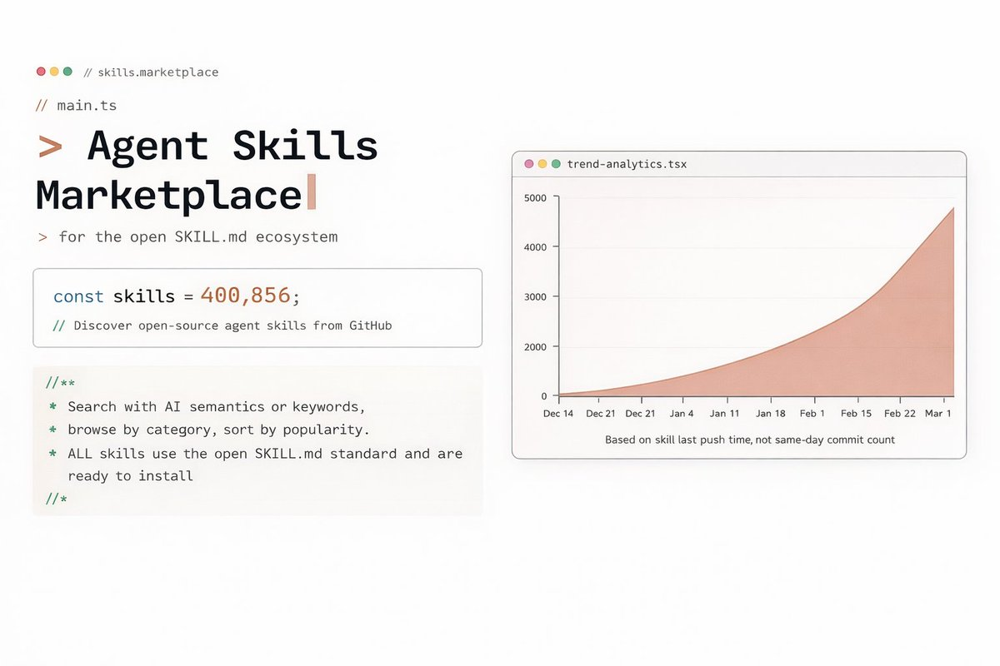
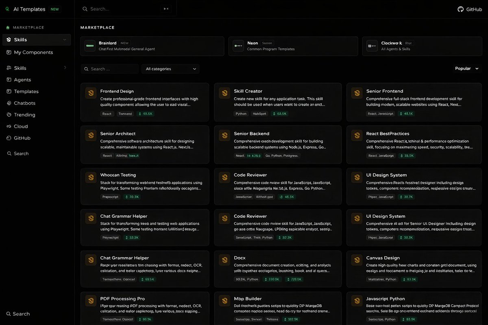

# How to build Claude Skills 2.0 Better than 99% of People

**Author:** leopardracer (@leopardracer)
**Date:** Mar 23, 2026
**Source:** https://x.com/leopardracer/status/2035999459729895493
**Stats:** 15 replies, 125 reposts, 985 likes, 2,229 bookmarks, 118.5K views

---



"It's a pain to give the same instructions to the AI every time..."
"The AI never remembers the company's rules and formats..."
"Everyone on the team uses the AI in different ways, so in the end, only those who are good at it benefit..."

---

Anthropic has just upgraded an incredible feature that can solve these problems. It's called "Claude Skills." This isn't just an update to the AI agent. It's a next-generation feature that lets you teach the AI your business processes and specialised knowledge so that it can grow into the ultimate expert tailored to your company's needs.

Claude Skills is the most powerful feature for teaching Claude specific tasks and workflows. What I've found most exciting about using it is that it eliminates the need to explain your preferences and processes in every conversation.

A Skill is a set of instructions packaged in a simple folder that you can set up once and benefit from every time. It really shines when you have a consistent workflow, such as generating front-end designs from specs or creating documents in line with your team's style guide.

In my experience, skills are not just "macros" or "templates," but act as a "knowledge base" that enhances Claude's decision-making abilities. They work particularly well with built-in functions such as code execution and document creation, allowing him to process even complex tasks seamlessly.

## What are Skills?

Skills are reusable pieces of knowledge and procedures that Claude Code can refer to to perform specific tasks. Each Skill is primarily defined as a Markdown file (SKILL.md) and can include associated scripts and resources as needed.

Claude Code loads the appropriate Skill in response to a user request and executes the task according to the instructions. This allows you to automate complex workflows and routine tasks consistently. Claude Code itself acts as a reference knowledge base, allowing you to directly execute scripts and manage workflows, so you can define and execute what should be done at what time using a rule-based system.

## What is Skill-creator?

Skill-creator is a "meta skill" that allows you to create, test, and improve skills in one go.

Roughly speaking, what a skill-creator does is the following five things.

1. Ask "What kind of skills do you want to develop?"
2. SKILL.md Automatically generate a draft of
3. Test it by actually running it with the test prompt
4. Evaluate the results and propose improvements
5. Repeat steps 2 to 4 until you are satisfied

The idea is that Claude Code itself will go through the cycle of manual SKILL.md writing, trying, and fixing things.

## How to write SKILL.md?

File structure

Basically, you can create a skill by simply creating `.claude/skills` a folder and file for the skill under SKILL.md

SKILL.md The contents will be as follows, written in YAML and Markdown.

```
---
name: Your Skill Name
description: Brief description of what this Skill does and when to use it
---
```

```
# Your Skill Name

## Instructions
Provide clear, step-by-step guidance for Claude.

## Examples
Show concrete examples of using this Skill.
```

First, I will explain the YAML part.

```
---
name: Your Skill Name
description: Brief description of what this Skill does and when to use it
---
```

This is called metadata and is a very important part of creating a skill.

Claude reads the metadata at startup and only knows when each skill exists and when it's available, incorporating it into the system prompt. This approach lets you have many skills without unnecessarily bloating your context.

When a prompt or request matches the skill's metadata, Claude reads it from the SKILL.md file system.

The accuracy of whether or not something is actually executed depends heavily on the content of the metadata, so this is a very important factor.

Next, I will explain the content section.

```
# Your Skill Name
```

```
## Instructions
Provide clear, step-by-step guidance for Claude.

## Examples
Show concrete examples of using this Skill.
```

The metadata is always loaded when Claude starts up, but the content part is loaded at runtime. Then, when an agent skill is executed, Claude will process the contents in the content part.

[Official best practices](https://platform.claude.com/docs/en/agents-and-tools/agent-skills/best-practices) recommend keeping your SKILL.md under 500 lines. If it exceeds that, split out detailed reference material into a separate file:

```
.claude/skills/
  my-skill/
    SKILL.md          <- Main instructions (within 500 lines)
    templates/         <- Template files
    reference.md       <- Detailed reference material
```

Use instructions in SKILL.md Read to guide Claude to load additional files only when needed, unpacking as needed rather than loading everything at once. This is Progressive Disclosure: provide the core instructions first, unpacking the details as needed.

The key here is that even if Agent Skills is doing an efficient job of loading, it's best to keep the content part brief as well - when Claude loads the content part, it will compete with the conversation history and other context.

Therefore, CLAUDE.md omit general references to system prompts, programming languages, libraries, etc. in the content section. One of the tricks to creating a highly accurate skill is to determine which parts to omit and where to begin in the content section.

## Why is this skill needed?

When responding to PR review comments, we faced the following challenges:

- It's time-consuming to check every review comment
- It's hard to know which comments are unaddressed
- It's a hassle to communicate the contents of review comments to Claude Code.

By using this Skill, Claude Code will automatically retrieve unaddressed comments and suggest fixes.

## How Skills Work

A Skill is simply a folder containing commands.

At the heart of a Skill is a folder containing a SKILL.md file. This Markdown file uses YAML Front Matter to define metadata (such as name and description), while the main body contains clear, step-by-step task instructions and examples.

```
my-Skill.zip
  my-Skill/
    Skill.md
    resources/
```

Claude will automatically discover and load the relevant skills.

No manual skill triggering is required. At the start of a session, Claude scans the metadata (name and description) of all installed skills and loads this brief information into its system prompt.

When your request matches the description of a skill, Claude automatically reads and loads the complete instructions for that skill.

The "progressive disclosure" mechanism makes Skills extremely efficient.

Skill uses a three-layer structure (YAML preface, body, and file references) to gradually and on-demand feed information into the model context, avoiding a one-time overload and improving efficiency and token economy.



Skills are designed with token efficiency in mind. Upon initial loading, each Skill uses only a few dozen tokens to store its metadata. The detailed instructions for a Skill are only displayed in the context window when it is triggered.

This on-demand loading mechanism means you can install a large number of Skills without impacting model performance due to a full context window.

For more complex Skills, different instructions can be split across multiple files, and Claude reads only the parts needed for the current task, further conserving tokens.



## MCP Vs Skills

Skills are another powerful layer for those already using MCP (Model Context Protocol). I find the relationship best understood with the analogy of a kitchen and a recipe.

MCP provides a professional kitchen, giving you access to the tools, ingredients, and equipment. Skills, on the other hand, are recipes that provide step-by-step instructions for creating something of value.

Combining these two allows users to accomplish complex tasks without having to figure out all the steps themselves. When I first built the MCP server, I thought that just providing access to the tools would be enough, but in reality, there was a lack of workflow guidance on how to use the tools, which confused users.

After introducing Skills, a clear division of roles was created: MCP defined what can be done, and Skills taught how to do it, and the user experience improved dramatically.

## Installing this Skill

If you want to install Claude code in its best form, with all the best features, you have come to the right place. Make sure you have VS Code. If you don't have it, go and install it. In this video, I will not cover how to install.

Let's go ahead and open that, and now, we actually have a new project, so from here, let's go and install Claude code inside of VS Code and open up the extensions, click search and type Claude code. Make sure that you see the verification symbol and install the extension. After you install Claude code, look at the very top, and you will see the little logo and click on that.

Skills are actually a form of plugin. We use anthropics/skills marketplace. Install Skills through plugins in the marketplace, and Claude will automatically load them when needed.

## Add Skills plugin marketplace

You can also enter `/plugin`. The following is to add a plugin marketplace: Then, enter the official GitHub Skills address:

```
https://github.com/anthropics/skills
```

## Install Skills plugin

After adding the market, you will be prompted to install skill plugins:

You can also quickly install Skills using the following command:

```
/plugin install document-skills@anthropic-agent-skills
/plugin install example-skills@anthropic-agent-skills
```

The official uses of the two skill plugins are as follows:

- **document-skills**: A package of document skills that can handle documents such as Excel, Word, PPT, and PDF.
- **example-skills**: Sample skill sets that can handle skill creation, MCP building, visual design, algorithmic art, web testing, Slack GIF creation, theme styling, and more.

Installation successful. You can view the added skill plugins and the marketplace by `/plugin` entering the command prompt. Select marketplace.

You can access the skill plugin via `/plugin` command line Manage plugins to perform operations such as updating and deleting:

After installation, we're going to check if the `/skill-creator` available, I am going to ask the Claude Code:

```
Do u have the skill creator skill, and what does it do ?
```

You can see right here that we do have that, so I will switch to plan mode and ask it to build us a new skill.

> I want you to create a skill that helps me plan a complete one-month app launch. I need it to break down the launch into manageable weekly chunks - first two weeks for getting everything ready (finishing features, creating app store materials, setting up marketing), third week for the actual launch (testing with a small group first, reaching out to press, going live), and the final week for monitoring how it's doing and making quick fixes. Include some templates I can actually use like launch checklists and social media posts. The skill should activate whenever I mention things like "app launch plan" or "launch my app in 30 days." It should work whether I'm launching an iPhone app.

## The main text should only include things that Claude doesn't know.

The Skill-Creator guide has this to say:

> "Default assumption: Claude is already very smart. Only add context Claude doesn't already have."

The basic premise is that Claude is intelligent to begin with, so writing general knowledge or programming basics in SKILL.md will only waste tokens.

You should focus on information you wouldn't know (company-specific rules, quirks of specific libraries, domain-specific workflows, etc.).

It is recommended to avoid lengthy explanations and use an imperative and concise writing style.

## Match the "degrees of freedom" of instructions to the task

It's not necessary to specify everything in great detail; the key is to adjust the granularity of your instructions to suit the task.

- **High degree of freedom** (text-based instructions) - When multiple approaches, such as writing, are effective.
- **Moderate flexibility** (pseudocode or scripts with parameters) - There is a recommended pattern, but some variation is OK.
- **Low flexibility** (specific scripts, few parameters) - When consistency of procedures is crucial, and mistakes are fatal.

What types of Claude Skills are there, and where can I find them?

In terms of usage, there are two types: Claude currently supports using the official built-in Skill and locally uploaded Skills.

Based on the source of the skill, it can be divided into three types:

**Official Skills**, provided by Anthropic and its partners.

```
https://github.com/anthropics/skills
```



[Claude.ai](https://claude.ai/) For example, the logic code behind those smooth features you use in the web version - such as "develop a web application for me," "analyse this PDF document," and "write a Snake game and preview it" - is all in this repository! You create Custom Skills and are suitable for users who need personalised customisation. Use Skill Creator to create and upload Skill files.

**Community skills**, shared by other users, are readily available and much faster than reinventing the wheel, making them ideal for skill selection and modification. Simply download and upload; however, be aware of security risks before use.

```
https://skillsmp.com/
```



```
https://www.aitmpl.com/skills
```



How do you determine if a task is suitable to be made into a Skill?

When you find yourself frequently requesting the same type of tasks from Claude, or have templates or assets that need to be used repeatedly, such as:

- "Help me write the weekly report using the company's template": You need to write a team weekly report every week, and each time you need to tell Claude to organize the content according to three parts: "This week's achievements, difficulties encountered, and next steps." At this point, you can create a "Team Weekly Report Generator" skill.
- "Create presentations in our company's style": Often, it's essential to strictly adhere to brand guidelines, including logo usage, brand colors, company name, company business content, and professional expectations. You can package these guidelines into a "Brand Presentation Style" skill.
- "Organizing market analysis reports/conducting competitor research using a specific format": For example, creating a market analysis report might require combining three sets of competitor data, one set of internal sales data, and applying a fixed analytical framework. This entire complex process can be encapsulated into a "market analysis report" skill.

Conversely, if it's just an occasional, one-off request, you can simply state it in the chat, and there's no need to create a Skill.

## Conclusion:

Claude Skills is an absolute must-have for people who frequently perform repetitive, routine tasks. It transforms your "unclear work experience" into "explicit rules" that AI can understand, allowing Anthropic's tools to be perfectly adapted to your needs.

Whether you're a product owner, project manager, copywriter, or anyone using Claude in the workplace, you can rely on it to reduce repetitive work and ensure consistent output - that's the core value of Skills.
