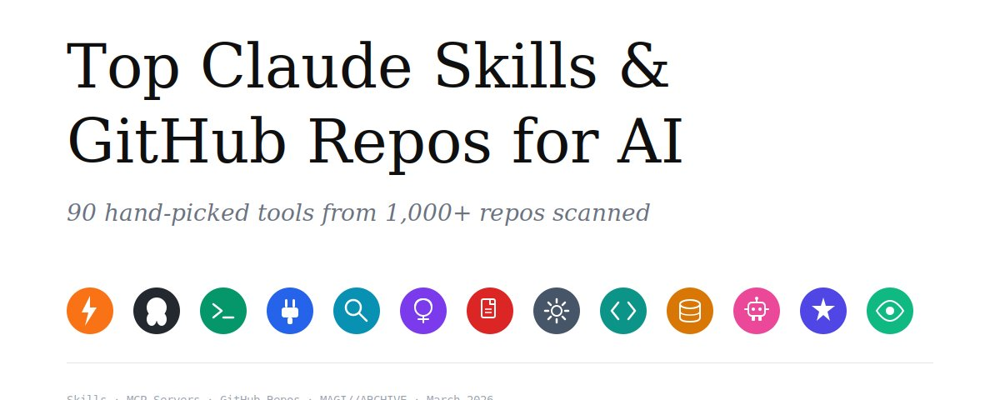
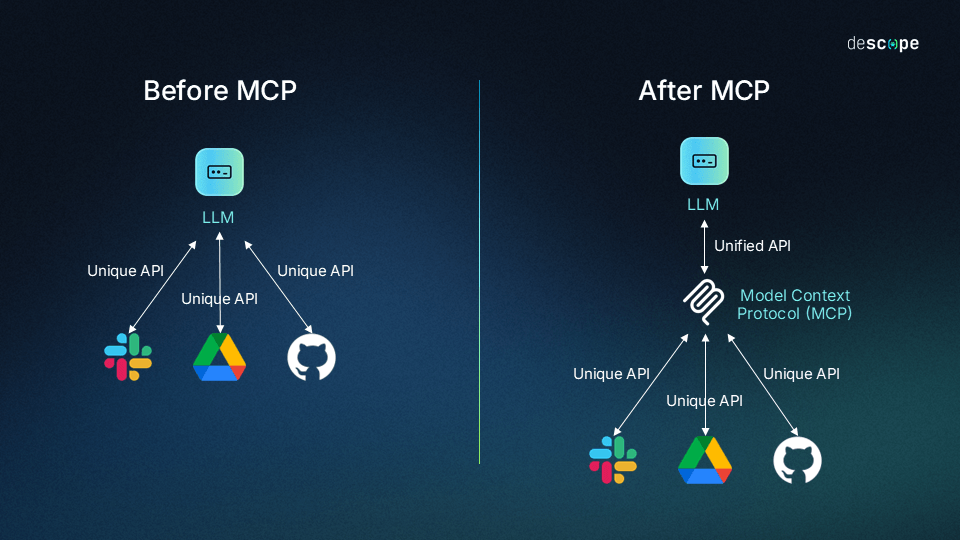
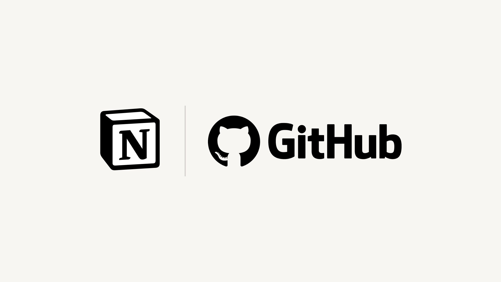
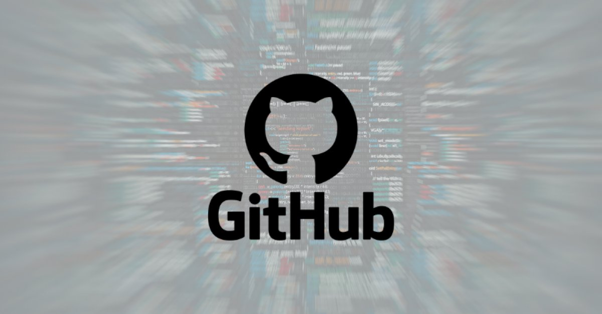
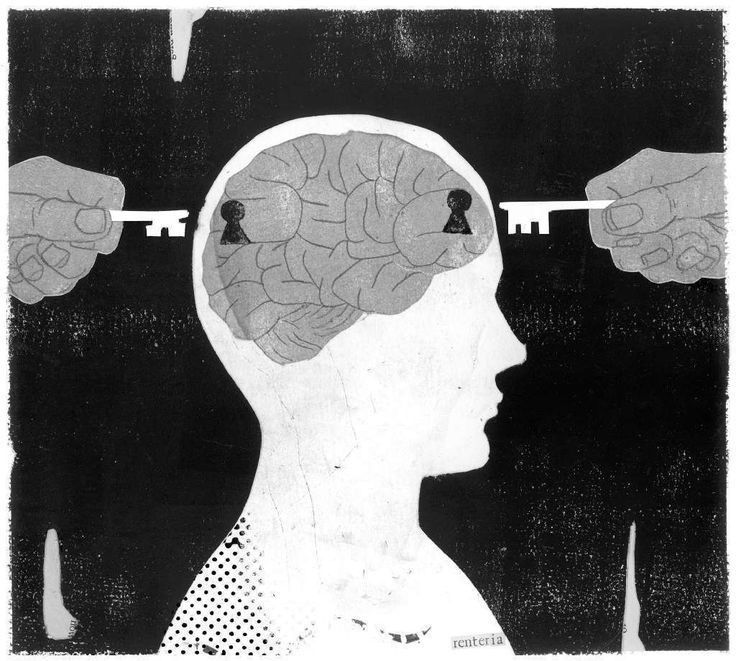

# Top 50 Claude Skills & GitHub Repos for AI — The Only List You Need.

**Author:** darkzodchi (@zodchiii)
**Date:** Mar 20, 2026
**Source:** https://x.com/zodchiii/status/2034924354337714642
**Stats:** 117 replies, 1,680 reposts, 9,659 likes, 6.4M views

---

## I scanned 1,000+ repos and tested 200+ skills so you don't have to.

Here are the 90 AI tools that actually matter right now — skills, MCP servers, and GitHub repos in one list. Zero fluff.

## Part 1: Claude Skills

There are 60,000+ community skills out there. It's an app store for AI coding knowledge. These 22 are the ones worth installing.

### Document & Office (Official Anthropic)

01 — PDF Processing — Read, extract tables, fill forms, merge/split. Highest-utility skill for knowledge workers.
https://github.com/anthropics/skills/tree/main/skills/pdf

02 — DOCX — Create & edit Word docs with tracked changes, comments, formatting.
https://github.com/anthropics/skills/tree/main/skills/docx

03 — PPTX — Slide decks from natural language. Layouts, charts, speaker notes.
https://github.com/anthropics/skills/tree/main/skills/pptx

04 — XLSX — Formulas, analysis, charts via plain English.
https://github.com/anthropics/skills/tree/main/skills/xlsx

05 — Doc Co-Authoring — Real collaborative writing. Human writes, Claude responds, back and forth.
https://github.com/anthropics/skills/tree/main/skills/doc-coauthoring

### Design & Creative

06 — Frontend Design — Escape "AI slop" aesthetics. Real design systems, bold typography. 277k+ installs.
https://github.com/anthropics/skills/tree/main/skills/frontend-design

07 — Canvas Design — Social graphics, posters, covers — text in, PNG/PDF out.
https://github.com/anthropics/skills/tree/main/skills/canvas-design

08 — Algorithmic Art — Fractal patterns, geometric compositions via p5.js.
https://github.com/anthropics/skills/tree/main/skills/algorithmic-art

09 — Theme Factory — Batch-generate color schemes from one prompt.
https://github.com/anthropics/skills/tree/main/skills/theme-factory

10 — Web Artifacts Builder — Calculators, dashboards via natural language. No frontend skills needed.
https://github.com/anthropics/skills/tree/main/skills/web-artifacts-builder

### Dev & Engineering

11 — Superpowers — 20+ battle-tested skills. TDD, debugging, plan-to-execute pipeline. 96k+ stars.
https://github.com/obra/superpowers

12 — Systematic Debugging — Root cause analysis first, fix second. 4-phase methodology. S9.2 on SkillHub.
https://github.com/obra/superpowers

13 — File Search — Ripgrep + ast-grep mastery. S9.0 rated.
https://github.com/massgen/massgen

14 — Context Optimization — Reduce token costs, KV-cache tricks. 13.9k stars.
https://github.com/muratcankoylan/agent-skills-for-context-engineering

15 — Skill Creator (Official) — Meta-skill: describe a workflow, get a SKILL.md in 5 min.
https://github.com/anthropics/skills/tree/main/skills/skill-creator

16 — Remotion Best Practices — AI video generation. 117k weekly installs.
https://github.com/remotion-dev/remotion

### Marketing & SEO

17 — Marketing Skills by Corey Haines — 20+ skills: CRO, copywriting, SEO, email sequences, growth.
https://github.com/coreyhaines31/marketingskills

18 — Claude SEO — Full-site audits, schema validation. 12 sub-skills.
https://github.com/AgriciDaniel/claude-seo

19 — Brand Guidelines — Encode your brand into a skill. Auto-applies everywhere.
https://github.com/anthropics/skills/tree/main/skills/brand-guidelines

### Knowledge & Learning

20 — NotebookLM Integration — Claude + NotebookLM bridge. Summaries, mind maps, flashcards.
https://github.com/PleasePrompto/notebooklm-skill

21 — Obsidian Skills — By Obsidian's CEO. Auto-tagging, auto-linking, vault-native.
https://github.com/kepano/obsidian-skills

22 — Excel MCP Server — Manipulate Excel without Microsoft Excel.
https://github.com/haris-musa/excel-mcp-server

All official skills: https://github.com/anthropics/skills

Browse 80k+ community skills: https://skillsmp.com

## My Must-Have MCP Servers

Beyond skills — I love using these. Skills teach Claude HOW to do things. MCP gives it ACCESS to the outside world. These three changed my workflow.

### Tavily

Search engine built for AI agents. Not blue links — clean structured data. Four tools: search, extract, crawl, map. Connects as remote MCP in one minute.
https://github.com/tavily-ai/tavily-mcp

### Context7

Injects up-to-date library docs into your LLM's context. No more hallucinated APIs. No more deprecated methods. Just add "use context7" to your prompt. Supports Next.js, React, Supabase, MongoDB, thousands more.
https://github.com/upstash/context7

### Task Master AI

Your AI's project manager. Feed a PRD -> structured tasks with dependencies -> Claude executes one by one. Turns chaotic sessions into a proper pipeline. Works across Cursor, Claude Code, Windsurf.
https://github.com/eyaltoledano/claude-task-master

## Part 2: GitHub Repos

25 open-source engines powering the AI revolution.

Let's start with most famous one and go into more lowkey ones.

### Agent Frameworks

23 — OpenClaw — The viral AI agent. Persistent, multi-channel, writes its own skills. 210k+ stars.
https://github.com/openclaw/openclaw

24 — AutoGPT — Full agent platform for long-running tasks.
https://github.com/Significant-Gravitas/AutoGPT

25 — LangGraph — Agents as graphs. Multi-agent orchestration. 26.8k stars.
https://github.com/langchain-ai/langgraph

26 — OWL — Multi-agent cooperation. Tops GAIA benchmark.
https://github.com/camel-ai/owl

27 — Dify — Open-source LLM app builder. Workflows, RAG, agents all-in-one.
https://github.com/langgenius/dify

28 — CrewAI — Multi-agent with roles, goals, backstories.
https://github.com/crewAIInc/crewAI

29 — CopilotKit — Embed AI copilots into React apps.
https://github.com/CopilotKit/CopilotKit

### Local AI

30 — Ollama — Run LLMs locally with one command.
https://github.com/ollama/ollama

31 — Open WebUI — Self-hosted ChatGPT-like interface.
https://github.com/open-webui/open-webui

32 — LlamaFile — LLM as single executable. Zero dependencies.
https://github.com/Mozilla-Ocho/llamafile

33 — Unsloth — Fine-tune 2x faster, 70% less memory.
https://github.com/unslothai/unsloth

### Workflow & Automation

34 — n8n — Open-source automation, 400+ integrations + AI nodes.
https://github.com/n8n-io/n8n

35 — Langflow — Visual drag-and-drop for agent pipelines. 140k stars.
https://github.com/langflow-ai/langflow

36 — Huginn — Self-hosted web agents. Monitoring, alerts. Privacy-first.
https://github.com/huginn/huginn

### Search & Data

37 — GPT Researcher — Autonomous research -> compiled reports.
https://github.com/assafelovic/gpt-researcher

38 — Firecrawl — Any website -> LLM-ready data.
https://github.com/mendableai/firecrawl

39 — Vanna AI — Natural language -> SQL.
https://github.com/vanna-ai/vanna

### Dev Tools

40 — Codebase Memory MCP — Codebase -> persistent knowledge graph.
https://github.com/DeusData/codebase-memory-mcp

41 — DSPy — Program (not prompt) foundation models.
https://github.com/stanfordnlp/dspy

42 — Spec Kit (GitHub) — Spec-driven dev. Write specs, AI generates code. 50k+ stars.
https://github.com/github/spec-kit

43 — NVIDIA NemoClaw — Secure sandbox for autonomous agents.
https://github.com/NVIDIA/NemoClaw

### Curated Collections

44 — Awesome Claude Skills — Best curated skill list. 22k+ stars.
https://github.com/travisvn/awesome-claude-skills

45 — Anthropic Skills Repo — Official reference implementations.
https://github.com/anthropics/skills

46 — Awesome Agents — 100+ open-source agent tools.
https://github.com/kyrolabs/awesome-agents

47 — MAGI//ARCHIVE — Daily feed of fresh AI repos.
https://tom-doerr.github.io/repo_posts/

## 40 fresh Github Repos Worth Watching

I scanned 1,000+ repos from Github forums and picked the most interesting AI projects. Don't forget to do security check yourself.

### Agent Orchestration & Multi-Agent

- gstack — Claude Code as virtual engineering team
  https://github.com/garrytan/gstack
- cmux — Multiple Claude agents in parallel
  https://github.com/craigsc/cmux
- figaro — Orchestrate Claude agent fleets on desktop
  https://github.com/byt3bl33d3r/figaro
- claude-squad — Terminal agents in parallel sessions
  https://github.com/smtg-ai/claude-squad
- deer-flow (ByteDance) — Sub-agents and sandboxes through skills
  https://github.com/bytedance/deer-flow
- SWE-AF — One API call spins up engineering team
  https://github.com/Agent-Field/SWE-AF
- AIlice — Complex tasks -> dynamic agents
  https://github.com/myshell-ai/AIlice
- Agent Alchemy — Claude Code + plugins + task manager
  https://github.com/sequenzia/agent-alchemy

### Agent Infrastructure & Security

- Ghost OS — AI agents operate every Mac app
  https://github.com/ghostwright/ghost-os
- e2b/desktop — Isolated virtual desktops for agents
  https://github.com/e2b-dev/desktop
- container-use (Dagger) — Containerized environments for coding agents
  https://github.com/dagger/container-use
- Canopy — Encrypted P2P mesh for AI agents
  https://github.com/kwalus/Canopy
- agent-governance-toolkit (Microsoft) — Security middleware for agents
  https://github.com/microsoft/agent-governance-toolkit
- claude-code-security-review (Anthropic) — PRs analyzed for security
  https://github.com/anthropics/claude-code-security-review
- promptfoo — Automated security testing for AI models
  https://github.com/promptfoo/promptfoo

### Memory & Context

- Mem9 — Memory system for AI agents
  https://github.com/mem9-ai/mem9
- Codefire — Persistent memory for coding agents
  https://github.com/websitebutlers/codefire-app
- Memobase — User profile memory for LLMs
  https://github.com/memodb-io/memobase

### Coding Agents & Dev Tools

- Qwen Code — Terminal AI coding agent by QwenLM
  https://github.com/QwenLM/qwen-code
- gptme — Personal AI agent in terminal
  https://github.com/gptme/gptme
- Claude Inspector — See hidden Claude Code prompt mechanics
  https://github.com/kangraemin/claude-inspector
- TDD Guard — Enforces test-first for AI agents
  https://github.com/nizos/tdd-guard
- rendergit (Karpathy) — Git repo -> single file for humans and LLMs
  https://github.com/karpathy/rendergit
- autoresearch (Karpathy) — Autonomous LLM training system
  https://github.com/karpathy/autoresearch
- pydantic-ai — Type-safe agent framework
  https://github.com/pydantic/pydantic-ai
- claude-deep-research-skill — 8-phase research with auto-continuation
  https://github.com/199-biotechnologies/claude-deep-research-skill

### MCP & Integrations

- MCP Playwright — Browser automation for LLMs
  https://github.com/executeautomation/mcp-playwright
- stealth-browser-mcp — Undetectable browser automation
  https://github.com/vibheksoni/stealth-browser-mcp
- fastmcp — Build MCP servers in minimal Python
  https://github.com/jlowin/fastmcp
- markdownify-mcp — PDFs, images, audio -> Markdown
  https://github.com/zcaceres/markdownify-mcp
- MCPHub — Manage multiple MCP servers via HTTP
  https://github.com/samanhappy/mcphub

### Search, Data & LLM Tools

- CK (BeaconBay) — Search code by meaning, not keywords
  https://github.com/BeaconBay/ck
- ExtractThinker — ORM for document intelligence
  https://github.com/enoch3712/ExtractThinker
- OmniRoute — API proxy for 44+ AI providers
  https://github.com/diegosouzapw/OmniRoute
- dlt — LLM-native data pipelines from 5,000+ sources
  https://github.com/dlt-hub/dlt
- simonw/llm — Lightweight CLI for local and remote LLMs
  https://github.com/simonw/llm
- Portkey-AI/gateway — Route requests to 250+ LLMs
  https://github.com/Portkey-AI/gateway
- lmnr — Trace and evaluate agent behavior
  https://github.com/lmnr-ai/lmnr

### Video & More

- LTX-Desktop (Lightricks) — Generate and edit videos locally
  https://github.com/Lightricks/LTX-Desktop
- MetaClaw — Evolve AI agents without GPU
  https://github.com/aiming-lab/MetaClaw
- Vane — AI answering engine with local LLMs
  https://github.com/ItzCrazyKns/Vane

## Where to Find More Skills

- skillsmp.com — 80k+ skills, largest catalog
- aitmpl.com/skills — Templates, one-command install
- skillhub.club — 31k+ skills, AI-rated
- agentskills.io — Official spec

Install any skill: Personal: ~/.claude/skills/ Project: .claude/skills/ Clone, copy, restart. Done.

## TL;DR

- **Skills** = teach Claude HOW to do things better
- **MCP** = give Claude ACCESS to external tools and data
- **GitHub repos** = the open-source engines powering it all

Combine all three -> unstoppable AI workflow.

## That's it. Now go build something.

This list took me hours to compile — scanning 1,000+ repos, testing skills, reading docs. If it saved you time, you know what to do.

I post stuff like this regularly — AI tools, workflows, prompts, and things I actually use. No fluff, no hype, just what works.

Follow me so you don't miss the next one:

Telegram -> https://t.me/zodchixquant

If you found a tool I missed — DM me. I'll add it to the next update.
