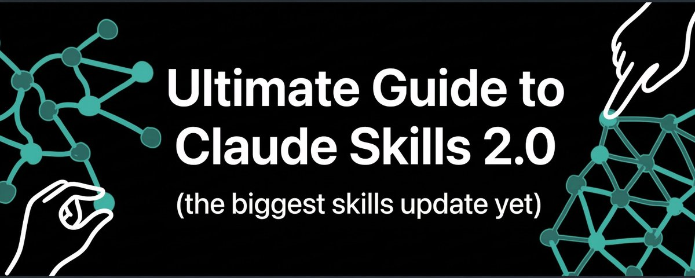

# Ultimate Guide to Claude Skills 2.0 (the biggest skills update yet)

**Author:** Ole Lehmann (@itsolelehmann)
**Date:** March 10, 2026
**Source:** https://x.com/itsolelehmann/status/2031461162768867622
**Stats:** 14 replies, 124 retweets, 1,224 likes, 3,576 bookmarks, 275,981 views

---

## Original Tweet

The original tweet by Ole Lehmann contains a link to the full X article (https://x.com/i/article/2031326565460594688) with the cover image shown above.

## Thread Breakdown

*From the companion thread tweet (https://x.com/itsolelehmann/status/2031679839476875734) — 833 likes, 75 retweets, 26 replies, 1,777 bookmarks, 171,297 views:*

---

claude skills 2.0 quietly launched this week and most people missed it

anthropic shipped 3 upgrades to skills that fix the problems almost everyone runs into

here's the breakdown (and how to upgrade yours):

problem 1: you had no way to measure how well your skills were actually performing.

now you can run real evals that test your skill against multiple prompts and get a score (like 7/9 passed).

you fix what failed, retest, and repeat until it's dialed in.

---

problem 2: your skills break when models update and you don't notice.

say you wrote a skill 3 months ago when claude needed detailed instructions for landing pages.

now claude is way better at landing pages by default

but your old skill is still forcing it to follow outdated steps instead of using its own improved abilities.

now you can run a/b comparisons between your skill and raw claude

so you know if a skill is still earning its place or if you should fix/retire it.

---

problem 3: claude doesn't even use your skill half the time because the description is too vague or too specific.

now the skill creator rewrites your descriptions automatically so they trigger at the right time.

anthropic ran this on their own skills and saw better triggering on 5 out of 6.

i cooked a full step-by-step breakdown below

---

## X Article Preview

**Title:** Ultimate Guide to Claude Skills 2.0 (the biggest skills update yet)

**Preview text:** Claude Skills 2.0 just dropped and most people missed it. Anthropic quietly upgraded the Skill Creator, and it fixes the 3 biggest problems everyone has with skills right now. If you use this right,

*Note: The full X article (https://x.com/i/article/2031326565460594688) requires JavaScript rendering on X.com and could not be fully extracted. The thread above contains the key breakdown of the three problems and solutions. The article itself contains an additional detailed step-by-step walkthrough of how to use the new Skill Creator features.*

## Key Features of Claude Skills 2.0

Based on the thread and article preview:

1. **Eval Testing** — Run your skill against multiple prompts and get a pass/fail score. Identify failures, iterate, and retest until performance is dialed in.

2. **A/B Comparison Testing** — Compare your skill's output against raw Claude (without the skill loaded). A separate agent reviews both outputs side-by-side without bias to determine if the skill still adds value or should be retired.

3. **Automatic Description Rewriting** — The Skill Creator rewrites skill descriptions so they trigger at the right time. Anthropic tested this on their own skills and saw improved activation on 5 out of 6.

## How to Access

Available on Claude.ai, Cowork, or Claude Code (via plugin installation). Invoke with commands like: "Use the Skill Creator to evaluate [skill name]."
