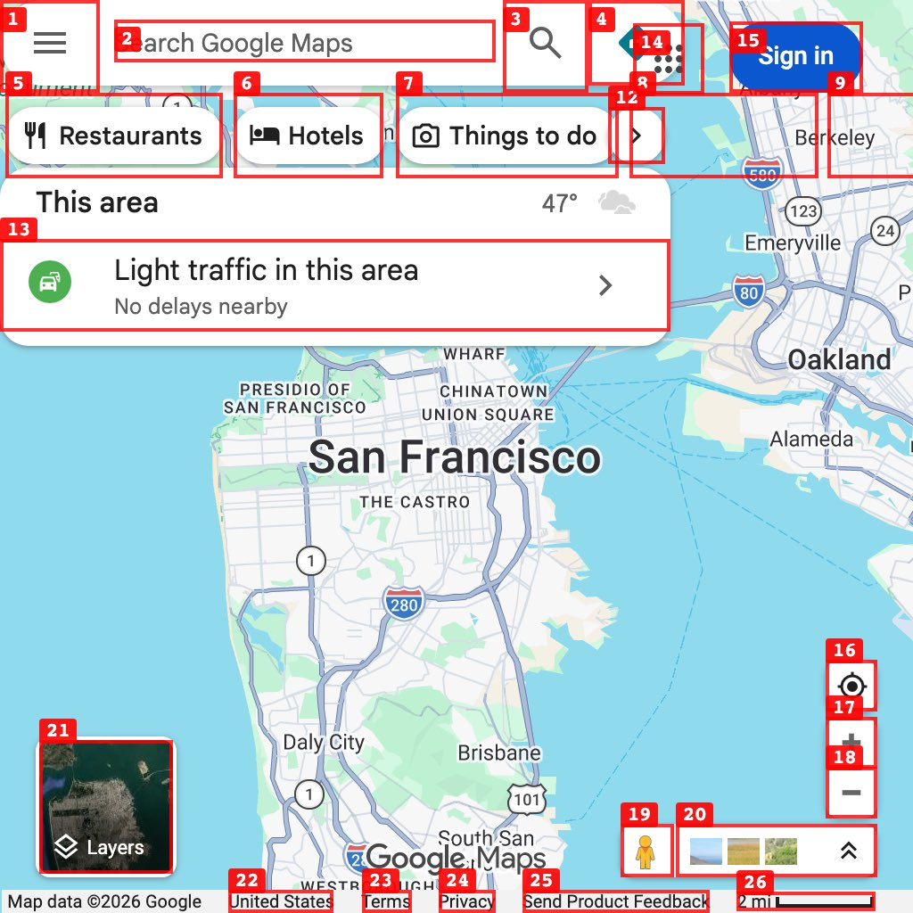

# New: Annotated Screenshots for agent-browser

**Author:** Chris Tate (@ctatedev)
**Date:** Feb 19, 2026
**Source:** https://x.com/ctatedev/status/2024346489456144735
**Stats:** 34 replies, 30 reposts, 663 likes, 539 bookmarks, 41.1K views

---

New: Annotated Screenshots

`agent-browser screenshot --annotate`

Text snapshots are fast and often enough. But the web is messy - canvas elements, icon-only buttons, missing ARIA labels.

Screenshots give visual context but lose the structure.

Neither connects what your agent sees to what it can do.

Annotated screenshots solve this. Numbered labels overlay each interactive element, linking the visual page to the accessibility tree.

