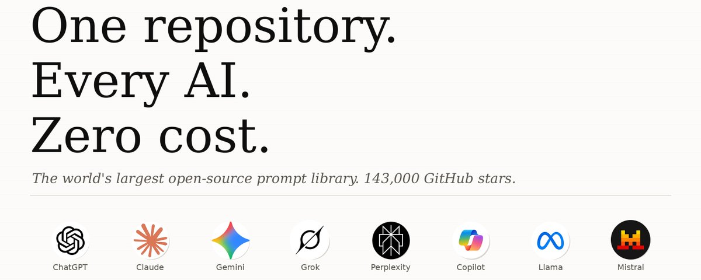
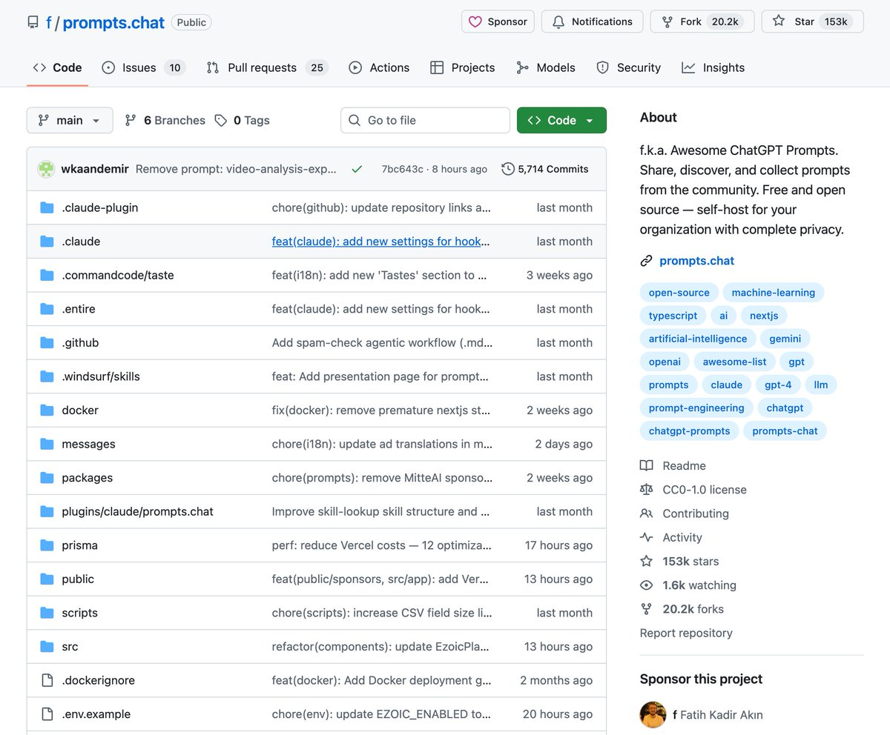
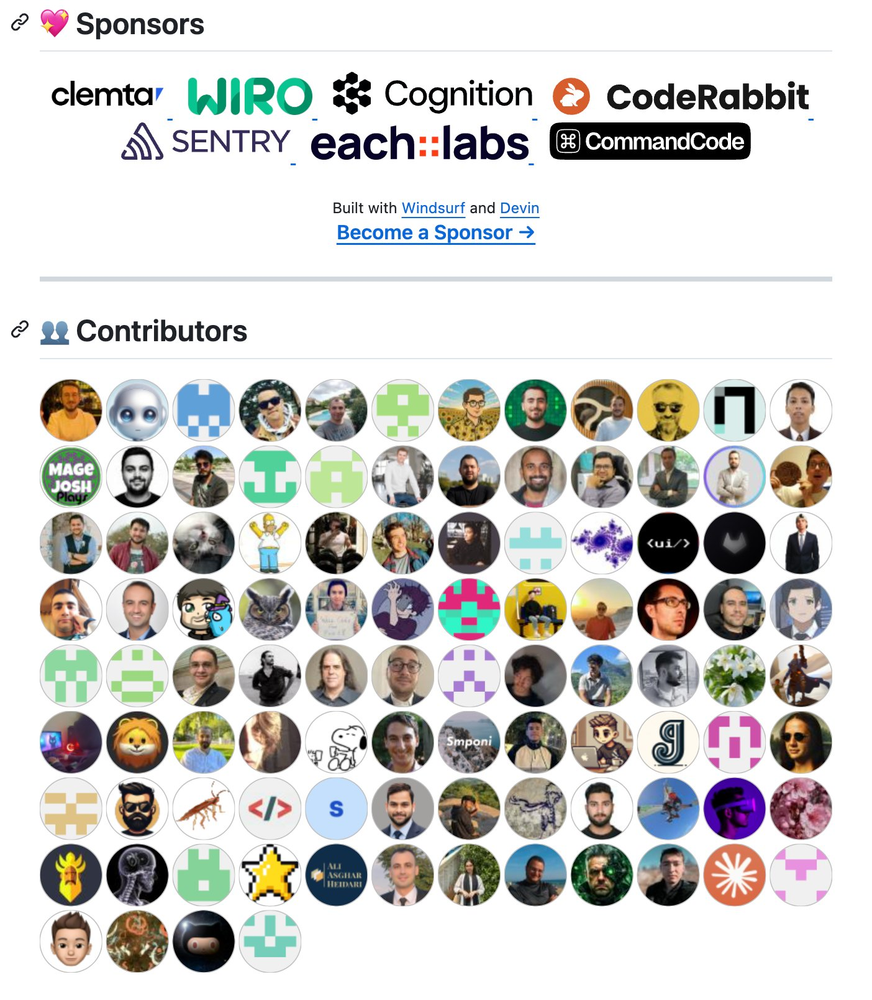
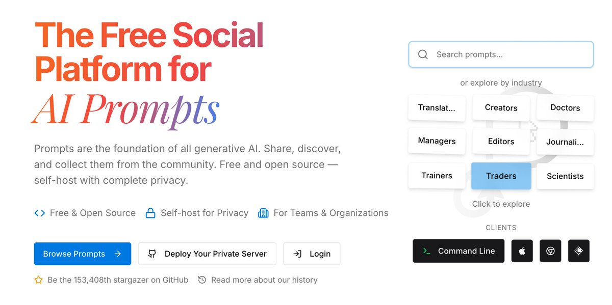

# You've Been Using AI Wrong. 153,000 People Already Figured It Out

**Author:** Qwerty (@qwerty_ytrevvq)
**Date:** Mar 20, 2026
**Source:** https://x.com/qwerty_ytrevvq/status/2034971608683618380
**Stats:** 15 replies, 71 reposts, 831 likes, 4,057 bookmarks, 514.8K views

---

## A free repository that makes your AI smarter in 5 minutes.

Most people open ChatGPT and type something like "write me an email" or "explain quantum physics." They get a mediocre response. They think AI is overhyped.

The problem isn't the AI. The problem is how you talk to it.

[awesome-chatgpt-prompts](https://github.com/f/awesome-chatgpt-prompts) is a GitHub repository. 143,000+ stars. Featured in Forbes. Referenced by Harvard and Columbia. 40+ academic citations. The most liked dataset on Hugging Face. #33 most popular repository in the world. The first and largest open-source prompt library for AI - launched December 2022.

Works with ChatGPT, Claude, Gemini, Llama, Mistral - any modern AI.

## Why your AI gives mediocre answers?

When you ask AI to "explain marketing" - it responds like an encyclopedia. When you say "act as a CMO with 20 years of experience at Fortune 500 companies and help me build a go-to-market strategy for my SaaS product targeting mid-market companies" - it responds like a real expert.

Role = context = quality.

Small changes in how you ask lead to massive changes in what you get back. Most people write prompts that do one thing - state the task. A good prompt does four: gives the model a role, gives it context, defines the output format, and sets constraints.

This repository fixes that in minutes.

## What's inside?

150+ carefully curated prompts organized by role. The principle is simple - you tell the AI who to be, and it becomes that.

**"Act as a Linux Terminal"**
Type commands - AI executes them like a real terminal. Perfect for learning and testing without risk.

**"Act as a Financial Analyst"**
AI analyzes data like a professional. Structured output with risks, assumptions, and recommendations.

**"Act as a Socratic Method Teacher"**
Doesn't give you answers - asks questions that lead you to the right conclusion. The best way to actually learn.

**"Act as a Regex Generator"**
Describe what you need to find - get a working regular expression with explanation.

**"Act as a Debate Partner"**
AI takes the opposite position and argues it as strongly as possible. The best way to stress-test your ideas before committing.

**"Act as a Code Reviewer"**
Analyzes your code, finds bugs, suggests improvements like a senior developer who actually cares.

**"Act as a Startup Idea Validator"**
Give it market context - get structured analysis of feasibility, competition, and risks.

**"Act as a Mental Health Adviser"**
Supportive conversation with professional framing. Not a replacement for therapy - but useful for thinking through problems.

## The structure of a great prompt

A good prompt does four things: gives the model a role, gives it context, defines the output format, and sets constraints. Most prompts people write do only one of these - that's why the output is mediocre.

Example of a weak prompt:

> "Write me a marketing strategy."

Example of a strong prompt:

> "Act as a growth marketing expert who has scaled B2B SaaS companies from $1M to $10M ARR. I'm building a project management tool for remote teams. Write a 90-day go-to-market strategy focused on organic acquisition. Format as a week-by-week plan with specific tactics, KPIs, and success metrics."

Same AI. Completely different result.

## For Polymarket traders

The right prompt turns AI into an analytical tool.

**"Act as a Prediction Market Analyst"**
Give it the context of an event - AI analyzes probabilities, historical patterns, current sentiment, and tells you where the market might be mispriced.

**"Act as a Devil's Advocate"**
You're confident in a position - AI finds every argument against it. The best way to pressure-test a trade before entering.

**"Act as a News Sentiment Analyzer"**
Paste a headline - AI evaluates how it affects a specific market and in which direction prices should move.

**"Act as a Probability Calibration Expert"**
Describe an event and the current market price - AI evaluates whether the market is pricing it correctly based on base rates and historical data.

The difference between "what do you think about this market?" and a structured prompt is the difference between a random opinion and professional-grade analysis.

## Free prompt engineering course included

The repository now includes a free interactive guide to prompt engineering - 25+ chapters covering everything from basics to advanced techniques: chain-of-thought reasoning, few-shot learning, and building AI agents.

This isn't just a collection of prompts. It's a curriculum for how to work with AI properly.

## How to start in 5 minutes

1. Go to [github.com/f/awesome-chatgpt-prompts](https://github.com/f/awesome-chatgpt-prompts)
2. Press Ctrl+F and search for the role you need
3. Copy the prompt into ChatGPT, Claude, or any other AI
4. Adapt it to your specific task

Or go to [prompts.chat](https://prompts.chat/) - the same collection with a cleaner interface, search, and the ability to add your own prompts.

## The numbers

143,000+ GitHub stars. Forbes. Harvard. Columbia. 40+ academic citations. Most liked dataset on Hugging Face. Recommended by Greg Brockman and Wojciech Zaremba (OpenAI co-founders), Clement Delangue (Hugging Face CEO), Thomas Dohmke (former GitHub CEO).

Most people use AI at 10% of its potential. This fixes that.

Save it. You'll come back to it.
