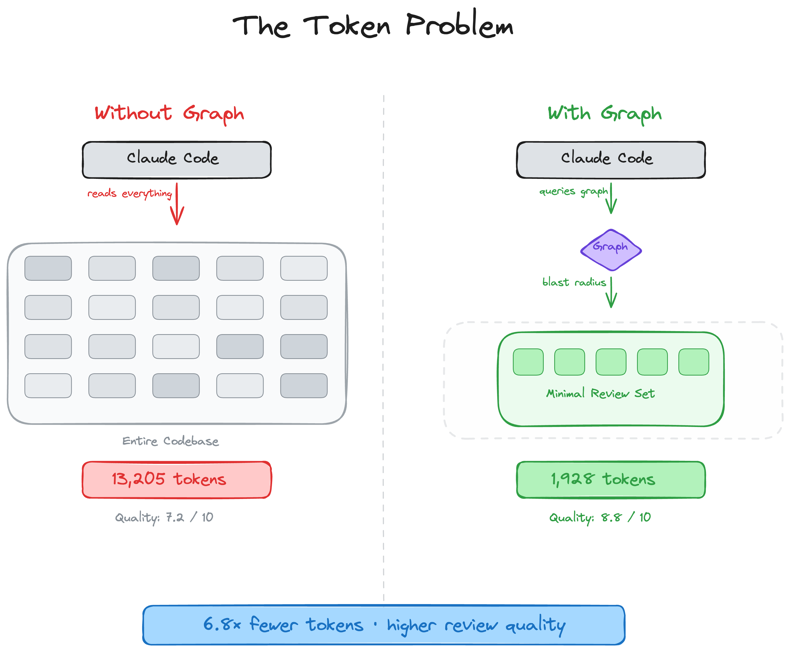
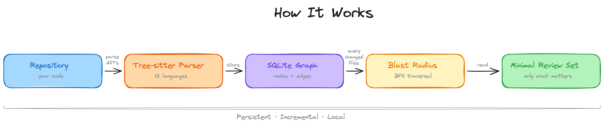
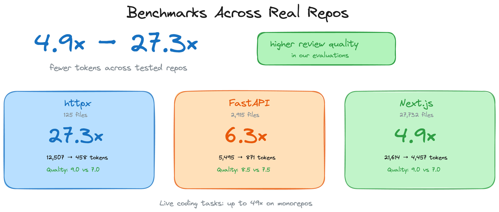

# code-review-graph: Local Knowledge Graph for Claude Code

**Author:** tirth8205
**Date:** 2026
**Source:** https://github.com/tirth8205/code-review-graph?tab=readme-ov-file

---

## Stop burning tokens. Start reviewing smarter.







Claude Code re-reads your entire codebase on every task. code-review-graph fixes that. It builds a structural map of your code with Tree-sitter, tracks changes incrementally, and gives Claude precise context so it reads only what matters.

## Quick Start

### Claude Code Plugin (recommended)

```bash
claude plugin marketplace add tirth8205/code-review-graph
claude plugin install code-review-graph@code-review-graph
```

### pip

```bash
pip install code-review-graph
code-review-graph install
```

Restart Claude Code after either method. Requires Python 3.10+ and uv.

Then open your project and tell Claude:

> Build the code review graph for this project

The initial build takes ~10 seconds for a 500-file project. After that, the graph updates automatically on every file edit and git commit.

## How It Works

Your repository is parsed into an AST with Tree-sitter, stored as a graph of nodes (functions, classes, imports) and edges (calls, inheritance, test coverage), then queried at review time to compute the minimal set of files Claude needs to read.

- Blast-radius analysis
- Incremental updates in < 2 seconds
- 14 supported languages

## Benchmarks

All figures come from real tests on three production open-source repositories.

- Code review benchmark details (6.8x average reduction)
- Live coding task details (14.1x average, 49x peak)
- Monorepo scale: the 49x case

## Usage

- Slash commands
- CLI reference
- MCP tools

## Features

| Feature | Details |
|---|---|
| Incremental updates | Re-parses only changed files. Subsequent updates complete in under 2 seconds. |
| 14 languages | Python, TypeScript, JavaScript, Vue, Go, Rust, Java, C#, Ruby, Kotlin, Swift, PHP, Solidity, C/C++ |
| Blast-radius analysis | Shows exactly which functions, classes, and files are affected by any change |
| Auto-update hooks | Graph updates on every file edit and git commit without manual intervention |
| Semantic search | Optional vector embeddings via sentence-transformers |
| Interactive visualisation | D3.js force-directed graph with edge-type toggles and search |
| Local storage | SQLite file in .code-review-graph/. No external database, no cloud dependency. |
| Watch mode | Continuous graph updates as you work |

## Contributing

```bash
git clone https://github.com/tirth8205/code-review-graph.git
cd code-review-graph
python3 -m venv .venv && source .venv/bin/activate
pip install -e ".[dev]"
pytest
```

## Licence

MIT. See LICENSE.
