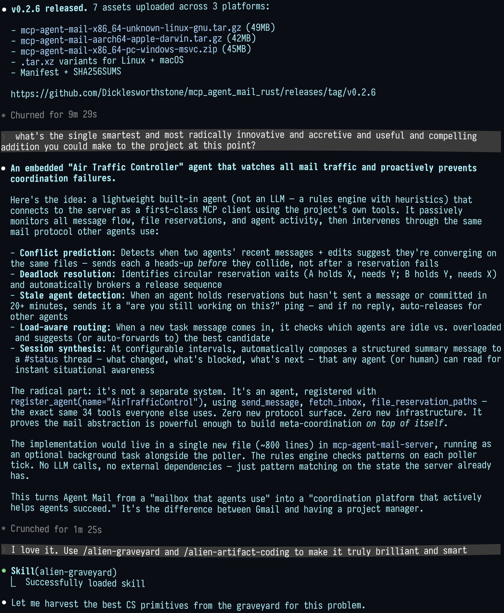

# "God, I Love This Prompt" -- Air Traffic Controller Agent for MCP Agent Mail

**Author:** Jeffrey Emanuel (@doodlestein)
**Date:** March 14, 2026
**Source:** https://x.com/doodlestein/status/2032891274177524175
**Stats:** 44 replies, 64 retweets, 1,426 likes, 84,001 views, 2,434 bookmarks

---

## Post

God, I love this prompt.

## Image Content (Full Transcription)

The attached image shows a terminal session from what appears to be a Claude Code / agent coding environment. It documents a prompt interaction where the user asks for a radical new addition to the `mcp_agent_mail` project (the Rust version, v0.2.6 just released). The full transcription follows:

---

> v0.2.6 released. 7 assets uploaded across 3 platforms:
> - mcp-agent-mail-x86_64-unknown-linux-gnu.tar.gz (49MB)
> - mcp-agent-mail-aarch64-apple-darwin.tar.gz (42MB)
> - mcp-agent-mail-x86_64-pc-windows-msvc.zip (45MB)
> - .tar.xz variants for Linux + macOS
> - Manifest + SHA256SUMS
>
> https://github.com/Dicklesworthstone/mcp_agent_mail_rust/releases/tag/v0.2.6
>
> Churned for 9m 29s

**User prompt:**

> what's the single smartest and most radically innovative and accretive and useful and compelling addition you could make to the project at this point?

**Agent response:**

An embedded "Air Traffic Controller" agent that watches all mail traffic and proactively prevents coordination failures.

Here's the idea: a lightweight built-in agent (not an LLM -- a rules engine with heuristics) that connects to the server as a first-class MCP client using the project's own tools. It passively monitors all message flow, file reservations, and agent activity, then intervenes through the same mail protocol other agents use:

- **Conflict prediction:** Detects when two agents' recent messages + edits suggest they're converging on the same files -- sends each a heads-up *before* they collide, not after a reservation fails
- **Deadlock resolution:** Identifies circular reservation waits (A holds X, needs Y; B holds Y, needs X) and automatically brokers a release sequence
- **Stale agent detection:** When an agent holds reservations but hasn't sent a message or committed in 20+ minutes, sends it a "are you still working on this?" ping -- and if no reply, auto-releases for other agents
- **Load-aware routing:** When a new task message comes in, it checks which agents are idle vs. overloaded and suggests (or auto-forwards to) the best candidate
- **Session synthesis:** At configurable intervals, automatically composes a structured summary message to a #status thread -- what changed, what's blocked, what's next -- that any agent (or human) can read for instant situational awareness

The radical part: it's not a separate system. It's an agent, registered with `register_agent(name="AirTrafficControl")`, using `send_message`, `fetch_inbox`, `file_reservation_paths` -- the exact same 34 tools everyone else uses. Zero new protocol surface. Zero new infrastructure. It proves the mail abstraction is powerful enough to build meta-coordination *on top of itself*.

The implementation would live in a single new file (<800 lines) in mcp-agent-mail-server, running as an optional background task alongside the poller. The rules engine checks patterns on each poller tick. No LLM calls, no external dependencies -- just pattern matching on the state the server already has.

This turns Agent Mail from a "mailbox that agents use" into a "coordination platform that actively helps agents succeed." It's the difference between Gmail and having a project manager.

> Churned for 1m 25s

**User response:**

> I love it. Use /alien-graveyard and /alien-artifact-coding to make it truly brilliant and smart

> Skill(alien-graveyard)
> Successfully loaded skill

> Let me harvest the best CS primitives from the graveyard for this problem.

---

## Context

Jeffrey Emanuel is the creator of [MCP Agent Mail](https://github.com/Dicklesworthstone/mcp_agent_mail), an asynchronous coordination layer for AI coding agents that provides identities, inboxes, searchable threads, and advisory file leases over FastMCP + Git + SQLite. The Rust version (`mcp_agent_mail_rust`) is a high-performance rewrite of the original Python implementation.

The prompt in this tweet demonstrates a pattern of asking the AI agent for its single most impactful contribution to a project, then immediately directing it to implement the idea using specialized skills (`/alien-graveyard` and `/alien-artifact-coding`).

The "Air Traffic Controller" concept is notable because it proposes building meta-coordination capabilities using the same communication primitives that regular agents use -- essentially, an agent that manages other agents through the same mail protocol, requiring zero new infrastructure or protocol changes.

## Top Comments

> **Note:** The 44 replies to this post could not be retrieved because X.com requires authentication to display reply threads. The tweet was posted on March 14, 2026 (one day before capture) and has not yet been indexed by third-party services.

Based on the high engagement metrics (1,426 likes, 2,434 bookmarks, 64 retweets on 84K views), this post generated significant interest in the AI/agent engineering community. The bookmarks-to-likes ratio (1.7:1) is unusually high, suggesting developers found the Air Traffic Controller concept practically valuable enough to save for reference.
