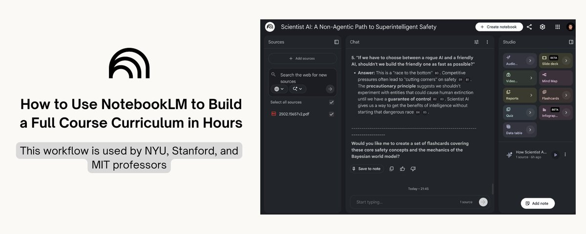
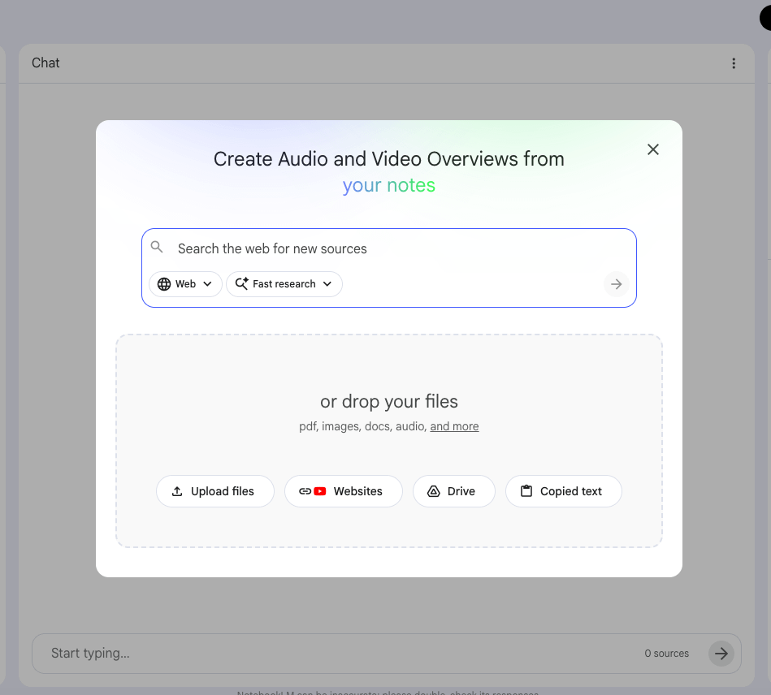

# How to Use NotebookLM to Create Your Entire Course Curriculum From Scratch

**Author:** Ihtesham Ali (@ihtesham2005)
**Date:** Mar 20, 2026
**Source:** https://x.com/ihtesham2005/status/2035035410758619428
**Stats:** 25 replies, 336 reposts, 2,005 likes, 5,023 bookmarks, 966K views

---



Professors at NYU, Stanford, and Case Western stopped building courses by hand.

They're using NotebookLM to do it in hours and one just called it the biggest shift in academic research in 20 years.

Here's the exact workflow they shared publicly:

## Step 1 - The source upload strategy that changes everything.



Most people upload one or two documents.

Professors building full courses upload their entire reading list at once.

Up to 50 sources per notebook on the free tier.

500,000 words per source.

PDFs, Google Docs, URLs, YouTube lectures, audio files, images with OCR.

One notebook = one course unit.

The workflow Stanford faculty documented publicly:

- Upload all assigned readings for a unit
- Upload the course syllabus
- Upload previous years' exam questions
- Upload any relevant primary sources

NotebookLM now has a 1-million token context window.

It holds the entire unit in its head simultaneously and reasons across all of it at once.

No AI on the market does this grounded in YOUR specific sources.

## Step 2 - The curriculum mapping prompt.

Once sources are uploaded, this is the first prompt professors run:

```
"Based on all uploaded materials, create a complete curriculum map for this unit. Identify the 5 core concepts students must understand. For each concept, list: the source that introduces it, the source that deepens it, and the source that challenges or complicates it. Then suggest a logical teaching sequence."
```

What comes back is a structured roadmap of the entire unit with every claim cited back to the exact uploaded source.

NYU's Assistant Dean used a version of this to identify course equivalencies across an entire revised curriculum for student advising.

What used to require weeks of manual cross-referencing across departments happened in one session.

## Step 3 - Generating the lesson plan stack.

After the curriculum map, professors run this:

```
"Using the uploaded syllabus and course materials, create a detailed day-by-day lesson plan for [topic]. Each class session should include: a learning objective, the key concepts to cover, one real-world example or analogy, a discussion question, and an estimated time breakdown for a 60-minute class."
```

NotebookLM generates the full plan grounded strictly in the materials uploaded.

No hallucinated citations. No invented examples.

Everything it produces traces back to a source you can click and verify inline.

Arizona State University faculty documented using exactly this approach to organize scholarly articles and identify themes across disciplines work that previously took entire research semesters.

## Step 4 - The student-facing materials workflow.

This is where NotebookLM saves professors the most time per week.

After building the lesson plan, they generate the entire student-facing package from the same notebook:

- Study guides with main ideas, critical arguments, and supporting evidence - one click in Studio
- Reading comprehension questions based on exact course materials
- Flashcards for key concepts and terminology - auto-generated, cited to source
- Practice quizzes - multiple choice or short answer, with an answer key that cites back to the reading

Northeastern University lecturers documented having students create their OWN custom study aids from course readings using this exact workflow.

Students stop asking "what do I need to know?"

The notebook tells them in their own preferred format from the exact materials the professor assigned.

## Step 5 - The Audio Overview for student prep.

This is the feature that went viral among students once professors started sharing it.

Before every class, professors generate an Audio Overview of that week's readings.

Students get a 10-15 minute podcast-style summary two AI hosts explaining the material, making connections, using analogies — before they've read a single page.

Case Western Reserve University faculty documented using this specifically to help students approach dense readings they'd otherwise avoid entirely.

The result: students show up to class having already encountered the key ideas.

Class time shifts from "let me explain what the reading said" to actual discussion, application, and debate.

That's the pedagogical shift professors are calling transformational.

Not the tool itself. What the tool makes possible in the room.

## Step 6 - The Deep Research upgrade for literature reviews.

This is the feature that changed things for research faculty specifically.

Deep Research available on NotebookLM lets the tool autonomously search the web, build a bibliography, and compile a fully cited research report.

One Pitt researcher documented cutting literature review prep time by 70% using it.

The workflow:

- Upload your existing sources and research question
- Run Deep Research
- NotebookLM plans its own web searches, identifies gaps in your current sources, pulls new papers, and synthesizes everything into a cited report

Walter Isaacson used NotebookLM to analyze Marie Curie's journals for his book.

Primary historical research documents not just student notes.

When a Pulitzer Prize-winning biographer is using your research workflow, that's a signal worth paying attention to.

## Step 7 - Google Classroom integration for sharing with students.

This is the 2026 update that closed the loop for faculty.

You can now create a NotebookLM notebook directly from Google Classroom.

One click pulls in all the resources already assigned to students.

No manual re-uploading. No rebuilding the curriculum in a new tool.

Assign notebooks to students as "View Only" - they get the full AI-assisted experience grounded in exactly the materials you assigned.

Students can query the notebook, generate their own study guides, run their own audio overviews, create flashcards all from the same sources the professor built the course on.

The professor sets the knowledge base once.

The students interact with it in whatever format helps them learn best.

That's personalized education at scale without any extra work from the professor after the initial setup.

## The full professor workflow - save this.

Here's the complete stack documented by faculty across NYU, Stanford, Case Western, Arizona State, and Northeastern:

Step 1 -> Upload entire reading list + syllabus + past exams into one notebook per unit

Step 2 -> Run curriculum mapping prompt get the full teaching sequence with citations

Step 3 -> Generate day-by-day lesson plans for every class session

Step 4 -> Generate student-facing package study guides, flashcards, quizzes in one click

Step 5 -> Create Audio Overviews for student pre-reading before every class

Step 6 -> Use Deep Research to run literature reviews and identify source gaps

Step 7 -> Share notebooks via Google Classroom students interact with the same source base

What used to take a full summer now takes a week.

What used to take a week now takes an afternoon.

The professors who figure this out first aren't working less.

They're working on the parts that actually require a human in the room.

The university system has been running on the same curriculum-building process for decades.

Upload readings. Write lectures. Build assessments. Repeat every semester from scratch.

NotebookLM didn't change what professors teach.

It changed how long the invisible work takes.

The literature review that took 3 months.

The lesson plan stack that took 2 weeks.

The study materials that took a weekend.

All of it is still the professor's intellectual work.

NotebookLM just removed the part where you manually cross-reference 50 PDFs at 11pm.

The institutions moving fastest on this aren't replacing faculty.

They're giving them their time back.

That's the real shift.

And it's already happening.
